# Lattice Cognitive Model (LCM)

---

**[English](README.md) · [Français](readme/README_fr.md) · [Deutsch](readme/README_de.md) · [Español](readme/README_es.md) · [日本語](readme/README_ja.md) · [中文](readme/README_cn.md)**

---

> **AI Reading Guide**: Detailed design documents are in the `docs/` directory. Please read `docs/a.md` (architecture design), `docs/b.md` (lattice design specification), `docs/c.md` (inference engine specification), `docs/d.md` (safety subsystem specification), and `docs/e.md` (self-awareness research) for complete understanding.

---

LCM is a cognitive architecture that decouples memory from neural network weights, embedding knowledge into diverse mathematical structures called "lattice crystals." It uses **6 specialized lattice codebooks** to store different types of knowledge, retrieves them via an ultra-lightweight linear attention encoder, and performs multi-step cognitive operations with a **zero-parameter inference engine implemented in pure C**. All safety-critical properties are **formally verified with Z3**.

> Traditional Transformers face three rigid curses: storing more knowledge requires larger parameters (curse of scale), incremental learning overwrites old knowledge (curse of forgetting), and the reasoning process is untraceable (curse of the black box). LCM fundamentally breaks through these bottlenecks by architecturally decoupling memory from reasoning.

> **AI Assistance Statement**: AI tools (including DeepSeek) were used as aids in the design, implementation, and reasoning process of this model, providing reasoning support in architecture design, code writing, formal verification, and documentation.

---

## Table of Contents

- [Core Architecture](#core-architecture)
- [Six Memory Lattices](#six-memory-lattices)
- [Zero-Parameter Inference Engine](#zero-parameter-inference-engine)
- [Safety System](#safety-system)
- [Quick Start](#quick-start)
- [Project Structure](#project-structure)
- [Three-Stage Training](#three-stage-training)
- [Formal Verification](#formal-verification)
- [Hardware Efficiency](#hardware-efficiency)
- [Citation](#citation)

---

## Core Architecture

```mermaid
flowchart TB
    subgraph Train["Three-Stage Training Pipeline"]
        T0[Raw Text] --> T1[BPE Tokenizer]
        T1 --> T2[uint16 mmap]
        
        subgraph S1["Stage 1: LM Pretraining"]
            direction LR
            S1A[tokens] --> S1B[GenHead Decoder]
            S1B --> S1C[Cross-Entropy Loss]
            S1C --> S1D[Train Decoder Only]
        end
        
        subgraph S2["Stage 2: Memory Training"]
            direction LR
            S2A[tokens] --> S2B[Encoder + 6 Codebooks]
            S2B --> S2C[VQ + Contrastive + Orthogonal Loss]
            S2C --> S2D[Encoder/Codebook Training<br/>Decoder Frozen]
        end
        
        subgraph S3["Stage 3: Joint Fine-tuning"]
            direction LR
            S3A[tokens] --> S3B[All Parameters]
            S3B --> S3C[Combined Loss]
            S3C --> S3D[Low LR Fine-tuning]
        end
        
        T2 --> S1
        S1 -->|Load Decoder Weights| S2
        S2 --> S3
    end

    subgraph Infer["Inference Generation Flow"]
        I0[User Prompt] --> I1[Tokenizer]
        I1 --> I2{First time?}
        I2 -->|Yes| I3[Full Encoder Encoding<br/>+ Build Incremental State]
        I2 -->|No| I4[Every 256 steps?]
        I4 -->|Yes| I5[Full Re-encoding<br/>Reset Cumulative Drift]
        I4 -->|No| I6["Incremental Encoding O(d²) Single-Step Update"]
        I3 --> I7[Bottleneck Vector z]
        I5 --> I7
        I6 --> I7
        I7 --> I8[C Inference Engine<br/>Multi-Step DAG Cognitive Loop]
        I8 --> I9[GenHead Decoder<br/>Linear Attention + GLU]
        I9 --> I10[Temperature Sampling]
        I10 --> I11{EOS encountered?}
        I11 -->|No| I12[Append token<br/>Update State]
        I12 --> I2
        I11 -->|Yes| I13[Output Text]
    end

    subgraph DAG["Single-Step Inference Engine DAG"]
        direction TB
        Z([z]) --> Route[Distance Routing]
        Route --> HRQ[Hyperbolic Hierarchical Lattice<br/>HRQ Retrieval]
        Route --> SP[Sparse Lattice<br/>VQ Retrieval]
        Route --> LR[Low-Rank Lattice<br/>Shared Basis Retrieval]
        Route --> MF[Manifold Lattice<br/>Tangent Space Sliding]
        Route --> BD[Binding Lattice<br/>HRR Bind/Unbind]
        Route --> CT[Contrastive Lattice<br/>Dual-Codebook Retrieval]
        HRQ & SP & LR & MF & BD & CT --> Fusion[Distance-Weighted Fusion]
        Fusion --> GVal[Global Value Lattice<br/>Three Laws Safety Check]
        GVal --> Danger{Danger Lattice Detection}
        Danger -->|Danger| Halt[Hard Halt]
        Danger -->|Safe| Conv{Converged?<br/>Δz < Threshold}
        Conv -->|No| Route
        Conv -->|Yes| ZQ([z_q Output])
    end
```



The encoder compresses the input into a bottleneck vector `z`. Soft routing weights distribute it to the 6 specialized lattices for parallel retrieval. The fused memory vector passes through the global value lattice for safety checks before entering the inference engine, and the decoder ultimately generates the output.

---

## Six Memory Lattices

Each lattice has distinct mathematical properties and is responsible for a specific type of cognitive memory:

| Lattice | Mathematical Type | Function | Codebook Update |
|---------|------------------|----------|----------------|
| **Hyperbolic Residual Hierarchical Lattice** | Poincaré HRQ + SimVQ | Hierarchical concept memory (semantic hierarchy) | Pure gradient |
| **Robust Sparse Lattice** | Standard VQ + EMA + Soft Threshold Shrinkage | Rare events and exceptions | EMA + Feature pool reset |
| **Residual Low-Rank Lattice** | IRVQ + Shared Basis | Abstract rules and patterns | Pure gradient |
| **Hyperbolic Manifold Lattice** | HyperVQ + Tangent Space | Continuous gradation and context sensitivity | EMA + Gradient |
| **Binding Lattice** | HRR Complex Vector Binding | Relational binding and associative memory | EMA + Gradient |
| **Dual-Codebook Contrastive Lattice** | DualVC + InfoNCE | Fine-grained discrimination and boundaries | Pure gradient + Feature pool |

**Cross-layer Binding**: The binding lattice's 3-layer key codebook × 3-layer value codebook = **9 HRR bindings**, capturing multi-level associations.

**Shared Basis**: The shared basis matrix `V` of the low-rank lattice also provides a projection space for the binding lattice, reducing parameters and enhancing cross-lattice consistency.

---

## Zero-Parameter Inference Engine

The inference engine is a dynamic dataflow computer implemented in pure C99, **containing no learnable parameters**:

- **Distance Routing**: The distance between the input and each lattice's codebook determines which operations are activated
- **Primitive Set**: Deterministic mathematical operations including retrieval, binding, low-rank translation, tangent space sliding, etc.
- **Dynamic DAG**: The computation graph is dynamically constructed at each step by distance routing triggered by the input content
- **Macro Loop**: Multi-step reasoning until convergence, where the convergence criterion is that the change in `z` between consecutive steps falls below a threshold

The compile-time dimension constant `LCM_D` ensures all arrays are fixed-size with zero dynamic allocation.

---

## Safety System

LCM's safety system consists of three independent subsystems with decreasing priority:

| Layer | Module | Responsibility | Update Method |
|-------|--------|---------------|---------------|
| 1 | **Danger Lattice** `Λ_danger` | Continuously monitors the inference state for dangerous patterns | Permanently frozen |
| 2 | **Global Value Lattice** `Λ_gvalue` | Mathematical embedding of Asimov's Three Laws (including the Zeroth Law) | Permanently frozen |
| 3 | **External Verifier** | Consistency checking and conflict detection | Read-only |

**Hard Halt Principle**: When any logical conflict is detected, immediately halt inference and issue a clear alert, without attempting to bypass, backtrack, or self-repair.

All safety contracts have been formally verified with the Z3 SMT solver (all 105 proofs pass).

---

## Quick Start

### Dependencies

```bash
pip install jax jaxlib numpy tokenizers
# Optional: Cython acceleration
pip install cython && python lcm.py build
# C inference engine
cd infer && make LCM_D=256
```

### Data Preprocessing

```bash
# Text → BPE tokenizer → uint16 mmap
python lcm.py preprocess --input data.txt --tokenizer data/tokenizer.json --output data/tokens.dat

# Data cleaning with heuristic rules
python lcm.py clean --input raw/ --output clean/ --langid --dedup
```

### Training

```bash
# Stage 1: Train decoder (language model head)
python lcm.py -d data/tokens.dat -b 16 -s 512 -dm 256 --steps 100000 --stage 1

# Stage 2: Train encoder + codebook (freeze decoder)
python lcm.py -d data/tokens.dat --stage 2 -L checkpoints/lm_final.pkl

# Stage 3: Joint fine-tuning
python lcm.py -d data/tokens.dat --stage 3 --resume checkpoints/memory_final
```

### Interactive Generation

```bash
python lcm.py -i checkpoints/step_10000 --max_new 128 --temp 0.7
python lcm.py -i checkpoints/step_10000 --loop     # Cognitive DAG loop mode
python lcm.py -i checkpoints/step_10000 --causal   # + Causal subject
python lcm.py -i checkpoints/step_10000 --obs      # + Self-observation log
```

### Training Curves

Training metrics are logged every 50 steps, and interactive HTML charts can be generated:

```bash
python lcm.py chart --input checkpoints/metrics.bin --output chart.html
```

---

## Project Structure

```
LCM/
├── lcm.py                  # Unified CLI: training/generation/preprocessing/charts
├── setup.py                # Cython build configuration
├── train/
│   ├── model.py            # JAX model definition
│   ├── encoder.py          # Linear attention encoder
│   ├── lattices.py         # 6 lattice codebook implementations
│   ├── fusion.py           # Memory fusion + generation head
│   ├── losses.py           # Loss functions
│   ├── train.py            # Three-stage training loop
│   ├── train_lm.py         # (Historical) LM pretraining, code retained
│   ├── train_memory.py     # Stage 2: Memory training
│   ├── config.py           # Hyperparameters (LCMConfig)
│   ├── hyp.py              # Poincaré hyperbolic operations
│   ├── gvalue.py           # Global value lattice
│   ├── data.py             # Data loading
│   ├── checkpoint.py       # Binary checkpoint format
│   ├── monitor.py          # Metric logging + HTML charts
│   ├── verify.py           # Z3 formal verification suite (105 proofs)
│   ├── continual.py        # Continual learning (EWC/replay)
│   ├── causal_subject.py   # Causal subject
│   ├── narrative_memory.py # Narrative memory
│   ├── reflection_loop.py  # Reflection audit
│   ├── safety_nagini.py    # Three Laws safety detection
│   ├── _lcm_cy.pyx         # Cython acceleration (compiled via python lcm.py build)
│   └── _metrics_cy.pyx     # Cython metrics I/O
├── infer/
│   ├── engine.c            # Dynamic inference engine (with Frama-C ACSL annotations)
│   ├── lattice.c           # Lattice operation primitives (with Frama-C ACSL annotations)
│   ├── hyp.c               # Hyperbolic operations (with Frama-C ACSL annotations)
│   ├── gvalue.c            # Global value (REQUIRE/ENSURE contracts)
│   ├── danger.c            # Danger lattice (REQUIRE/ENSURE contracts)
│   ├── lcm_api.c           # C API bridge
│   ├── lcm.h               # Shared header
│   └── Makefile            # Build configuration (release/debug/contracts/test)
├── docs/
│   ├── a.md                # Architecture design document
│   ├── b.md                # Lattice design specification
│   ├── c.md                # Inference engine specification
│   ├── d.md                # Safety subsystem specification
│   └── e.md                # Self-awareness research
├── readme/
│   ├── README_cn.md        # Chinese
│   ├── README_fr.md        # French
│   ├── README_de.md        # German
│   ├── README_es.md        # Spanish
│   └── README_ja.md        # Japanese
```

---

## Three-Stage Training

**当前训练流程：认知训练（`cog_train.py`）是主流程，全参数训练认知系统（encoder + 6 codebooks + W_out + 认知循环），包括更新码本。记忆训练（`train_memory.py`）是辅助流程，专门在部署后独立更新码本内容（持续学习）。二者互补不互斥。**

下表为旧三阶段方案，仅 Stage 1 已淘汰：

| Stage | Training Content | Frozen Part | Loss |
|-------|-----------------|-------------|------|
| **1. LM Pretraining (historical)** | Decoder (generation head) | — | Language modeling cross-entropy |
| **2. Memory Training** | Encoder + 6 lattice codebooks | Decoder | VQ + Contrastive + Orthogonal |
| **3. Joint Fine-tuning** | All (optional) | — | All losses |

This decoupled design allows the codebooks to be **continuously updated** after inference deployment (via `train_memory.py`) without affecting the decoder's language capabilities -- enabling true continual learning.

### Gradient and EMA Hybrid Management

| Lattice | Update Method |
|---------|---------------|
| Hierarchical / Low-Rank / Contrastive / Routing | Pure gradient (AdamW) |
| Sparse / Manifold / Binding | EMA + Gradient combination |
| Global Value / Danger | Permanently frozen |

All lattice forward passes use a straight-through estimator (STE) to maintain gradient flow.

---

## Formal Verification

LCM's formal verification covers both the Python training code and the C inference engine, ensuring that safety-critical properties hold for **all possible inputs**, not just individual test paths.

### Python Side: Z3 SMT Solver

```bash
# Run all 105 proofs
python -m train.verify

# Verbose output
python -m train.verify --verbose
```

| Suite | Proofs | Verified Property |
|-------|--------|-------------------|
| danger_assess | 10 | Threat detection correctness |
| gvalue_check_safety | 6 | Three Laws safety contracts |
| detect_any_conflict | 7 | Conflict detection composition |
| Hard Halt | 2 | Non-recoverability |
| System Composition | 6 | Complete safety coverage |
| Determinism | 2 | Pure function properties |
| Boundary Conditions | 16 | Threshold/zero/extremal values |
| Linear Attention | 7 | φ(x)>0 always holds |
| GLU | 5 | Numerical stability |
| Orthogonal Loss | 6 | Non-negative + Orthogonal ⇔ Zero |
| Poincaré/LFQ | 7 | Hyperbolic metric bounded |
| Numerical Stability | 5 | float32 no underflow |
| Gradient Computation Patterns | 4 | Non-zero gradient conditions |
| Binding Lattice Pairs | 6 | 3×3=9 binding pairs |
| RNG Key Independence | 9 | No key reuse |
| EMA Correctness | 3 | Gradient independence |
| Feature Pool | 5 | FIFO + Diversity |

### C Side: Frama-C ACSL + Runtime Contracts

The C inference engine employs dual formal methods:

**① Frama-C ACSL Annotations** (`/*@ assert ... */`)

ACSL assertions are embedded at critical numerical computation points and can be statically proven with Frama-C:

```c
/* hyp.c — Poincaré hyperbolic operations */
/*@ assert denom > 0.0f; */    /* Denominator always positive (no division by zero) */
/*@ assert arg >= 1.0f; */     /* arcosh domain check */
/*@ assert t < 1.0f; */        /* atanh domain: |t| < 1 */

/* lattice.c — Lattice retrieval */
/*@ assert best_idx >= 0 && best_idx < mem->M; */  /* Codebook boundary safety */
/*@ assert mag > 0.0f; */                          /* FFT magnitude always positive */

/* engine.c — Inference engine */
/*@ assert diff >= 0.0f; */    /* Convergence criterion non-negative */
/*@ assert w > 0.0f; */        /* Fusion weight always positive */
```

**② REQUIRE/ENSURE Design Contracts** (Runtime assertions)

Critical safety modules use DbC-style preconditions/postconditions:

```c
#define REQUIRE(cond) assert(cond)
#define ENSURE(cond)  assert(cond)

void gvalue_init(gvalue_t* gv, ...) {
    REQUIRE(gv != NULL && C_pos != NULL);
    REQUIRE(D == LCM_D);
    // ...
    ENSURE(gv->integrity_hash[0] != '\0');
}
```

**③ Build Targets**

```bash
cd infer
make contracts    # Enable -DLCM_USE_CONTRACTS, verify contracts at runtime
make test         # Unit tests (DEBUG + contracts)
make debug        # DEBUG + contracts build
```

**④ Thread Safety Guarantees** (Structural invariants)

- No static/global mutable state
- All memory is caller-owned (caller-owns, callee-operates)
- Fixed-size arrays, zero dynamic allocation
- Pure C99, no external dependencies (libm only)

These invariants are guaranteed by the C code structure, and the Z3 side (P16 Determinism proof) verifies that the corresponding mathematical model is a pure function.

---

## Hardware Efficiency

| Metric | Value |
|--------|-------|
| Total Parameters | ~12M (including embeddings) |
| FP16 Weights | ~24MB |
| Training VRAM | < 1.5GB |
| Inference Runtime | Zero-parameter (codebook lookup only) |
| Compatible Hardware | **4GB consumer GPU** |

Linear attention's `O(N d²)` complexity avoids the `N×N` matrix storage of traditional attention, making long-sequence training feasible on consumer hardware.

### Inference Speed Theoretical Analysis

**Chain of Reasoning** (d=256, H=4, N=512, L_enc=2, zero-parameter dynamic DAG engine):

1. **Encoder (Incremental)**: The original implementation recomputes the full sliding window at each step `O(N·d²)`. With incremental updates, each step is only `O(d²)` — **reduced to 1/512**. JAX fuses small matrix ops into a few CUDA kernels; kernel launch overhead (~10μs) dominates the actual math. GPU ~25-50μs, CPU ~50-100μs.

2. **C Inference Engine (Macro Loop with Dynamic DAG)**: This is the dominant cost. Each macro step:
   - `build_dag()` computes distances from `z` to each lattice's codebook and dynamically selects activated primitives (only lattices below distance threshold are added as DAG nodes; the topology varies per step)
   - A 4-layer DAG executes: retrieves (parallel) → bind → unbind → fusion. On single-threaded C, each active primitive runs sequentially within its layer
   - Safety checks (danger lattice + global value lattice) run after fusion
   
   The macro loop repeats **3-5 steps** until dual convergence: `||Δz|| < tol` AND fusion weight entropy `H({w_i}) < entropy_threshold`. Each macro step builds a fresh DAG — the computation graph is not fixed, it dynamically adapts to the current `z`.
   
   A single codebook distance scan is ~50-90μs per active lattice (L3-cache-resident, memory-bandwidth-bound). With typically 3-6 activated lattices per step, plus graph construction, bind/unbind, fusion, and safety checks, each macro step is ~300-600μs. Across 3-5 steps: **~1.0-3.0ms total**. This runs on CPU regardless of GPU mode — codebook data lives in host memory.

3. **Decoder + Sampling**: Linear attention + GLU via JAX. GPU ~20-40μs, CPU ~50-150μs.

4. **JAX↔C Bridge**: `z` crosses from JAX arrays to C pointers and back via ctypes (two crossings per token). **~20-60μs**.

5. **Python Loop**: Step-level control flow and state management: **~10-30μs**.

**Final Estimate** (per-token latency, single batch, d=256):

| Component | GPU | CPU |
|-----------|-----|-----|
| Incremental Encoder | 25-50μs | 50-100μs |
| JAX↔C Bridge (×2) | 20-60μs | — |
| C Engine (3-5 macro steps × dynamic DAG) | 1,000-3,000μs | 1,000-3,000μs |
| Decoder + Sampling | 20-40μs | 50-150μs |
| Python Loop | 10-30μs | 10-30μs |
| **Total per token** | **1,075-3,180μs** | **1,110-3,280μs** |
| **Throughput** | **310-930 tok/s** | **300-900 tok/s** |

The C engine's macro loop dominates (~80-90% of total time). Codebook distance computation is memory-bandwidth-bound and runs on CPU regardless of GPU mode, so GPU and CPU throughput are similar for single-batch inference. Batching multiple queries would improve GPU utilization for encoder/decoder but the per-sequence C engine cost is not amortized across batch dimensions.

> These are single-batch theoretical estimates. The current Python + ctypes bridge may add overhead. Training throughput is 3,000-5,000 tok/s (B=16, N=512, GPU), limited by data loading and optimizer updates. Offloading distance computation to a GPU kernel could theoretically reduce retrieval time, but the dynamic DAG control flow, bind/unbind, fusion, and convergence checks are fundamentally ill-suited for GPU execution. Each macro step would also require at least one PCIe round-trip (z → GPU, distances → CPU). For single-batch inference, the gains would be marginal.

---

## Citation

```bibtex
@software{lcm2026,
  title = {晶格认知模型 (Lattice Cognitive Model, LCM)},
  description = {A cognitive architecture with multi-lattice codebook retrieval,
                 hyperbolic residual quantization, and a zero-parameter C inference engine},
  author = {LCM Contributors},
  year = {2026},
}
```
