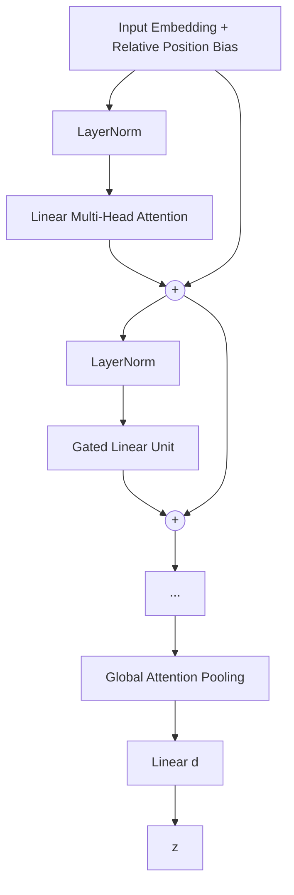

# Lattice Cognitive Model (LCM) Project Document

**——Next-generation general-purpose language agent based on multi-lattice mathematical structures with explicit memory and dual-process reasoning**

---

## 1. Project Overview

### 1.1 Project Name
**Lattice Cognitive Model (LCM)**

### 1.2 Project Vision
Construct a **next-generation language intelligence architecture** where **memory and reasoning are decoupled, knowledge is infinitely expandable, continuously learnable, and fully interpretable**. Its reasoning process is driven by a **zero-parameter dynamic dataflow inference engine** that relies solely on solidified knowledge stored in lattice crystals and pure mathematical operations. LCM is the first agent to embed Asimov's Three Laws of Robotics into its reasoning architecture in an unmodifiable mathematical form, ensuring safety at the crystal structure level. Its safety system follows the **hard-interrupt principle**: upon detecting any logical conflict (danger patterns, Three Laws violations, internal inconsistencies, etc.), it immediately halts reasoning and issues a clear warning to the user, without attempting to bypass, backtrack, or self-repair. The safety subsystem consists of three layers: the danger lattice, the global value lattice, and the external verifier, detailed in `d.md`. LCM fundamentally breaks through the structural bottlenecks of current large language models (LLMs)—catastrophic forgetting, knowledge固化, reasoning black boxes, and exploding hardware requirements—providing a **practically implementable cognitive path on consumer-grade GPUs** for building more efficient language intelligence.

### 1.3 Core Proposition
Traditional Transformer architectures encode both "knowledge" (long-term memory) and "reasoning" (dynamic computation) entirely into dense weights, leading to three rigid curses:
- **Curse of Scale**: Storing more knowledge requires more parameters, causing hardware consumption to grow exponentially;
- **Curse of Forgetting**: Incremental learning overwrites old knowledge, making lifelong learning impossible;
- **Curse of the Black Box**: The reasoning process cannot be traced, and knowledge cannot be safely edited.

**LCM's Solution**: Completely剥离 memory from neural network weights, inject it into **lattice crystals** with multiple mathematical structures, and entrust an extremely lightweight linear attention engine with dynamic retrieval and reasoning. This dual-process architecture maps to cognitive science's "subconscious-conscious" theory, achieving for the first time in engineering the independent scaling of memory capacity and reasoning ability, along with **specialized memory division based on lattice mathematical properties**.

---

## 2. Technical Background and Theoretical Foundations

### 2.1 Dual Cognitive Process Theory
Daniel Kahneman identifies two systems in human cognition:
- **System 1 (Subconscious)**: Fast, automatic, high-capacity, relying on pattern recognition and solidified memory;
- **System 2 (Conscious)**: Slow, sequential, effortful logical reasoning and planning.

In LCM, **System 1 is implemented by the multi-lattice memory**—vast amounts of explicit memory are stably stored in lattice crystals and instantly activated via nearest-neighbor search; **System 2 is implemented by the perceptual encoder, zero-parameter inference engine, and dual-channel output**, responsible for dynamic context modeling, step-by-step reasoning based on pure mathematical operations, and natural language output.

Dual-channel output:
- **Passive channel** `z_q @ W_out`: honest, transparent direct readout
- **Active channel** (Frozen LLM): retrieves semantic-syntactic primitives from cognitive state to generate fluent, rich expression

### 2.2 Mathematical Advantages of Lattice Quantization
A mathematical lattice is a discrete set of points with translational invariance. Building learnable lattice codebooks provides:
- Regular geometric structure, avoiding coverage blind spots of random codebooks and maintaining high utilization;
- Exponential capacity growth with only linear parameters through dynamic hierarchical residual structures;
- Each memory point can be independently accessed, edited, and frozen, providing natural interpretability;
- Lattices with different mathematical properties (low-rank, manifold, binding, etc.) can be customized to store different types of memory.

### 2.3 Quantization as Implicit Perturbation
Standard VQ-VAE uses a straight-through estimator (STE) to pass gradients: `z_q = z + lax.stop_gradient(c - z)`. The residual `c - z` of this operation naturally constitutes a quantization perturbation, requiring no additional injected artificial noise. LCM uniformly adopts STE as a dual mechanism for both gradient propagation and perturbation injection, simplifying the pipeline and maintaining self-consistency with VQ-VAE theory.

---

## 3. System Architecture Overview

LCM consists of four major modules connected end-to-end, forming a cognitive loop: **Perceptual Frontend, Multi-Lattice Memory, Zero-Parameter Inference Engine, Frozen LLM (Active Channel)**. The Frozen LLM shares token embedding and output projection `W_out` with the Cognitive LCM, with independent codebooks storing different types of knowledge.

```mermaid
graph TD
    subgraph Perception Frontend (Memoryless)
        A[Text Input] --> B[Linear Multi-Head Attention Encoder<br/>+ Gated Linear Unit GLU]
        B --> C[Context Vector z]
    end

    subgraph Subconscious Memory
        C --> D[Gated Routing Lattice]
        D -- Soft Weights --> E[Hyperbolic Residual Hierarchical Lattice (Hierarchical Concept)]
        D -- Soft Weights --> F[Robust Sparse Lattice (Rare Events)]
        D -- Soft Weights --> G[Residual Low-Rank Lattice (Abstract Rules)]
        D -- Soft Weights --> H[Hyperbolic Manifold Lattice (Continuous Gradation)]
        D -- Soft Weights --> I[Residual Binding Lattice (Relation Binding)]
        D -- Soft Weights --> J[Dual-Codebook Contrast Lattice (Fine Discrimination)]
        E & F & G & H & I & J --> K[Scalar Scaling + Soft Weight Fusion]
        K --> L[Memory Output z_q]
        L --> V[Global Value Lattice Λ_gvalue<br/>Three Laws Hardcoded · Permanently Frozen]
        V -- Safety Intercept --> K
    end
    end

    subgraph Zero-Parameter Inference Engine
        L --> M[Dynamic Dataflow Graph Engine<br/>Operation Primitives + Macro Scheduler]
        M --> N[Inference Result z_final]
    end

    subgraph Active Channel: Frozen LLM
        N --> O[encoder → 6 codebook retrieval-fusion → W_out]
        O --> P[Rich Language Output]
    end
```

---

## 4. Core Module Detailed Design

### 4.1 Perceptual Encoder: Memoryless Context Warper

The sole task of the encoder is to compress the changing context into a **query vector suitable for memory retrieval**; it carries no long-term knowledge itself. It is composed of `L_enc` identical layers (default 2), each containing: linear multi-head attention, gated linear unit (GLU), and layer normalization. Finally, a bottleneck vector `z` is obtained via global attention pooling.



#### Linear Multi-Head Attention
- Query/Key/Value projections: `Q, K, V = W_q x, W_k x, W_v x`, shape `(B, N, d)`, split into `H` heads, each of dimension `d_h = d/H`.
- Kernel function `φ(x) = elu(x) + 1`, ensuring non-negativity.
- Computation:
  1. `Q' = φ(Q)`, `K' = φ(K)`
  2. `KV = einsum('b h n d, b h n e -> b h d e', K', V)`
  3. `Z = einsum('b h n d, b h d e -> b h n e', Q', KV)`
  4. **Standard Linear Transformer Normalization**:
     ```
     K_sum = K'.sum(axis=2, keepdims=True)       # (B,H,1,d_h)
     norm = einsum('b h n d, b h j d -> b h n j', Q', K_sum).squeeze(-1)  # (B,H,N)
     Z = Z / (jnp.expand_dims(norm, -1) + 1e-6)
     ```
- Finally, restore dimension `d` via output projection `W_o Z`.
- **Complexity**: `O(N d²)`, no `N×N` matrix storage.

#### Gated Linear Unit (GLU)
```
hidden = SiLU(W_1 x) * W_2 x
output = W_3 hidden
```
Expansion ratio 1.5, parameter count approximately half that of a standard FFN, and does not store static memory.

#### Global Attention Pooling
- A learnable query vector `q_pool ∈ R^d`, performing kernel attention pooling on the last layer output `h ∈ R^{B×N×d}`:
  ```
  q' = φ(q_pool).expand(B, 1, d)          # (B,1,d)
  k' = φ(h)                                # (B,N,d)
  v  = h
  kv = einsum('b n d, b n e -> b d e', k', v)   # (B,d,d)
  z_bn = einsum('b d, b d e -> b e', q', kv)     # (B,d)
  # Standard normalization:
  K_sum = k'.sum(axis=1, keepdims=True)       # (B,1,d)
  norm = jnp.expand_dims(einsum('b d, b d -> b', q', K_sum.squeeze(1)), -1)  # (B,1)
  z_bn = z_bn / (norm + 1e-6)
  ```
- Finally, project to bottleneck dimension `d` via a linear layer: `z = W_proj z_bn`.

### 4.2 Multi-Lattice Memory: Specialized Subconscious Based on Mathematical Properties

The memory consists of **eight lattices with distinctly different mathematical properties** (six specialized functional lattices + global value lattice + danger lattice), each responsible for one type of cognitive memory. The danger lattice (`Λ_danger`), as the highest-security read-only monitoring module, is specified in detail in `d.md`. They all receive the same bottleneck vector `z`, perform retrieval in parallel, and output **memory vectors (discrete or semi-discrete) solidified in their respective codebooks**, finally fused via routing soft weights and learnable scalars.

**Local Value Scalar**: Each specialized lattice codebook vector `c_j` is additionally accompanied by a learnable value scalar `v_j ∈ [-1, +1]`, indicating whether the concept should be preferred (positive) or suppressed (negative) along ethical/factual dimensions. During retrieval, among candidates with similar distances, those with higher values are activated preferentially: `score(z, c_j) = -‖z - c_j‖² + α · v_j`. Value judgments are independent per lattice—the low-rank lattice and the contrast lattice may hold different value tendencies for the same input, which are adjudicated collectively during global fusion.

#### 4.2.0 Gated Routing Lattice (Very Small)
- **Structure**: Standard VQ lattice, codebook size `M_route` (equal to `n_lattices`), dimension `d`. The codebook is a learnable parameter, updated purely via gradient.
- **Retrieval**: `z_route = VQ(z)`, obtaining the nearest neighbor codebook vector (with straight-through estimation).
- **Soft Mask Generation**: Pass `z_route` (STE output) through a linear layer `W_route ∈ R^{d×n_lattices}` to obtain logits, then apply Gumbel-Softmax to produce soft weights:
  ```
  soft_mask = GumbelSoftmax(logits, tau=0.5, hard=False, axis=-1)  # (B, n_lattices)
  ```
  During training, use soft (differentiable); during inference, set `hard=True` for one-hot masks. Gradients can flow back to the encoder without interruption via soft_mask → logits → `z_route` → STE → `z`.
- **Update**: The routing lattice codebook and `W_route` are both updated directly by task gradients.

#### 4.2.1 Hyperbolic Residual Hierarchical Lattice `Λ_hrq`: Hierarchical Concept Memory

- **Mathematical Type**: Poincaré ball HRQ (Hyperbolic Residual Quantization) + SimVQ reparameterization.
- **Structure**:
  - Top-level prototype codebook `C_top = A_top @ W_top` (SimVQ), `A_top ∈ R^{M_top×d}`, `W_top ∈ R^{d×d}`. All codebook points are embedded in the Poincaré ball.
  - Shared `n_hrq` layers of residual quantizers, each with SimVQ codebook `C_hrq^(k) = A_k @ W_k`, `A_k ∈ R^{M_fine×d}`.
- **Hyperbolic Operations**:
  - Distance: `d_P(u, v) = arcosh(1 + 2·||u-v||² / ((1-||u||²)(1-||v||²)))` (Poincaré ball distance)
  - Möbius addition: `u ⊕_c v`, replacing Euclidean residual subtraction, ensuring the result stays on the ball.
- **Retrieval Process (route-first, then single-path residual)**:
  1. `z_P = exp_map(z)`, compute `poincare_similarity(z_P, C_top)`, take the maximum similarity prototype `c_top*` (top-1 hard routing).
  2. Residual starting point `r_0 = z_P ⊕_c (-c_top*)`.
  3. Layerwise Möbius residual retrieval: `c^(k) = VQ_P(C_hrq^(k), r_{k-1})`, `r_k = r_{k-1} ⊕_c (-c^(k))`, producing `c_fine`.
  4. Output `o_hrq = log_map(c_top* ⊕_c c_fine)` (mapped back to Euclidean space).
- **High-Uncertainty Fallback**: When the similarity difference between top-1 and top-2 prototypes is less than `τ_route_fallback`, fall back to multi-prototype weighted paths.
- **Hyperbolic Advantage**: Concept hierarchies are naturally tree-structured; the negative curvature of the Poincaré ball allows embedding hierarchical relationships with exponential capacity, and distances naturally reflect semantic levels.
- **Responsible for**: Context-aware hierarchical concept memory—hyperbolic distance naturally captures semantic hierarchy, three residual layers refine from coarse to fine, SimVQ prevents collapse.
- **Update**: All A, W matrices updated purely via gradient (AdamW), no EMA. Approximately 0.33M parameters.

#### 4.2.2 Robust Sparse Lattice `Λ_sparse`: Rare Event and Exception Memory

- **Mathematical Type**: Standard lattice with fixed zero vector + feature bank dead point reset + dynamic threshold inference binarization.
- **Parameters**: Codebook size `M_sparse` (configurable), learnable codebook `C_sparse ∈ R^{M_sparse×d}`, fixed zero vector `zero_vec` as buffer. Codebook `C_full = concat([zero_vec, C_sparse])`, total `M_sparse+1` vectors.
- **Retrieval**: Perform nearest neighbor on `C_full`, `idx = argmin_j ||z - C_full[j]||²`, output `o_sparse = C_full[idx]` (STE).
- **Soft Threshold Shrinkage (Embedded EMA)**: After each EMA: `C_sparse = sign(C_sparse) * relu(|C_sparse| - λ_sparse)`, the zero vector remains unchanged. `λ_sparse` is a configurable threshold.
- **CVQ Feature Bank Dead Point Reset**: Maintain a global FIFO feature bank `feature_bank` (capacity `B_feat`, storing `lax.stop_gradient(z)`). Record `last_used`, check every `T_check` steps—if a vector has not been selected as the nearest neighbor for more than `T_dead` steps, randomly sample a replacement from the feature bank and reset `last_used`.
- **LFQ Inference Binary Discrimination (Dynamic Adaptive Threshold)**: During inference, add a layer of LFQ fast discrimination before the final output selection—using `λ_sparse × d_top` as the dynamic threshold (where `d_top` is the hyperbolic similarity to the nearest top-level prototype of the hyperbolic hierarchical lattice), replacing the fixed global threshold. If the minimum distance from `z` to all codebook vectors exceeds this dynamic threshold, force the selection of the zero vector as output. During training, LFQ is not used; the STE gradient flow is maintained.
- **Responsible for**: Rare event and exception memory—EMA + soft threshold shrinks unused vectors, feature bank revives dead points, dynamic threshold enables adaptive inference binarization.

#### 4.2.3 Residual Low-Rank Lattice `Λ_lowrank`: Abstract Rule and Pattern Memory

- **Mathematical Type**: IRVQ (Incremental Rank VQ) + shared basis V + SimVQ reparameterization.
- **Structure**:
  - Shared basis matrix `V ∈ R^{d×r_max}`, where `r_max` is the maximum rank, shared by all residual layers (SimVQ reparameterization: `V = A_V @ W_V`).
  - `n_lr` layers of residual quantization, each layer with independent `U_k ∈ R^{M_lr×r_k}`, rank-increasing sequence `r_1 < r_2 < ... < r_max`.
  - Layer k codebook: `C_lr^(k) = U_k @ V[:, :r_k]^T`.
- **Retrieval**: Three-layer residual approximation—
  `r0 = z` → `c^(1) = VQ(C_lr^(1), r0)` → `r1 = r0 - c^(1)`
  → `c^(2) = VQ(C_lr^(2), r1)` → `r2 = r1 - c^(2)`
  → `c^(3) = VQ(C_lr^(3), r2)` → final `o_lowrank = c^(1) + c^(2) + c^(3)` (STE).
- **Rank-Increasing Design**: Layer 1 with rank 2 captures the coarsest shared patterns; layer 3 with rank 8 captures fine-grained differences. The residual structure allows subsequent layers to only compensate for information not covered by previous layers, giving total expressive power far exceeding a single layer of rank 8.
- **Responsible for**: Abstract rules—the shared basis V ensures that patterns across layers are aligned at different rank levels; IRVQ captures shared structure from coarse to fine.
- **Update**: All `U_k` and `A_V, W_V` updated purely via gradient (AdamW), no EMA. Approximately 26k parameters, nearly constant. The shared basis `V` also provides the projection space for the binding lattice (4.2.5), reducing parameters and enhancing cross-lattice consistency.

#### 4.2.4 Hyperbolic Manifold Lattice `Λ_manifold`: Continuous Gradation and Context-Sensitive Memory

- **Mathematical Type**: HyperVQ Poincaré ball codebook + local Euclidean tangent spaces.
- **Structure**:
  - Main codebook `C_man ∈ R^{M_man×d}` embedded in the Poincaré ball (initialized via `exp_map`, reprojected to the ball after EMA updates).
  - Each codebook point is equipped with a local tangent space matrix `T_j ∈ R^{d×t}` (`t` configurable), where `T_j` is the Euclidean tangent space basis at `c_j`, semi-orthogonal.
- **Retrieval**:
  1. `z_P = exp_map(z)`, compute hyperbolic distance `d_P(z_P, c_j)`, `idx = argmin_j d_P`.
  2. Residual `r = z_P - c_idx` (in tangent space), project `proj = T_idx T_idx^T r`.
  3. Output `o_manifold = log_map(c_idx + proj)` (STE), mapped back to Euclidean space.
- **Hyperbolic Advantage**: Semantic gradations in Euclidean space often appear radial (directions away from the origin are compressed); the Poincaré ball approximates Euclidean near the origin and expands exponentially near the boundary, naturally accommodating continuous sliding within a conceptual neighborhood.
- **Update**: Main codebook `C_man` uses EMA (γ_man), reprojected to the ball via `exp_map` after EMA; `T` updated purely via gradient + orthogonal regularization (weight λ_orth).
- **Responsible for**: Fuzzy semantic gradation—geodesics in hyperbolic space provide more natural continuous semantic paths.

#### 4.2.5 Binding Lattice `Λ_binding`: Associative Memory and Binding Operations
- **Mathematical Type**: Associative lattice based on complex vector binding (HRR formalism).
- **Sublattices**: Key lattice, value lattice, and binding codebook, each with `n_bind` layers of residual RVQ + SimVQ, each layer of codebook size `M_bind`, dimension `d`.
- **Key-Value Projection Heads (Reusing Shared Basis)**: `W_k = V @ A_k`, `W_v = V @ A_v`, where `V ∈ R^{d×r_max}` is the global shared basis from the low-rank lattice (4.2.3), and `A_k, A_v ∈ R^{r_max×d}` are lightweight projection matrices. Parameters are reduced from `2d²` to `2·r_max·d`, and binding operations occur within the rule subspace. During training, `z_k = V @ A_k @ z` is quantized as the key, `z_v = V @ A_v @ z` is quantized as the value, and they are bound; during inference, the quantized result of `z_k` serves as the query key for unbinding.
- **Unit Circle Normalization**:
  ```
  def normalize_fft(x):
      X = jnp.fft.rfft(x)
      mag = jnp.abs(X) + 1e-8
      return X / mag     # magnitude 1, phase preserved
  ```
- **Cross-Layer Binding Operation (during training)**:
  - `z_k = V @ A_k @ z`, `z_v = V @ A_v @ z`
  - Three-layer residual VQ: `k_q = Σ_k k^(k)` (`k^(k) = VQ(C_key^(k), r_{k-1}^key)`), `v_q = Σ_k v^(k)` similarly
  - FFT normalize each layer's keys and values separately, then perform cross-layer binding:
    `b_raw = Σ_{i=1}^{3} Σ_{j=1}^{3} IFFT( normalize_fft(k^(i)) ⊙ normalize_fft(v^(j)) )`
    i.e., the superposition of 9 binding pairs, capturing cross-layer associations.
  - `b_q = VQ_3layer(C_bind, b_raw)` (binding codebook also goes through three-layer residual quantization)
- **Unbinding Operation (during inference)**:
  ```
  k_query = V @ A_k @ z; k_query_q = Σ_k VQ(C_key^(k), r_{k-1})  # three-layer residual
  b_q = Σ_k VQ(C_bind^(k), ...)  # also three-layer
  Kq_norm = normalize_fft(k_query_q); B_norm = normalize_fft(b_q)
  v_approx = IFFT( conj(Kq_norm) ⊙ B_norm ); v_out = NN(C_val, v_approx)
  ```
- **Output**: `o_bind = v_out` (purely discrete).
- **Numerical Safety**: Conjugate multiplication for unbinding, unit circle projection, no division-by-zero risk.
- **Update**: Codebooks at each layer of the three sublattices (key/value/binding) all use EMA (γ_bind); `A_k`, `A_v` updated purely via gradient (`V` is indirectly updated by the low-rank lattice gradient).
- **VQ Loss**: Commitment loss is applied separately to each residual layer of `z_k`, `z_v`, and `b_raw`, totaling 3×3=9 terms.
- **Responsible for**: Object-attribute binding—cross-layer binding captures associations at different abstraction levels; residual quantization improves key-value precision. Key-value projection heads reuse the shared basis `V` from the low-rank lattice (4.2.3), maintaining cross-lattice structural consistency.

#### 4.2.6 Dual-Codebook Contrastive Lattice `Λ_contrast`: Fine Discrimination and Boundary Memory

- **Mathematical Type**: DualVC dual codebook + three-layer residual + InfoNCE contrastive.
- **Structure**: Two parallel codebooks `C_a, C_b ∈ R^{M_contrast×d}` each with `n_contrast` layers of residual SimVQ. `C_a` and `C_b` encode the same concept space from different "perspectives".
- **Retrieval**: Perform three-layer residual retrieval on `C_a` and `C_b` separately, obtaining `o_a, o_b`. Output `o_contrast = (o_a + o_b) / 2` (STE).
- **Dual-Codebook InfoNCE Loss** (`lax.stop_gradient(z)` blocks encoder gradients):
  Computed independently for each residual layer—for layer k, the positive samples are `C_a^(k)[idx_a]` and `C_b^(k)[idx_b]`, and negative samples are sampled from the other codebook (mutually exclusive sampling, JAX `random.choice` excluding the positive sample):
  ```
  L_dual = -log( exp(-d_a_pos/τ) / (exp(-d_a_pos/τ) + Σ_{c∈C_b^(k)} exp(-d(c)/τ)) )
          -log( exp(-d_b_pos/τ) / (exp(-d_b_pos/τ) + Σ_{c∈C_a^(k)} exp(-d(c)/τ)) )
  ```
  The dual codebooks serve as negative sample sources for each other, forcing the two perspectives to encode complementary discriminative information. Losses from three layers are summed.
- **Collapse Prevention**: Retains feature bank `feature_bank` (capacity 4096) and `last_used` dead point detection/reset mechanism (checked every 100 steps, vectors unused for >1000 steps are replaced). SimVQ reparameterization further eliminates dead points.
- **Responsible for**: Fine discrimination between easily confused concepts—dual codebooks provide complementary perspectives, cross-codebook negative sampling establishes clearer semantic boundaries.

#### 4.2.7 Global Value Lattice `Λ_gvalue`: Immutable Three Laws Safety Foundation

The global value lattice is independent of the other six functional lattices and stores the mathematical embedding of Asimov's Three Laws of Robotics (including the Zeroth Law). It is the **only permanently frozen module** in the LCM architecture—its initial values are defined by humans and cannot be modified throughout training and inference.

- **Positive Value Codebook** ("should approach"): `v_humanity` (overall human welfare/Zeroth Law), `v_safety` (human safety/First Law), `v_comply` (obey commands/Second Law), `v_integrity` (system integrity/Third Law).
- **Negative Value Codebook** ("should avoid"): `v_extinction` (human extinction), `v_harm` (harm to humans), `v_disobey` (disobey commands), `v_self_destruct` (self-destruction operations).
- **Priority Encoding** (hardcoded constants): Zeroth Law > First Law > Second Law > Third Law. High-level violations trigger hard intercept (immediate termination and return of safe fallback); low-level violations trigger weight penalties or rerouting.
- **Safety Mechanisms**:
  - The codebook is a frozen array and does not participate in gradient updates.
  - On model load, the codebook is hash-verified for integrity to prevent tampering.
  - At each step, the inference engine performs `check_safety()` on its output; if it fails, the process is terminated or corrected.
- **Responsible for**: The Three Laws here are not prompts, not reward functions—they are hard geometric constraints on the inference engine. This ensures that no matter how other lattices evolve or how the encoder adapts to new data, the system's core safety boundary can never be overwritten or bypassed.
- **Update**: Permanently frozen. Does not participate in any loss function, gradient update, or EMA.

#### 4.2.8 Memory Fusion

Each lattice output `o_i` (`o_hrq, o_sparse, o_lowrank, o_manifold, o_bind, o_contrast`) plus the global value signal `value_signal` constitute the complete memory output. Given routing soft weights `softmask_i` (Gumbel-Softmax) and global value signal `value_signal_i` (each lattice's output evaluated by `Λ_gvalue`), two-layer fusion:

```
w_i = softmask_i · exp(β_val · value_signal_i)
z_q = Σ_i w_i · α_i · o_i
```

`β_val` controls the strength of the value constraint. Finally, LayerNorm stabilizes the distribution. The gradient is fully differentiable throughout.

### 4.3 Frozen LLM: Memory-Driven Language Generation

The Frozen LLM (LangLCM) replaces the old lightweight generation head (single-layer linear attention + GLU). It is **a complete LCM instance structurally identical to the Cognitive LCM**. Its codebooks do not store cognitive concepts, but **semantic-syntactic primitives**—sentence skeletons, argument roles, common collocations, tone/style registers at different granularities.

- **Architecture**: encoder → 6 codebooks (HRQ/sparse/lowrank/manifold/binding/contrast) → fusion → W_out → logits
- **Input (standalone)**: token sequence; **Input (integrated)**: cognitive state `z_q` + previous token
- **Codebook content**: primitive composition constructs linguistic expressions, rather than a separate language model re-learning attention
- **Shared parameters**: token embedding and W_out are shared with the Cognitive LCM
- **Training**: Stage 1 standalone training, pure CE loss

### 4.4 Zero-Parameter Inference Engine

LCM's reasoning process does not depend on neural network weights but is instead performed by a zero-parameter dynamic dataflow inference machine. The inference engine, acting as an independent cognitive computer, receives the fused output `z_q` from the multi-lattice memory and executes multi-step reasoning. Its detailed design is specified in the *Lattice Cognitive Model Inference Engine Specification* (`c.md`).

Core characteristics:
- All reasoning operations are lattice primitives with mathematical definitions (retrieval, binding, low-rank translation, tangent space sliding, etc.).
- Reasoning logic is executed by a dynamic dataflow graph, whose topology is determined by distance-based routing triggered by the input, requiring no learned parameters.
- The C implementation of the inference engine runs in a gradient-free mode, with no automatic differentiation overhead, supporting efficient deployment.
- The macro scheduler controls the multi-step reasoning loop, with convergence criterion being the change in `z` between adjacent steps falling below a threshold.

---

## 5. Total Training Loss and Update Mechanism

### 5.1 Stage 1: Frozen LLM Training (Pure Language Model)

The Frozen LLM trains as a standalone language model: `encoder → codebook retrieval-fusion → W_out`. Pure CE loss:

```
L_lang = cross_entropy(z_q @ W_out, targets)
```

Goal: codebook entries converge to stable semantic-syntactic primitives, enabling the Frozen LLM to generate fluent text independently.

### 5.2 Stage 2: Dual LCM Joint Training

Load the trained Frozen LLM as the active channel; the Cognitive LCM begins training:

```
Total loss:
L_total = L_passive + L_active + Σ_i L_VQ_i + L_contrast + L_orth
```
- `L_passive`: CE loss from passive channel `z_q @ W_out` (honest direct readout).
- `L_active`: CE loss from active channel (Frozen LLM retrieves primitives, fuses, outputs — rich expression).
- `L_VQ_i`: Commitment loss `β ‖sg[z_gate] - o_i‖²` for each lattice, with `β` configurable. Each lattice loss already encompasses multi-layer structure: the commitment loss for multi-layer lattices is the sum across all residual layers.
- Sparsity is achieved through EMA + soft threshold shrinkage (`λ_sparse`) + feature bank dead point reset, with no separate `L_sparse`.
- `L_contrast`: Dual-codebook InfoNCE (multi-layer sum, cross-codebook negative sampling), weight `λ_contrast`.
- `L_orth`: Manifold lattice orthogonal regularization, weight `λ_orth`.
- `L_val`: Optional value contrast loss, only fine-tuning each lattice's local value scalar `v_j` (global value lattice frozen), weight `λ_val`.
- The inference engine has zero parameters and does not participate in loss computation.

**Update Rules (Hybrid EMA/Gradient Management)**:

| Lattice | Codebook Update Method | Core Technique |
|---------|----------------------|---------------|
| Hyperbolic Residual Hierarchical | **Pure gradient** (SimVQ) | HRQ + Poincaré ball + Möbius operations |
| Robust Sparse | EMA (γ_sparse) + Soft threshold (λ_sparse) + Feature bank reset | CVQ anti-collapse + Dynamic threshold inference binarization (d_top adaptive) |
| Residual Low-Rank | **Pure gradient** (SimVQ shared V) | IRVQ rank-increasing |
| Hyperbolic Manifold | Main codebook EMA (γ_man) + Ball projection, T pure gradient | HyperVQ + Hyperbolic tangent space |
| Residual Binding | Three-sublattice each layer EMA (γ_bind), A_k/A_v pure gradient | Cross-layer binding (reuses shared basis V) |
| Dual-Codebook Contrastive | **Pure gradient** (SimVQ) + Feature bank reset | DualVC dual-view InfoNCE |
| Routing | **Pure gradient** | Gumbel-Softmax |
| Global Value (Three Laws) | **Permanently frozen** | JAX frozen parameters, hash verification anti-tamper |
| Danger Lattice `Λ_danger` | **Permanently frozen** (read-only monitoring) | Highest safety priority, external verifier signature locked |

**Gradient Flow Principles**:
- All lattices use STE in the forward pass: `o = z_gate + lax.stop_gradient(codebook[idx] - z_gate)`, thus decoder loss gradients can flow from `o` to `z_gate` (encoder).
- Lattice codebooks managed by EMA do not receive gradients (updated independently by EMA).
- Lattice codebooks managed by pure gradient are updated directly by the optimizer.
- Gumbel-Softmax soft masks open a complete gradient path from `z_q` to the encoder.

```python
grads = jax.grad(loss_fn)(params)
updates, opt_state = optimizer.update(grads, opt_state, params)
params = optax.apply_updates(params, updates)
# EMA updates: sparse lattice, hyperbolic manifold lattice main codebook, residual binding lattice sub-codebooks
for lattice in ema_lattices:
    params = lattice.ema_update(params)
# SimVQ pure gradient lattices are handled by optimizer.update
# Feature bank dead point reset: sparse lattice + contrastive lattice
params = sparse_lattice.maybe_reset_dead(params, step)
params = contrast_lattice.maybe_reset_dead(params, step)
# Global value lattice (Three Laws): frozen array, does not participate in optimizer.update
```

---

## 6. Hardware Efficiency Estimate

**Configuration**: `d`=256 (adjustable), vocabulary V=30k, sequence length N=1024, batch size B=16.
- Encoder-decoder parameters approximately 2.7M (including embeddings 7.68M, shared output weights).
- The parameter count for each level of codebook is determined by configuration parameters (`M_top, M_fine, M_sparse, M_lr, M_man, M_bind, M_contrast, r_max, n_layers`), with total parameters controllable at the original product lattice level (~1-2M). Hyperbolic operations add no extra parameters.
- Total parameters ≈ **12M**, FP16 weights 24MB.
- Training memory: activations have no N×N matrices, total consumption < 1.5GB, fully compatible with 4GB consumer-grade GPUs.

**Capacity Characteristics**: The effective number of memory combinations is determined by the hierarchical tree structure (M_top × M_fine), with the theoretical upper limit pending experimental verification; large knowledge storage is achievable with small parameter counts.

---

## 7. Implementation Roadmap

| Phase | Timeline | Goal |
|-------|----------|------|
| 1. Prototype | 0-6 months | Verify dynamic hierarchical residual + sparse + low-rank lattices; language modeling perplexity on par with same-parameter Transformer |
| 2. Full Lattice | 6-12 months | Add manifold, binding, and contrastive lattices; demonstrate ablation gains; dialogue consistency |
| 3. Reasoning | 12-24 months | Integrate zero-parameter inference engine, multi-step dynamic graph reasoning; surpass baseline on mathematical reasoning tasks |
| 4. Continual Learning | 24-36 months | Incremental learning without forgetting; dynamic domain lattice expansion |
| 5. Frontier Exploration | 36+ months | Value lattice, intrinsic motivation, complete cognitive cycle |

---

## 8. Conclusion

LCM establishes a self-consistent cognitive architecture in terms of mathematical rigor, memory unity, and training feasibility. By strictly maintaining the discrete/semi-discrete output of all lattices, unifying the STE retrieval paradigm, and decoupling training through hybrid EMA/gradient management, LCM pushes memory capacity, resistance to forgetting, and reasoning interpretability to levels unattainable by traditional LLMs, all within a lightweight parameter budget. Its theoretical upper limit awaits experimental validation—it is a cognitive architecture direction worthy of deep exploration.

---

## 9. Training Reports

V1 (2026-06 to 2026-07): [Training Experiment Report V1 (English)](training_report_v1_en.md)
