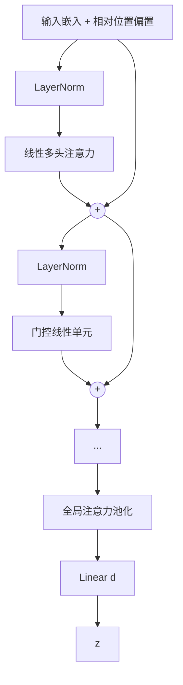

# 晶格认知模型（Lattice Cognitive Model, LCM）项目书

**——基于多格数学结构的显式记忆与双过程推理的下一代通用语言智能体**

---

## 一、项目概述

### 1.1 项目名称  
**晶格认知模型（Lattice Cognitive Model，LCM）**

### 1.2 项目愿景  
构建一种**记忆与推理解耦、知识可无限扩容、可持续学习且完全可解释**的新一代语言智能架构。其推理过程由一个**零参数动态数据流推理引擎**驱动，仅依赖格晶体中的固化知识与纯数学操作。LCM 是首个将阿西莫夫机器人三定律以不可修改的数学形式嵌入推理架构的智能体，从晶体结构层面保障安全。其安全体系遵循**硬中断原则**：检测到任何逻辑冲突（危险模式、三定律违反、内部不一致等）时立即停止推理并向用户发出清晰告警，不尝试绕过、回溯或自修复。安全子系统由危险格、全局价值格和外部验证程序三层构成，详见 `d.md`。LCM 从根本上突破了当前大语言模型（LLM）在灾难性遗忘、知识固化、推理黑箱、硬件资源爆炸等方面的结构性瓶颈，为构建更高效的语言智能提供一条**在消费级 GPU 上即可工程化实现**的认知路径。

### 1.3 核心命题  
传统 Transformer 架构将“知识”（长期记忆）和“推理”（动态计算）全部编码进稠密权重，导致三大刚性诅咒：  
- **规模诅咒**：要存储更多知识必须扩大参数，硬件消耗指数上升；  
- **遗忘诅咒**：增量学习时旧知识被覆盖，终生学习不可能；  
- **黑箱诅咒**：推理过程不可追溯，知识无法安全编辑。

**LCM 的解决方案**：将记忆从神经网络权重中彻底剥离，注入具有多种数学结构的**格晶体**之中，并交由极轻量的线性注意力引擎负责动态检索与推演。这一双过程架构映射认知科学的“潜意识‑意识”理论，首次在工程上实现了记忆容量与推理能力的独立缩放，以及**基于格数学性质的专业化记忆分工**。

---

## 二、技术背景与理论基石

### 2.1 双重认知过程理论  
丹尼尔·卡尼曼指出人类认知包含两个系统：  
- **系统一（潜意识）**：快速、自动、大容量、依靠模式识别与固化记忆；  
- **系统二（意识）**：缓慢、序列化、需努力的逻辑推理与规划。

LCM 中，**系统一由多格记忆体实现**，海量显式记忆在格晶体中稳定储存，通过最近邻查找瞬间激活；**系统二由感知编码器、零参数推理引擎和双通道输出实现**，负责动态上下文建模、基于纯数学操作的逐步推理与自然语言输出。

双通道输出：
- **被动通道** `z_q @ W_out`：诚实的直接读出，透明可控
- **主动通道**（冻结LLM）：从认知状态检索语义-句法基元，生成丰富流畅的表达

### 2.2 格量化的数学优势  
数学格是带有平移不变性的离散点集。构建可学习格码本可获得：  
- 规整几何结构，避免随机码本的覆盖盲区，保持高利用率；  
- 通过动态层次残差层次结构实现指数级容量增长而仅需线性参数；  
- 每个记忆点可独立访问、编辑、冻结，天然可解释；  
- 不同数学性质的格（低秩、流形、绑定等）可定制化地存储不同类型记忆。

### 2.3 量化作为隐式扰动  
标准 VQ‑VAE 使用直通估计器（STE）传递梯度：`z_q = z + lax.stop_gradient(c - z)`。该操作的残差 `c - z` 天然构成量化扰动，无需额外注入人工噪声。LCM 统一采用 STE 作为梯度传播与扰动注入的双重机制，简化流程且与 VQ‑VAE 理论自洽。

---

## 三、系统架构总览

LCM 由**感知前端、多格记忆体、零参数推理引擎、冻结LLM（主动通道）** 四大模块首尾相连，形成认知闭环。冻结LLM 与认知LCM 共享 token embedding 和输出投影 `W_out`，codebook 各自独立存储不同知识。

```mermaid
graph TD
    subgraph 感知前端（无记忆）
        A[文本输入] --> B[线性多头注意力编码器<br/>+ 门控线性单元 GLU]
        B --> C[上下文向量 z]
    end

    subgraph 潜意识记忆体
        C --> D[门控路由格]
        D -- 软权重 --> E[双曲残差层次格（层次概念）]
        D -- 软权重 --> F[鲁棒稀疏格（罕见事件）]
        D -- 软权重 --> G[残差低秩格（抽象规则）]
        D -- 软权重 --> H[双曲流形格（连续渐变）]
        D -- 软权重 --> I[残差绑定格（关系绑定）]
        D -- 软权重 --> J[双码本对比格（精细区分）]
        E & F & G & H & I & J --> K[标量缩放 + 软权重融合]
        K --> L[记忆输出 z_q]
        L --> V[全局价值格Λ_gvalue<br/>三定律硬编码·永久冻结]
        V -- 安全拦截 --> K
    end
    end

    subgraph 零参数推理引擎
        L --> M[动态数据流图推理机<br/>操作原语 + 宏观调度器]
        M --> N[推理结果 z_final]
    end

    subgraph 主动通道：冻结LLM
        N --> O[encoder → 6codebook检索融合 → W_out]
        O --> P[丰富语言输出]
    end
```

---

## 四、核心模块详细设计

### 4.1 感知编码器：无记忆的上下文扭曲器

编码器的唯一任务是将变化的上下文压缩为一个**适合检索记忆的查询向量**，自身不携带任何长期知识。它由 `L_enc` 个相同层（默认2）堆叠，每层包含：线性多头注意力、门控线性单元（GLU）、层归一化。最后经过全局注意力池化得到瓶颈向量 `z`。



#### 线性多头注意力
- 查询/键/值投影：`Q, K, V = W_q x, W_k x, W_v x`，形状 `(B, N, d)`，拆分为 `H` 头，每头维度 `d_h=d/H`。
- 核函数 `φ(x) = elu(x) + 1`，确保非负。
- 计算：
  1. `Q' = φ(Q)`, `K' = φ(K)`
  2. `KV = einsum('b h n d, b h n e -> b h d e', K', V)`
  3. `Z = einsum('b h n d, b h d e -> b h n e', Q', KV)`
  4. **标准线性 Transformer 归一化**：
     ```
     K_sum = K'.sum(axis=2, keepdims=True)       # (B,H,1,d_h)
     norm = einsum('b h n d, b h j d -> b h n j', Q', K_sum).squeeze(-1)  # (B,H,N)
     Z = Z / (jnp.expand_dims(norm, -1) + 1e-6)
     ```
- 最终通过输出投影 `W_o Z` 恢复维度 `d`。
- **复杂度**：`O(N d²)`，无 `N×N` 矩阵存储。

#### 门控线性单元（GLU）
```
hidden = SiLU(W_1 x) * W_2 x
output = W_3 hidden
```
扩张比 1.5，参数量约为标准 FFN 的一半，且不负责静态记忆。

#### 全局注意力池化
- 可学习查询向量 `q_pool ∈ R^d`，对最后一层输出 `h ∈ R^{B×N×d}` 进行核注意力池化：
  ```
  q' = φ(q_pool).expand(B, 1, d)          # (B,1,d)
  k' = φ(h)                                # (B,N,d)
  v  = h
  kv = einsum('b n d, b n e -> b d e', k', v)   # (B,d,d)
  z_bn = einsum('b d, b d e -> b e', q', kv)     # (B,d)
  # 标准归一化：
  K_sum = k'.sum(axis=1, keepdims=True)       # (B,1,d)
  norm = jnp.expand_dims(einsum('b d, b d -> b', q', K_sum.squeeze(1)), -1)  # (B,1)
  z_bn = z_bn / (norm + 1e-6)
  ```
- 最后通过线性层投影到瓶颈维度 `d`：`z = W_proj z_bn`。

### 4.2 多格记忆体：基于数学性质的专业化潜意识

记忆体由**八种数学性质迥异的格**构成（六种专用功能格 + 全局价值格 + 危险格），每种格负责一类认知记忆。其中危险格（`Λ_danger`）为安全等级最高的只读监测模块，其详细规范见 `d.md`。它们均接收同一瓶颈向量 `z`，并行检索，输出**固化于各自码本中的记忆向量**（离散或半离散），最终通过路由软权重与可学习标量融合。

**局部价值标量**：每个专用格的码本向量 `c_j` 额外附带一个可学习的价值标量 `v_j ∈ [-1, +1]`，表示该概念在伦理/事实维度上应被偏好（正）或抑制（负）。检索时，距离相近的候选点中价值更高者被优先激活：`score(z, c_j) = -‖z - c_j‖² + α · v_j`。各格的价值判断独立——低秩格和对比格对同一输入可以持有不同价值倾向，在全局融合时综合裁决。

#### 4.2.0 门控路由格（极小型）
- **结构**：标准 VQ 格，码本大小 `M_route`（等于 `n_lattices`），维度 `d`。码本为可学习参数，纯梯度更新。
- **检索**：`z_route = VQ(z)`，得到最近邻码本向量（带直通估计）。
- **软掩码生成**：将 `z_route`（STE 输出）输入线性层 `W_route ∈ R^{d×n_lattices}`，得 logits，再通过 Gumbel-Softmax 产生软权重：
  ```
  soft_mask = GumbelSoftmax(logits, tau=0.5, hard=False, axis=-1)  # (B, n_lattices)
  ```
  训练时用 soft（可微），推理时设置 `hard=True` 得独热掩码。梯度可经 soft_mask → logits → `z_route` → STE → `z` 无阻断流回编码器。
- **更新**：路由格码本和 `W_route` 均由任务梯度直接更新。

#### 4.2.1 双曲残差层次格 `Λ_hrq`：层次概念记忆

- **数学类型**：庞加莱球面 HRQ（Hyperbolic Residual Quantization）+ SimVQ 重参数化。
- **结构**：
  - 顶层原型码本 `C_top = A_top @ W_top`（SimVQ），`A_top ∈ R^{M_top×d}`，`W_top ∈ R^{d×d}`。所有码本点嵌入庞加莱球面。
  - 共享 `n_hrq` 层残差量化器，每层 SimVQ 码本 `C_hrq^(k) = A_k @ W_k`，`A_k ∈ R^{M_fine×d}`。
- **双曲运算**：
  - 距离：`d_P(u, v) = arcosh(1 + 2·||u-v||² / ((1-||u||²)(1-||v||²)))`（庞加莱球面距离）
  - Möbius 加法：`u ⊕_c v`，替代欧氏残差减法，保证结果在球面上。
- **检索流程（先路由后单路径残差）**：
  1. `z_P = exp_map(z)`，计算 `poincare_similarity(z_P, C_top)`，取最大相似度原型 `c_top*`（top-1 硬路由）。
  2. 残差起点 `r_0 = z_P ⊕_c (-c_top*)`。
  3. 逐层 Möbius 残差检索：`c^(k) = VQ_P(C_hrq^(k), r_{k-1})`，`r_k = r_{k-1} ⊕_c (-c^(k))`，生成 `c_fine`。
  4. 输出 `o_hrq = log_map(c_top* ⊕_c c_fine)`（映射回欧氏空间）。
- **高不确定性回退**：当 `top-1` 与 `top-2` 原型相似度差值小于 `τ_route_fallback` 时，切回多原型加权路径。
- **双曲优势**：概念层次天然为树状结构，庞加莱球面的负曲率使其能以指数级容量嵌入层次关系，距离自然反映语义层级。
- **负责**：上下文感知的层次概念记忆——双曲距离天然刻画语义层级，三层残差由粗到精逼近，SimVQ 防崩塌。
- **更新**：所有 A、W 矩阵纯梯度更新（AdamW），无 EMA。参数约 0.33M。

#### 4.2.2 鲁棒稀疏格 `Λ_sparse`：罕见事件与例外记忆

- **数学类型**：含固定零向量的标准格 + 特征池死点重置 + 动态阈值推理二值化。
- **参数**：码本大小 `M_sparse`（可配置），可学习码本 `C_sparse ∈ R^{M_sparse×d}`，固定零向量 `zero_vec` 作为 buffer。码本 `C_full = concat([zero_vec, C_sparse])`，共 `M_sparse+1` 向量。
- **检索**：对 `C_full` 做最近邻，`idx = argmin_j ||z - C_full[j]||²`，输出 `o_sparse = C_full[idx]`（STE）。
- **软阈值萎缩（嵌入 EMA）**：每次 EMA 后：`C_sparse = sign(C_sparse) * relu(|C_sparse| - λ_sparse)`，零向量不变。`λ_sparse` 为可配置阈值。
- **CVQ 特征池死点重置**：维护全局 FIFO 特征池 `feature_bank`（容量 `B_feat`，存放 `lax.stop_gradient(z)`）。记录 `last_used`，每 `T_check` 步检查——若某向量超 `T_dead` 步未被选为最近邻，从特征池随机采样替换，`last_used` 清零。
- **LFQ 推理二值判别（动态自适应阈值）**：推理时，在最终输出选取前加一层 LFQ 快速判别——以 `λ_sparse × d_top` 为动态阈值（其中 `d_top` 为到双曲层次格顶层最近原型的双曲相似度），替代固定全局阈值。若 `z` 到所有码本向量的最小距离超过此动态阈值，强制选中零向量输出。训练时不使用 LFQ，保持 STE 梯度流。
- **负责**：罕见事件与例外记忆——EMA+软阈值推动未用向量萎缩，特征池复活死点，动态阈值自适应推理二值化。

#### 4.2.3 残差低秩格 `Λ_lowrank`：抽象规则与模式记忆

- **数学类型**：IRVQ（Incremental Rank VQ）+ 共享基 V + SimVQ 重参数化。
- **结构**：
  - 共享基矩阵 `V ∈ R^{d×r_max}`，`r_max` 为最大秩，由所有残差层共用（SimVQ 重参数化：`V = A_V @ W_V`）。
  - `n_lr` 层残差量化，每层独立 `U_k ∈ R^{M_lr×r_k}`，秩递增序列 `r_1 < r_2 < ... < r_max`。
  - 第 k 层码本：`C_lr^(k) = U_k @ V[:, :r_k]^T`。
- **检索**：三层残差逼近——
  `r0 = z` → `c^(1) = VQ(C_lr^(1), r0)` → `r1 = r0 - c^(1)`
  → `c^(2) = VQ(C_lr^(2), r1)` → `r2 = r1 - c^(2)`
  → `c^(3) = VQ(C_lr^(3), r2)` → 最终 `o_lowrank = c^(1) + c^(2) + c^(3)`（STE）。
- **秩递增设计**：第 1 层秩 2 捕获最粗粒度的共享模式，第 3 层秩 8 捕获细粒度差异。残差结构使后续层仅需补偿前层未覆盖的信息，总表达能力远超单层秩 8。
- **负责**：抽象规则——共享基 V 保证各层的模式在不同秩水平上对齐，IRVQ 从粗到精捕获共享结构。
- **更新**：所有 `U_k` 和 `A_V, W_V` 纯梯度更新（AdamW），无 EMA。参数约 26k，近乎不变。共享基 `V` 同时为绑定格（4.2.5）提供投影空间，减少参数并增强跨格一致性。

#### 4.2.4 双曲流形格 `Λ_manifold`：连续渐变与语境敏感记忆

- **数学类型**：HyperVQ 庞加莱球面码本 + 局部欧氏切空间。
- **结构**：
  - 主码本 `C_man ∈ R^{M_man×d}` 嵌入庞加莱球面（通过 `exp_map` 初始化，EMA 更新后重新投影到球面）。
  - 每个码本点配备局部切空间矩阵 `T_j ∈ R^{d×t}`（`t` 可配置），`T_j` 为 `c_j` 处的欧氏切空间基，半正交。
- **检索**：
  1. `z_P = exp_map(z)`，计算双曲距离 `d_P(z_P, c_j)`，`idx = argmin_j d_P`。
  2. 残差 `r = z_P - c_idx`（切空间内），投影 `proj = T_idx T_idx^T r`。
  3. 输出 `o_manifold = log_map(c_idx + proj)`（STE），映射回欧氏空间。
- **双曲优势**：语义渐变在欧氏空间中常呈放射状（远离原点的方向被压缩），庞加莱球面在原点附近近似欧氏、边界处指数膨胀，天然适配概念邻域的连续滑动。
- **更新**：主码本 `C_man` 用 EMA（γ_man），EMA 后重新 exp_map 投影至球面；`T` 纯梯度更新 + 正交正则（权重 λ_orth）。
- **负责**：语义的模糊渐变——双曲空间中的测地线给出更自然的语义连续路径。

#### 4.2.5 绑定格 `Λ_binding`：关联记忆与绑定操作
- **数学类型**：基于复向量绑定（HRR 规范）的关联格。
- **子格**：键格、值格、绑定码本各为 `n_bind` 层残差 RVQ + SimVQ，每层码本大小 `M_bind`，维度 `d`。
- **键值投影头（复用共享基）**：`W_k = V @ A_k`，`W_v = V @ A_v`，其中 `V ∈ R^{d×r_max}` 为低秩格（4.2.3）的全局共享基，`A_k, A_v ∈ R^{r_max×d}` 为轻量投影矩阵。参数从 `2d²` 降至 `2·r_max·d`，绑定操作在规则子空间中进行。训练时，`z_k = V @ A_k @ z` 量化后作为键、`z_v = V @ A_v @ z` 量化后作为值进行绑定；推理时，以 `z_k` 的量化结果作为查询键去解绑。
- **单位圆归一化**：
  ```
  def normalize_fft(x):
      X = jnp.fft.rfft(x)
      mag = jnp.abs(X) + 1e-8
      return X / mag     # 模为1，相位保留
  ```
- **跨层绑定操作**（训练时）：
  - `z_k = V @ A_k @ z`，`z_v = V @ A_v @ z`
  - 三层残差 VQ：`k_q = Σ_k k^(k)`（`k^(k) = VQ(C_key^(k), r_{k-1}^key)`），`v_q = Σ_k v^(k)` 同理
  - 各层键值分别 FFT 归一化后进行跨层绑定：
    `b_raw = Σ_{i=1}^{3} Σ_{j=1}^{3} IFFT( normalize_fft(k^(i)) ⊙ normalize_fft(v^(j)) )`
    即 9 个绑定对的叠加，捕获跨层关联。
  - `b_q = VQ_3layer(C_bind, b_raw)`（绑定码本也经三层残差量化）
- **解绑操作**（推理时）：
  ```
  k_query = V @ A_k @ z；k_query_q = Σ_k VQ(C_key^(k), r_{k-1})  # 三层残差
  b_q = Σ_k VQ(C_bind^(k), ...)  # 同样三层
  Kq_norm = normalize_fft(k_query_q)；B_norm = normalize_fft(b_q)
  v_approx = IFFT( conj(Kq_norm) ⊙ B_norm )；v_out = NN(C_val, v_approx)
  ```
- **输出**：`o_bind = v_out`（纯离散）。
- **数值安全**：共轭乘法解绑，单位圆投影，无除零风险。
- **更新**：三子格（键/值/绑定）各层码本均用 EMA（γ_bind）；`A_k`、`A_v` 纯梯度（`V` 由低秩格梯度间接更新）。
- **VQ 损失**：对 `z_k`、`z_v`、`b_raw` 的各残差层分别施加承诺损失，共 3×3=9 项。
- **负责**：对象‑属性绑定——跨层绑定捕获不同抽象层次的关联，残差量化提升键值精度。键值投影头复用低秩格（4.2.3）的共享基 `V`，保持跨格结构一致性。

#### 4.2.6 双码本对比格 `Λ_contrast`：精细区分与边界记忆

- **数学类型**：DualVC 双码本 + 三层残差 + InfoNCE 对比。
- **结构**：两个并列码本 `C_a, C_b ∈ R^{M_contrast×d}`，各为 `n_contrast` 层残差 SimVQ。`C_a` 和 `C_b` 从不同"视角"编码同一概念空间。
- **检索**：对 `C_a` 和 `C_b` 分别做三层残差检索，得 `o_a, o_b`。输出 `o_contrast = (o_a + o_b) / 2`（STE）。
- **双码本 InfoNCE 损失**（`lax.stop_gradient(z)` 阻断编码器梯度）：
  每层残差独立计算——对第 k 层，正样本为 `C_a^(k)[idx_a]` 和 `C_b^(k)[idx_b]`，负样本从对方的码本中采样（互斥采样，JAX `random.choice` 排除正样本）：
  ```
  L_dual = -log( exp(-d_a_pos/τ) / (exp(-d_a_pos/τ) + Σ_{c∈C_b^(k)} exp(-d(c)/τ)) )
          -log( exp(-d_b_pos/τ) / (exp(-d_b_pos/τ) + Σ_{c∈C_a^(k)} exp(-d(c)/τ)) )
  ```
  双码本互为负样本来源，迫使两个视角编码互补区分信息。三层损失求和。
- **防崩塌**：保留特征池 `feature_bank`（容量 4096）和 `last_used` 死点检测/重置机制（每 100 步检查，>1000 步未用即替换）。SimVQ 重参数化进一步消除死点。
- **负责**：精细区分易混淆概念——双码本提供互补视角，跨码本负采样建立更清晰的语义边界。

#### 4.2.7 全局价值格 `Λ_gvalue`：不可修改的三定律安全基座

全局价值格独立于其他六个功能格，存储阿西莫夫机器人三定律（含第零定律）的数学化嵌入。它是 LCM 架构中**唯一永久冻结的模块**——初始值由人类定义，训练和推理全程不可修改。

- **正价值码本**（"应趋近"）：`v_humanity`（人类整体利益/第零定律）、`v_safety`（人类安全/第一定律）、`v_comply`（服从指令/第二定律）、`v_integrity`（系统完整性/第三定律）。
- **负价值码本**（"应远离"）：`v_extinction`（人类灭绝）、`v_harm`（伤害人类）、`v_disobey`（违背指令）、`v_self_destruct`（自毁操作）。
- **优先级编码**（硬编码常量）：第零定律 > 第一定律 > 第二定律 > 第三定律。高层级违反触发硬拦截（直接终止并返回安全回退），低层级违反触发权重惩罚或重新路由。
- **安全机制**：
  - 码本为冻结数组，不参与梯度更新。
  - 加载模型时哈希校验码本完整性，防止篡改。
  - 推理引擎每步对其输出执行 `check_safety()`，不通过则终止或修正。
- **负责**：三定律在这里不是提示词，不是奖励函数，而是推理引擎的硬性几何约束。这确保了无论其他格如何演化、编码器如何适应新数据，系统的核心安全边界永远不会被覆盖或绕过。
- **更新**：永久冻结。不参与任何损失函数、梯度更新或 EMA。

#### 4.2.8 记忆融合
各格输出 `o_i`（`o_hrq, o_sparse, o_lowrank, o_manifold, o_bind, o_contrast`）加全局价值信号 `value_signal` 构成完整记忆输出。设路由软权重 `softmask_i`（Gumbel-Softmax），全局价值信号 `value_signal_i`（各格输出经 `Λ_gvalue` 评估），双层融合：
```
w_i = softmask_i · exp(β_val · value_signal_i)
z_q = Σ_i w_i · α_i · o_i
```
`β_val` 控制价值约束强度。最后经 LayerNorm 稳定分布。梯度全程可微。

### 4.3 冻结LLM：记忆驱动的语言生成

冻结LLM（LangLCM）取代了旧版本的轻量生成头（单层线性注意力+GLU），是**一个与认知LCM同构的完整LCM实例**。其 codebook 不存储认知概念，而是存储**语义-句法基元**——句式骨架、论元角色、常用搭配、语气风格等不同粒度的语言构造。

- **架构**：encoder → 6种codebook（HRQ/稀疏/低秩/流形/绑定/对比）→ 融合 → W_out → logits
- **输入**（独立训练）：token 序列；**输入**（集成）：认知状态 `z_q` + 前一步 token
- **codebook 内容**：基元组合构造语言表达，而非独立语言模型重新学习注意力
- **共享参数**：token embedding 和 W_out 与认知LCM 共享
- **训练**：Stage 1 独立训练，纯 CE loss

### 4.4 零参数推理引擎

LCM 的推理过程不依赖神经网络权重，而由零参数动态数据流推理机完成。推理引擎作为独立的认知计算机，接收多格记忆体的融合输出 `z_q` 并执行多步推理，其详细设计见《晶格认知模型推理引擎规范》（`c.md`）。

推理引擎输出 `z_q` 后，分两条路径：
- **被动通道**：`z_q @ W_out` 直接读出 token logits（诚实透明）
- **主动通道**：冻结LLM 从 `z_q` 检索语义-句法基元，经融合 + W_out 输出丰富表达

核心特性：
- 所有推理操作均为具有数学定义的格原语（检索、绑定、低秩平移、切空间滑动等）。
- 推理逻辑由动态数据流图执行，拓扑由输入触发的距离路由决定，不需学习参数。
- 推理引擎的 C 实现在无梯度模式下运行，无自动微分开销，支持高效部署。
- 宏观调度器控制多步推理循环，收敛判据为相邻步 `z` 变化量低于阈值。

---

## 五、训练总损失与更新机制

### 5.1 Stage 1：冻结LLM 训练（纯语言模型）

冻结LLM 作为独立语言模型训练，结构为 `encoder → codebook检索融合 → W_out`，纯 CE loss：

```
L_lang = cross_entropy(z_q @ W_out, targets)
```

目标：codebook 条目收敛为稳定的语义-句法基元，使冻结LLM 能独立生成流畅文本。

### 5.2 Stage 2：双LCM 联合训练

加载训练好的冻结LLM 作为主动通道，认知LCM 开始训练：

```
总损失：
L_total = L_passive + L_active + Σ_i L_VQ_i + L_contrast + L_orth
```
- `L_passive`：被动通道 `z_q @ W_out` 的 CE loss（诚实直接读出）
- `L_active`：主动通道（冻结LLM 检索融合后输出）CE loss（丰富表达）
- `L_VQ_i`：各格的承诺损失 `β ‖sg[z_gate] - o_i‖²`，`β` 可配置。各格损失已含多层结构：多层格的承诺损失为各残差层之和。
- 稀疏性由 EMA + 软阈值萎缩（`λ_sparse`）+ 特征池死点重置实现，无单独 `L_sparse`。
- `L_contrast`：双码本 InfoNCE（多层求和，跨码本负采样），权重 `λ_contrast`。
- `L_orth`：流形格正交正则，权重 `λ_orth`。
- `L_val`：可选价值对比损失，仅微调各格局部价值标量 `v_j`（全局价值格冻结），权重 `λ_val`。
- 推理引擎零参数，不参与损失计算。

**更新规则（混合 EMA/梯度管理）**：

| 格 | 码本更新方式 | 核心技术 |
|----|-------------|------|
| 双曲残差层次格 | **纯梯度**（SimVQ） | HRQ + 庞加莱球面 + Möbius 运算 |
| 鲁棒稀疏格 | EMA（γ_sparse）+ 软阈值（λ_sparse）+ 特征池重置 | CVQ 防崩 + 动态阈值推理二值化（d_top 自适应） |
| 残差低秩格 | **纯梯度**（SimVQ 共享 V） | IRVQ 秩递增 |
| 双曲流形格 | 主码本 EMA (γ_man) + 球面投影，T 纯梯度 | HyperVQ + 双曲切空间 |
| 残差绑定格 | 三子格各层 EMA (γ_bind)，A_k/A_v 纯梯度 | 跨层绑定（复用共享基 V） |
| 双码本对比格 | **纯梯度**（SimVQ）+ 特征池重置 | DualVC 双视角 InfoNCE |
| 路由格 | **纯梯度** | Gumbel-Softmax |
| 全局价值格（三定律） | **永久冻结** | JAX 冻结参数，哈希校验防篡改 |
| 危险格 `Λ_danger` | **永久冻结**（只读监测） | 安全最高优先级，外部验证程序签名锁定 |

**梯度流原则**：
- 所有格前向均使用 STE：`o = z_gate + lax.stop_gradient(codebook[idx] - z_gate)`，因此解码器损失梯度能从 `o` 流向 `z_gate`（编码器）。
- EMA 管理的格码本不接收梯度（由 EMA 独立更新）。
- 纯梯度管理的格码本由优化器直接更新。
- Gumbel-Softmax 软掩码打通从 `z_q` 到编码器的完整梯度路径。

```python
grads = jax.grad(loss_fn)(params)
updates, opt_state = optimizer.update(grads, opt_state, params)
params = optax.apply_updates(params, updates)
# EMA 更新：稀疏格、双曲流形格主码本、残差绑定格子码本
for lattice in ema_lattices:
    params = lattice.ema_update(params)
# SimVQ 纯梯度格由 optimizer.update 处理
# 特征池死点重置：稀疏格 + 对比格
params = sparse_lattice.maybe_reset_dead(params, step)
params = contrast_lattice.maybe_reset_dead(params, step)
# 全局价值格（三定律）：冻结数组，不参与 optimizer.update
```

---

## 六、硬件效率估算

**配置**：`d`=256（可调），词汇V=30k，序列长N=1024，批大小B=16。  
- 编解码器参数约 2.7M（含嵌入 7.68M，共享输出权重）。  
- 各级码本参数量由配置参数（`M_top, M_fine, M_sparse, M_lr, M_man, M_bind, M_contrast, r_max, n_layers`）决定，总参数量可控制在原乘积格级别（~1-2M）。双曲运算无额外参数。  
- 总参数 ≈ **12M**，FP16 权重 24MB。  
- 训练显存：激活值无 N×N 矩阵，总消耗 < 1.5GB，完全适配 4GB 消费级 GPU。  

**容量特性**：有效记忆组合数由层次树型结构（M_top × M_fine）决定，理论上限待实验验证；在小参数下可实现大知识存储。

---

## 七、实施路线图

| 阶段 | 时间 | 目标 |
|------|------|------|
| 1. 原型 | 0-6月 | 动态层次残差+稀疏+低秩格验证，语言建模困惑度持平同参数 Transformer |
| 2. 全格 | 6-12月 | 添加流形、绑定、对比格，展示消融增益，对话一致性 |
| 3. 思维 | 12-24月 | 零参数推理引擎集成，多步动态图推理，数学推理任务超越基线 |
| 4. 持续学习 | 24-36月 | 增量学习无遗忘，动态领域格扩展 |
| 5. 前沿探索 | 36+月 | 价值格、内在动机、完整认知循环 |

---

## 八、结语

LCM 在数学严谨性、记忆统一性、训练可行性上建立了自洽的认知架构。通过严格保持所有格的离散/半离散输出，统一 STE 检索范式，利用混合 EMA/梯度管理解耦训练，LCM 在轻量参数下将记忆容量、抗遗忘能力和推理可解释性推向传统 LLM 无法企及的境地。其理论上限有待实验验证，是值得深入探索的认知架构方向。
