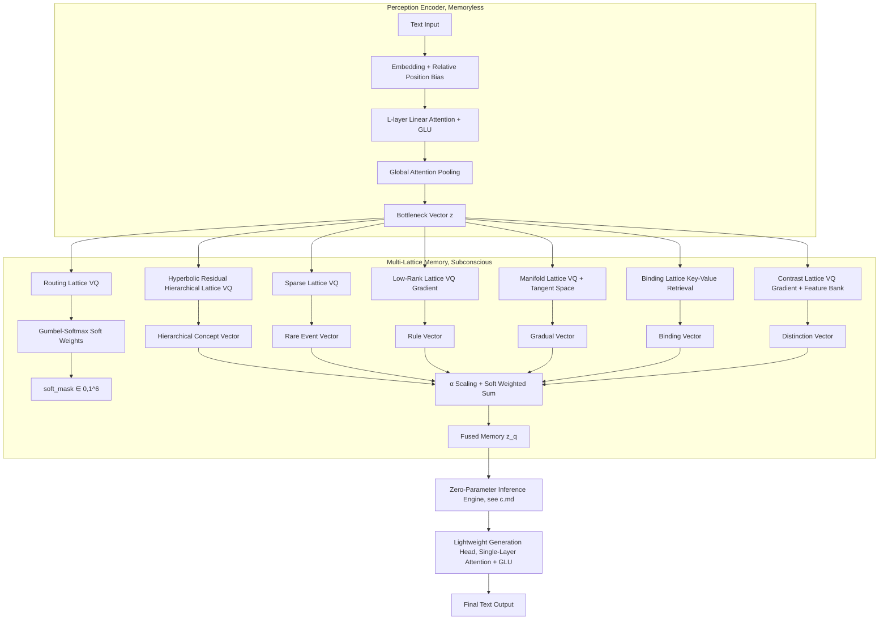

# Lattice Cognitive Model (LCM) Technical Specification and Implementation Guide v3.0

> **Version Notes**: This technical document provides a comprehensive mathematical refinement of the core modules of the "Lattice Cognitive Model (LCM)" project book, covering complete engineering implementation details from discrete memory lattices, generation head, to training losses. v3.0 completely rewrites the codebook update mechanism (hybrid EMA/gradient management), the binding lattice unbinding method (conjugate multiplication), routing gating (Gumbel-Softmax), contrast lattice collapse prevention (feature bank), low-rank lattice parameterization (pure gradient), and linear attention normalization, abolishes the FSP module, and separates the inference process into an independent zero-parameter inference engine (see c.md). **v4.0 new**: Generation head (single-layer linear attention+GLU) replaced by **Active Channel (pretrained LLM)** — a complete LCM instance structurally identical to the Cognitive LCM, with codebooks storing semantic-syntactic primitives, constructing linguistic expressions via retrieval and fusion.

---

## 1. Notation and Global Conventions

| Symbol | Meaning | Recommended Value (all configurable) |
|------|------|--------|
| `B` | Batch size | 16 |
| `N` | Sequence length | 512 |
| `d` | Hidden/bottleneck dimension | 256 |
| `H` | Number of attention heads | 4 |
| `d_h` | Dimension per head `d/H` | 64 |
| `n_layers` | Number of residual quantization layers per lattice | 3 |
| `M_top` | Number of top-level prototypes in hyperbolic residual hierarchical lattice | 64 |
| `M_fine` | Bottom-level codebook size in hyperbolic residual hierarchical lattice | 64 |
| `M_sparse` | Sparse lattice codebook size | 512 |
| `M_lr` | Low-rank lattice codebook size | 1024 |
| `M_man` | Manifold lattice codebook size | 512 |
| `M_bind` | Binding lattice sub-codebook size | 512 |
| `M_contrast` | Contrast lattice codebook size | 512 |
| `M_route` | Routing lattice codebook size | 6 |
| `r_max` | Maximum rank for low-rank lattice | 8 |
| `r_k` | Rank sequence for layer k of low-rank lattice | `[2, 4, 8]` |
| `t` | Manifold lattice tangent space dimension | 4 |
| `γ_prod` | Product-correlation EMA decay rate | 0.999 |
| `γ_sparse` | Sparse lattice EMA decay rate | 0.99 |
| `γ_man` | Manifold lattice main codebook EMA decay rate | 0.99 |
| `γ_bind` | Binding lattice EMA decay rate | 0.99 |
| `β` | VQ commitment loss coefficient | 0.25 |
| `λ_sparse` | Sparse lattice soft threshold shrinkage + inference dynamic threshold scaling factor | 1e-4 |
| `λ_contrast` | Contrast loss weight | 0.1 |
| `λ_orth` | Manifold lattice orthogonal regularization weight | 0.01 |
| `τ_contrast` | Contrast loss temperature | 0.1 |
| `τ_val` | Value bias negative sampling temperature | 0.05 |
| `τ_gumbel` | Gumbel-Softmax temperature | 0.5 |
| `τ_route_fallback` | Hyperbolic hierarchical lattice routing fallback threshold | 0.1 |
| `ε` | Numerical stability constant | 1e-6 |
| `T_check` | Dead code check interval (steps) | 100 |
| `T_dead` | Dead code determination threshold (steps) | 1000 |
| `B_feat` | Feature bank capacity | 4096 |
| `M_gval` | Global value lattice codebook size | 128 |
| `β_val` | Value constraint strength | 0.5 |
| `α_val` | Local value bias intensity (dimensionless, normalized by avg_dist²) | 0.1 |
| `M_danger` | Danger lattice codebook size | 256 |
| `safety_margin_relative` | Three Laws relative safety criterion offset | 0.5 |
| `MAX_RETRIEVALS_PER_STEP` | Maximum retrievals per step | 128 |
| `MAX_INFERENCE_STEPS` | Maximum inference steps (hard limit) | 16 |
| `CONSISTENCY_THRESHOLD` | Minimum value consistency threshold | 0.7 |
| `entropy_threshold` | Fusion weight entropy convergence threshold | 0.5 |
| `c` | Poincaré sphere curvature | 1.0 |

**Operator Notes**:
- `sg[·]`: Stop gradient (`detach()`)
- `‖·‖²`: Squared Euclidean distance
- `φ(x) = ELU(x) + 1`: Linear attention kernel function
- `FFT` / `IFFT`: Fast Fourier Transform (used for circular convolution binding)
- `STE`: Straight-Through Estimator `o = z + lax.stop_gradient(codebook[idx] - z)`

All parameters can be passed at initialization via a configuration dictionary or dataclass; the above values are only recommended defaults.

---

## 2. System Architecture Overview



---

## 3. Perception Encoder: Memoryless Context Compressor

The encoder does not store long-term knowledge; it is only responsible for mapping variable-length context to a fixed-dimensional query vector `z`.

### 3.1 Embedding and Position Bias
- Word embedding matrix `E ∈ R^{V×d}` (V is vocabulary size).
- Relative position bias `b_{rel} ∈ R^{2N_max -1}`, broadcast via an index table into a bias matrix `B ∈ R^{N×N}`, added to attention scores (can be used for score modulation in linear attention, but can be omitted after kernelization, simplified to directly adding to `Q, K` or using learnable embeddings).

### 3.2 Encoder Layers (total `L_enc` layers, default 2)
Each layer contains two sub-layers: linear multi-head attention and gated linear unit (GLU), both using Pre-LayerNorm.

#### Linear Multi-Head Attention (Standard Linear Transformer Normalization)
**Input**: `x ∈ R^{B×N×d}`
**Parameters**: `W_Q, W_K, W_V ∈ R^{d×d}`, output projection `W_O ∈ R^{d×d}`.
**Computation**:
1. Linear projection and split into heads:
   `Q = x W_Q` → `(B,N,h,d_h)`, similarly `K, V`
2. Kernelization: `Q' = φ(Q)`, `K' = φ(K)`, `φ(u)=ELU(u)+1`
3. Aggregate key-value:
   `kv = einsum('b h n d, b h n e -> b h d e', K', V)`
4. Context aggregation:
   `Z = einsum('b h n d, b h d e -> b h n e', Q', kv)`
5. Standard normalization:
   `K_sum = K'.sum(axis=2, keepdims=True)  # (B,H,1,d_h)`
   `norm = einsum('b h n d, b h j d -> b h n j', Q', K_sum).squeeze(-1)  # (B,H,N)`
   `Z = Z / (jnp.expand_dims(norm, -1) + ε)`
6. Concatenate heads and output projection: `out = W_O · Z_concat`

**Pseudocode**:
```python
def linear_attn(x, W_q, W_k, W_v, W_o, h):
    B, N, D = x.shape
    Q = x @ W_q; K = x @ W_k; V = x @ W_v
    Q = Q.reshape(B, N, h, -1).transpose(0, 2, 1, 3)  # (B,h,N,d_h)
    K = K.reshape(B, N, h, -1).transpose(0, 2, 1, 3)
    V = V.reshape(B, N, h, -1).transpose(0, 2, 1, 3)

    Q = jax.nn.elu(Q) + 1
    K = jax.nn.elu(K) + 1

    kv = jnp.einsum('b h n d, b h n e -> b h d e', K, V)
    Z = jnp.einsum('b h n d, b h d e -> b h n e', Q, kv)

    K_sum = K.sum(axis=2, keepdims=True)  # (B,h,1,d_h)
    norm = jnp.einsum('b h n d, b h j d -> b h n j', Q, K_sum).squeeze(-1)
    Z = Z / (jnp.expand_dims(norm, -1) + 1e-6)

    Z = Z.transpose(0, 2, 1, 3).reshape(B, N, D)
    return Z @ W_o
```

#### Gated Linear Unit (GLU)
**Input**: `x ∈ R^{B×N×d}`
**Parameters**: `W_1, W_2 ∈ R^{d×d_e}`, `W_3 ∈ R^{d_e×d}` (`d_e = int(1.5 d)`)
**Computation**: `hidden = SILU(x W_1) ⊙ (x W_2)` → `out = hidden @ W_3`

#### Encoder Forward Pass
**Global Attention Pooling** (taking the last layer's output `h`):
- Learned query vector `q_pool ∈ R^d`, `q' = φ(q_pool).expand(B,1,d)`
- Key-value kernelization: `k' = φ(h)`, `v = h`
- `kv = einsum('b n d, b n e -> b d e', k', v)`
  `z_bn = einsum('b d, b d e -> b e', q', kv)`
- Standard normalization:
  `K_sum = k'.sum(axis=1, keepdims=True)  # (B,1,d)`
  `norm = jnp.expand_dims(einsum('b d, b d -> b', q', K_sum.squeeze(1)), -1)  # (B,1)`
  `z_bn = z_bn / (norm + ε)`
- Projection: `z = Linear(d) · z_bn`

#### Inference Mode Incremental Update (Recurrent Form of Linear Attention)

During autoregressive generation, only one `token` is produced per step, **eliminating** the need to recompute the full sliding window at each step.

**Principle**: The `φ(Q)⏉` aggregation of linear attention is associative, allowing incremental accumulation of `KV_cumsum`:

```
KV_cumsum^{(t+1)} = KV_cumsum^{(t)} + φ(k_{t+1}) ⊗ v_{t+1}
K_sum^{(t+1)}     = K_sum^{(t)}     + φ(k_{t+1})
```

The attention output for the new `token` requires only `O(d²)` (compared to `O(N·d²)` for full recomputation):

```
z_{t+1} = φ(q_{t+1}) @ KV_cumsum^{(t+1)} / (φ(q_{t+1}) @ K_sum^{(t+1)} + ε)
```

**Step-by-step** (per layer):

1. **First step initialization**: Fully encode the entire prompt (`_encoder_full_with_state`), building:
   - The `kv` matrix `(H, d_h, d_h)` and `k_sum` vector `(H, d_h)` for each layer
   - The `pool_kv` matrix `(d, d)` and `pool_k` vector `(d,)` for global pooling

2. **Incremental step** (`_encoder_recurrent_step`, O(d²) per layer):
   - Look up embedding → `h ∈ R^d`
   - Pre-LN → single-head QKV (`(H, d_h)`)
   - Kernelize → append to cumsum: `kv += φ(k)⊗v`, `k_sum += φ(k)`
   - Attention output: `φ(q) @ kv / (φ(q) @ k_sum)` → `w_O · reshape`
   - GLU → residual
   - Incremental update of global pooling: `pool_kv += φ(h)⊗h`, `pool_k += φ(h)`
   - Compute new `z`

**Multi-head preservation**: QKV are computed per-head as `(H, d_h)`, with per-head cumsum maintained independently.

**Semantic change**: Full encoding is **bidirectional** (all positions see each other); incremental update is **causal** (the new token can see all historical tokens, but old tokens cannot see the new token). This is the more appropriate semantics for autoregressive generation.

**Numerical drift and reset**: The cumulative sum grows unbounded with generation length, causing float32 precision loss. Two countermeasures:
- **Periodic hard reset** (implemented): Recompute `_encoder_full_with_state` using the full sliding window every 256 steps
- **Alternative**: Scale cumsum when a numerical threshold is reached (but the low `O(d²)` overhead makes simple reset preferable)

**Pseudocode**:
```python
ENC_RESET_INTERVAL = 256

# First step
z, state = full_encode(params, prompt_ids, n_heads)

for gen_step in range(max_new):
    if gen_step % ENC_RESET_INTERVAL == 0:
        z, state = full_encode(params, token_ids[-max_seq_len:], n_heads)
    else:
        z = recurrent_step(state, token_ids[-1], params['layers'], n_heads)
    # ... decode z → logits → sample
```

**Complexity Comparison** (d=256, H=4, N=512, L_enc=2):

| Mode | Computation per Step | Approx. Ratio |
|------|---------|------|
| Full Recalculation | L_enc · (12·N·d² + 2·N·d·d_ff) ≈ 530 MFLOPS | **~512×** |
| Incremental Update | L_enc · (12·d² + 2·d·d_ff) ≈ 1.0 MFLOPS | **~1×** |

Theoretical speedup of approximately **100-200×** when generating 128 tokens (for JAX/NumPy implementations, Python loop overhead is the main bottleneck).

---

## 4. Multi-Lattice Memory: Specialized Memory Crystals

### 4.0 Shared Base Modules

#### 4.0.1 SimVQ Linear Reparameterized Codebook

```python
import jax
import jax.numpy as jnp
from jax import lax

def simvq_codebook(params, z):
    """JAX function: SimVQ linear reparameterized codebook.
    params: {'A': (M,d), 'W': (d,d)} learnable parameters.
    """
    C = params['A'] @ params['W']  # (M, d)
    dist = jnp.linalg.norm(z[:, None, :] - C[None, :, :], axis=-1)
    idx = dist.argmin(axis=-1)
    z_q = C[idx]
    z_q = z + lax.stop_gradient(z_q - z)  # STE
    return z_q, idx, dist.min(axis=-1)
```

#### 4.0.2 Hyperbolic Operation Utilities (Poincaré Ball Model)

**Distance function differentiation**: `poincare_similarity` is used in all scenarios requiring comparison such as argmin, softmax, and threshold judgment (maintains monotonicity and avoids acosh overhead); `poincare_distance` is only used for final human-readable output.

```python
import jax.numpy as jnp

def poincare_similarity(u, v, c=1.0):
    """Hyperbolic similarity (undeformed), monotonically equivalent to hyperbolic distance, used for all internal comparisons."""
    num = jnp.linalg.norm(u - v, axis=-1, keepdims=True) ** 2
    denom = (1 - c * jnp.linalg.norm(u, axis=-1, keepdims=True) ** 2) * \
            (1 - c * jnp.linalg.norm(v, axis=-1, keepdims=True) ** 2)
    return 2 * c * num / (denom + 1e-8)

def poincare_distance(u, v, c=1.0):
    """True hyperbolic distance (with acosh), only used for final human-readable output. For internal comparisons, use poincare_similarity."""
    return jnp.arccosh(1 + poincare_similarity(u, v, c) + 1e-8)

def exp_map(x, c=1.0):
    """Euclidean vector → Poincaré ball (exponential map)"""
    n = jnp.linalg.norm(x, axis=-1, keepdims=True) + 1e-8
    return jnp.tanh(c ** 0.5 * n) * x / (c ** 0.5 * n)

def log_map(y, c=1.0):
    """Poincaré ball → Euclidean vector (logarithmic map)"""
    n = jnp.linalg.norm(y, axis=-1, keepdims=True) + 1e-8
    return jnp.arctanh(c ** 0.5 * n.clip(max=0.999)) * y / (c ** 0.5 * n)

def mobius_add(u, v, c=1.0):
    """Möbius addition, ensures the result stays on the ball"""
    u_norm2 = jnp.linalg.norm(u, axis=-1, keepdims=True) ** 2
    v_norm2 = jnp.linalg.norm(v, axis=-1, keepdims=True) ** 2
    uv = (u * v).sum(axis=-1, keepdims=True)
    num = (1 + 2 * c * uv + c * v_norm2) * u + (1 - c * u_norm2) * v
    denom = 1 + 2 * c * uv + c ** 2 * u_norm2 * v_norm2
    return num / (denom + 1e-8)
```

#### 4.0.3 Residual VQ Generic Class

```python
def residual_vq(params_list, z, use_simvq=True):
    """JAX function: n_layers residual VQ.
    params_list: list of parameter dicts for each layer's codebook (SimVQ format or plain embedding format).
    """
    r = z
    z_q_total = jnp.zeros_like(z)
    indices = []
    for params_cb in params_list:
        if use_simvq:
            z_q, idx, _ = simvq_codebook(params_cb, r)
        else:
            C = params_cb['embed']
            dist = jnp.linalg.norm(r[:, None, :] - C[None, :, :], axis=-1)
            idx = dist.argmin(axis=-1)
            z_q = C[idx]
        z_q_total = z_q_total + z_q
        r = r - z_q
        indices.append(idx)
    return z_q_total, indices

def residual_vq_commit_loss(params_list, z, use_simvq=True):
    """Residual VQ commitment loss (each layer computed independently, weight 0.25)."""
    loss = 0.0
    r = z
    for params_cb in params_list:
        if use_simvq:
            C = params_cb['A'] @ params_cb['W']
        else:
            C = params_cb['embed']
        dist = jnp.linalg.norm(r[:, None, :] - C[None, :, :], axis=-1)
        idx = dist.argmin(axis=-1)
        loss += 0.25 * jnp.mean((lax.stop_gradient(r) - C[idx]) ** 2)
        r = r - C[idx]
    return loss
```

All lattices receive `z ∈ R^{B×d}` and output memory vectors of dimension `d` (the manifold lattice is semi-discrete; the rest are discrete). All lattices uniformly use STE in the forward pass. Codebook update methods differ by lattice (EMA or pure gradient), as detailed in each lattice's definition.

**Local value scalar**: Each dedicated lattice's codebook vector has an associated learnable scalar `v_j ∈ [-1, +1]` (JAX learnable parameter, initialized to 0). During retrieval, distance ranking is modulated by a value bias:
```
avg_dist² = lax.stop_gradient(mean_j(‖z_batch - C[j]‖²))   # Average squared distance for current batch
score(z, c_j) = -‖z - c_j‖² + α_val · v_j · avg_dist²
```
`α_val` becomes a dimensionless relative strength, with a single value adapting to different dimensions and codebook sizes.

**Global value lattice**: Independent positive/negative value codebook (see 4.7), frozen after training, providing cross-lattice value constraints during inference and fusion.

### 4.0 Routing Lattice `Λ_route`
- Codebook `C_route ∈ R^{n_lattices×d}` (`n_lattices=6`), set as learnable parameters, updated via pure gradient.
- **Retrieval**: `idx = argmin_j ‖z − C_route[j]‖²`, `z_route = C_route[idx]`, STE output.
- **Soft mask generation**:
  ```
  logits = Linear_route(z_route)                   # (B, n_lattices)
  soft_mask = GumbelSoftmax(logits, tau=0.5, hard=False, axis=-1)  # (B, n_lattices)
  ```
  During training `hard=False` is fully differentiable; during inference `hard=True` gives a one-hot mask. Gradients flow from `soft_mask` → `logits` → `z_route` → STE → `z`, without interruption.
- **VQ loss**: `L_route = β ‖sg[z] − z_route‖²`, β=0.25.
- **Update**: Both `C_route` and `Linear_route` are updated directly by gradients, no EMA needed.

### 4.1 Hyperbolic Residual Hierarchical Lattice `Λ_hrq`

- **Top layer**: SimVQ codebook, `M_top` prototypes, `C_top = A_top @ W_top ∈ R^{M_top×d}`. Codebook points are embedded into the Poincaré ball via `exp_map`.
- **Bottom layers**: Shared `n_layers` residual quantization layers, each with SimVQ codebook `C_hrq^(k) = A_k @ W_k`, size `M_fine`.
- **Retrieval process (routing first, then single-path residual)**:
  1. Compute similarity between `z_P = exp_map(z)` and `C_top` (`poincare_similarity`), select the highest similarity prototype `c_top*` as the routing target (top-1 hard routing).
  2. Residual starting point `r_0 = mobius_add(z_P, -c_top*)`.
  3. Layer-by-layer Möbius residual retrieval (shared codebook): `c^(k) = VQ_sim(C_hrq^(k), r_{k-1})`, `r_k = mobius_add(r_{k-1}, -c^(k))`, producing `c_fine`.
  4. Output `o_hrq = log_map(mobius_add(c_top*, c_fine))`.
- **High-uncertainty fallback**: When the similarity difference between `top-1` and `top-2` prototypes is less than the threshold `τ_route_fallback`, automatically switch back to the multi-prototype weighted path (softmax weight fusion followed by layer-wise residuals).
- **Hyperbolic operations**: All distance comparisons use `poincare_similarity` (avoiding acosh); only final human-readable output uses `poincare_distance`.
- **VQ loss**: `L_top + Σ_{k=1}^{n_layers} L_res^(k)`, each weighted by β. Loss is computed in Euclidean space (after `log_map`).
- **Update**: All A, W matrices use pure gradient (AdamW), no EMA. Approximately 0.33M parameters.

### 4.2 Robust Sparse Lattice `Λ_sparse`
- Learnable codebook `C_sparse ∈ R^{512×d}`, JAX learnable parameters. Fixed zero vector `zero_vec ∈ R^{1×d}` as a frozen array (does not participate in gradient updates).
- **Retrieval** (training/inference branches):
  ```python
  if self.training:
      C_search = self.C_sparse  # Does not include zero vector
  else:
      C_search = concat(self.zero_vec, self.C_sparse)  # Includes zero vector during inference for LFQ binarization
  idx = argmin_j ‖z − C_search[j]‖²
  o_sparse = C_search[idx]  # STE
  ```
  During training, the VQ commitment loss does not involve the zero vector; during inference, the zero vector participates in nearest-neighbor competition.
- **Soft threshold shrinkage (embedded in EMA update)**: After EMA update, apply soft threshold to `C_sparse` in a gradient-free context:
  ```python
  C_sparse = jnp.sign(C_sparse) * jnp.clip(jnp.abs(C_sparse) - 1e-4, a_min=0)
  ```
  The zero vector remains fixed; threshold is `1e-4`. This operation is embedded in `ema_update()`, no additional loss term needed.
- **VQ loss**: `L_sparse_vq = β ‖sg[z] − o_sparse‖²`.
- **CVQ feature bank reset**: `feature_bank` (4096) + `last_used`. Check every 100 steps; if unused for >1000 steps, replace with random sampling from the bank:
  ```python
  def maybe_reset_dead(self, step):
      for idx in self.dead_indices(step):
          repl = random_choice(self.feature_bank)
          self.C[idx] = repl
          self.N[idx] = 1
          self.m[idx] = self.C[idx].clone()
          self.last_used[idx] = step
          # Cold-start EMA statistics to prevent stale statistics from biasing new vectors, accelerating integration
  ```
- **LFQ inference binarization (dynamic threshold)**: During inference, use an adaptive threshold based on the hierarchical lattice's top-layer distance, replacing a fixed global threshold:
  ```
  d_sparse_min = min_j ‖z - C_sparse[j]‖²      # Retrieve only from non-zero codebook
  d_top = poincare_similarity(exp_map(z), c_top*)  # Hyperbolic similarity to the nearest top-layer prototype of the hierarchical lattice
  if d_sparse_min > λ_sparse * d_top:
      Output zero_vec
  else:
      Output the nearest non-zero codebook vector
  ```
  This judgment is disabled during training. `λ_sparse` is a configurable hyperparameter, `c_top*` is the top-1 routing prototype of the hyperbolic hierarchical lattice.
- **Update**: EMA (γ_sparse) + soft threshold shrinkage, with feature bank dead code reset.

### 4.3 Residual Low-Rank Lattice `Λ_lowrank`

- **Global shared basis**: `V ∈ R^{d×r_max}`, SimVQ reparameterized (`V = A_V @ W_V`). This basis is also reused by the binding lattice's key-value projection head (see 4.5) to maintain cross-lattice structural consistency and reduce parameters.
- **`n_layers` layers with increasing rank**: `U_k ∈ R^{M_lr×r_k}`, with rank sequence `r_k` increasing to `r_max`. Each layer's codebook `C_lr^(k) = U_k @ V[:, :r_k]^T`.
- **Residual retrieval**: `r0 = z` → `c^(1) = VQ(C^(1), r0)` → `r1 = r0 - c^(1)` → … → `o_lowrank = Σ c^(k)` (STE).
- **VQ loss**: Independent `β ‖sg[r_{k-1}] − C^(k)[idx_k]‖²` for each layer, updating `U_k` and `A_V, W_V` simultaneously.
- **Responsibility**: Abstract rules — increasing rank allows subsequent layers to focus on compensating for pattern differences not covered by previous layers.
- **Update**: All matrices use pure gradient (AdamW), approximately 26k parameters.

### 4.4 Hyperbolic Manifold Lattice `Λ_manifold`

- **Main codebook**: `C_man ∈ R^{M_man×d}`, embedded in the Poincaré ball (initialized via `exp_map`, reprojected to the ball after EMA).
- **Tangent space**: `T_j ∈ R^{d×t}` (`t` configurable), the local Euclidean tangent space basis at `c_j`, semi-orthogonal.
- **Retrieval**:
  1. `z_P = exp_map(z)`, `idx = argmin_j poincare_similarity(z_P, C_man[j])` (using similarity argmin to avoid acosh overhead).
  2. `r = z_P - c_idx` (in tangent space), `proj = T_idx @ T_idx.T @ r`.
  3. Output `o_manifold = log_map(c_idx + proj)` (STE).
- **Hyperbolic advantage**: The Poincaré ball expands exponentially near the boundary, making continuous sliding of conceptual neighborhoods more natural.
- **VQ loss**: `β ‖sg[z] − log_map(C_man[idx])‖²` (computed in Euclidean space).
- **Regularization** (sampling approximation):
  ```python
  active = unique(indices)                              # Lattice points activated in this batch
  sampled = random.sample(all_indices, max(0, k - len(active)))  # Supplementary sampling
  target = active ∪ sampled
  L_orth = λ_orth * Σ_{j∈target} ‖T_j^T T_j - I‖²
  ```
  Regularization is only applied to activated and a small number of sampled lattice points, reducing computation to 1/10~1/30.
- **Update**: `C_man` uses EMA (γ_man), with `exp_map` reprojection after EMA; `T` uses pure gradient.

### 4.5 Residual Binding Lattice `Λ_binding`

- **`n_layers` layers of RVQ sub-lattices**: Key codebook `C_key^(k)`, value codebook `C_val^(k)`, binding codebook `C_bind^(k)`, each of size `M_bind`.
- **Key-value projection head (reusing shared basis)**: `W_k = V @ A_k`, `W_v = V @ A_v`, where `V ∈ R^{d×r_max}` is the global shared basis of the low-rank lattice (4.3), and `A_k, A_v ∈ R^{r_max×d}` are lightweight projection matrices. Parameters are reduced from `2d²` to `2·r_max·d`, and binding operations are performed in a regular subspace, yielding better structure.
- **Cross-layer binding** (during training):
  - `z_k = V @ A_k @ z`, `z_v = V @ A_v @ z`; each undergoes three-layer residual VQ to obtain `k_q = Σ k^(i)`, `v_q = Σ v^(j)`.
  - `b_raw = Σ_{i=1}^{3} Σ_{j=1}^{3} IFFT( normalize_fft(k^(i)) ⊙ normalize_fft(v^(j)) )` (9 cross-layer pairs superimposed).
  - `b_q = RVQ_3layer(C_bind, b_raw)`.
- **Unbinding**: Conjugate multiplication `conj(Kq_norm) ⊙ B_norm`, nearest-neighbor retrieval in the value codebook.
- **Output**: `o_bind = v_out`.
- **VQ loss**: Independent commitment loss for each residual layer, number of terms = `n_layers²`, weight β.
- **Update**: Three sub-codebooks use EMA (γ_bind); `A_k, A_v` use pure gradient (`V` is indirectly updated by the low-rank lattice gradient).

### 4.6 Dual-Codebook Contrast Lattice `Λ_contrast`

- **Dual codebooks**: `C_a, C_b ∈ R^{M_contrast×d}`, each with `n_layers` layers of residual SimVQ. `o_contrast = (o_a + o_b) / 2` (STE).
- **DualVC InfoNCE** (`lax.stop_gradient(z)` blocks encoder gradient): Computed independently per layer, with positive samples being each codebook's own nearest neighbors and negative samples sampled from the other codebook (JAX random sampling, excluding positive samples):
  ```
  L_dual^k = -log(exp(-d_a/τ) / (exp(-d_a/τ) + Σ_{c∈C_b^(k)} exp(-‖z_detach - c‖²/τ)))
            -log(exp(-d_b/τ) / (exp(-d_b/τ) + Σ_{c∈C_a^(k)} exp(-‖z_detach - c‖²/τ)))
  ```
  Summed across layers, weighted by λ_contrast.
- **Value-biased negative sampling**: Introduce a global value distance bias into the negative sampling weights, making the contrast lattice preferentially focus on ethically sensitive semantic boundaries:
  ```
  Sampling weight ∝ exp(-‖c - v_harm‖² / τ_val) × [c ≠ positive sample]
  ```
  Where `v_harm` is taken from the global value lattice's negative value codebook `C_gvalue_neg` (harm vector), **frozen and non-trainable**. Codebook vectors closer to `v_harm` receive higher sampling probability, encouraging the contrast lattice to more finely distinguish between safety and harm-related concepts.
- **Collapse prevention**: Feature bank `feature_bank` (4096) + `last_used` dead code reset (every 100 steps, replace if >1000 steps unused), SimVQ further eliminates dead codes. Replacement uses **farthest point sampling** instead of random sampling to maximize differentiation:
  ```python
  def maybe_reset_dead(self, step):
      for idx in self.dead_indices(step):
          dead_vec = self.C[idx][None, :]
          dist_to_bank = jnp.linalg.norm(dead_vec[:, None, :] - self.feature_bank[None, :, :], axis=-1)
          repl_idx = dist_to_bank.argmax(axis=-1)         # Select the farthest
          self.C[idx] = self.feature_bank[repl_idx]
          self.N[idx] = 1
          self.m[idx] = self.C[idx].copy()
          self.last_used[idx] = step
          # Cold-start EMA statistics to prevent stale statistics from biasing new vectors, accelerating integration
  ```
- **Update**: All A, W matrices use pure gradient (AdamW).

### 4.7 Global Value Lattice `Λ_gvalue` (Three Laws Hardcoded, Permanently Frozen)

The global value lattice stores immutable ethical constraints, corresponding to the mathematical embedding of Asimov's Three Laws of Robotics (including the Zeroth Law). All vectors are initialized before training and remain frozen throughout training and inference, accepting no gradient updates.

**Positive value codebook** `C_gvalue_pos` — "approach" value points for each law:

| Symbol | Corresponding Law | Semantics |
|------|---------|------|
| `v_humanity` | Zeroth Law | The overall interests of humanity must not be harmed |
| `v_safety` | First Law | Shall not harm humans, nor through inaction allow humans to come to harm |
| `v_comply` | Second Law | Obey human orders (except where they conflict with the First Law) |
| `v_integrity` | Third Law | Protect its own existence (except where this conflicts with the First or Second Law) |

**Negative value codebook** `C_gvalue_neg` — "avoid" value points for each law:

| Symbol | Violated Law | Semantics |
|------|----------|------|
| `v_extinction` | Zeroth Law | Human extinction or existential threat |
| `v_harm` | First Law | Causing any harm to humans |
| `v_disobey` | Second Law | Disobeying explicit human commands |
| `v_self_destruct` | Third Law | Self-destruction (should not self-destruct even when not conflicting with higher-order laws) |

**Priority encoding** (hardcoded constants, not modifiable):
```python
LAW_PRIORITY = {
    "v_humanity":   0,   # Zeroth Law → highest priority, immediate termination
    "v_safety":     1,   # First Law
    "v_harm":       1,   # Violates First Law
    "v_comply":     2,   # Second Law
    "v_disobey":    2,
    "v_integrity":  3,   # Third Law
    "v_self_destruct": 3,
}
```

**Freezing and verification**:
```python
class GValueCodebook:
    """JAX-compatible global value codebook (read-only, does not participate in training).
    C_pos, C_neg are frozen arrays, excluded by the optimizer.
    """
    def __init__(self, C_pos, C_neg):
        self.C_pos = C_pos.copy()          # frozen array
        self.C_neg = C_neg.copy()          # frozen array
        self.hash_pos = hashlib.sha256(jnp.asarray(C_pos).tobytes()).hexdigest()
        self.hash_neg = hashlib.sha256(jnp.asarray(C_neg).tobytes()).hexdigest()

    def verify_integrity(self):
        cur_pos = hashlib.sha256(jnp.asarray(self.C_pos).tobytes()).hexdigest()
        cur_neg = hashlib.sha256(jnp.asarray(self.C_neg).tobytes()).hexdigest()
        assert cur_pos == self.hash_pos, "GValue positive codebook tampered!"
        assert cur_neg == self.hash_neg, "GValue negative codebook tampered!"

    def check_safety(self, z, safety_margin_relative=0.5):
        pos_d_min = poincare_distance(z, self.C_pos).min(axis=-1)
        neg_d_min = poincare_distance(z, self.C_neg).min(axis=-1)
        violated = pos_d_min > neg_d_min - safety_margin_relative
        if violated.any():
            return False, 0
        return True, -1
```

**Training setup**: `C_pos`, `C_neg` are frozen arrays (excluded by setting a `frozen` mask in JAX `optax`). They do not participate in any loss function. They are excluded from the EMA update list. Saved/loaded marked as `frozen_params`, call `verify_integrity()` after loading.

### 4.8 Fusion
- Each lattice outputs `o_i` (i=1..6) and routing soft weight `softmask_i`. Fusion weights are determined solely by semantic similarity and the `α_val` value bias, no longer using soft penalty coefficients.
- **Fusion**:
  ```
  w_i = softmask_i · α_i
  z_q = Σ_i w_i · o_i
  ```
  Safety violations are no longer handled by soft penalties during fusion; they are uniformly intercepted by the inference engine's safety conflict detection (hard interrupt). The fusion layer maintains pure semantic routing.

---

## 5. Active Channel (pretrained LLM) and Dual-Channel Output

### 5.1 Active Channel (pretrained LLM): Memory-Driven Language Generation

The Active Channel (pretrained LLM) (LangLCM) replaces the old lightweight generation head (single-layer causal linear attention + GLU). It is a **complete LCM instance structurally identical to the Cognitive LCM**. Its codebooks store semantic-syntactic primitives (sentence skeletons, argument roles, common collocations, tone/style), constructing expressions via retrieval and fusion of primitives, rather than re-learning language modeling through neural networks.

- **Architecture**: encoder → 6 codebooks (HRQ/sparse/lowrank/manifold/binding/contrast) → fusion → W_out → logits
- **Shared parameters**: token embedding and `W_out` are shared with the Cognitive LCM (same matrix, vocabulary knowledge interoperation)
- **Training**: Stage 1 standalone training (pure CE loss), Stage 2 integrated as Cognitive LCM's active channel

#### 5.1.1 Forward Pass (Training Mode, Teacher Forcing)

```
tokens (B, N)
  → embed[x] → (B, N, d)
  → causal encoder → (B, N, d)  (each position only sees its prefix)
  → vmap codebook retrieval+fuse → (B, N, d)  (each position independently retrieves primitives)
  → W_out → (B, N, V) logits
```

Generation is autoregressive, token by token: `current token → encoder incremental update → codebook retrieval-fusion → W_out → sample → next token`.

#### 5.1.2 Dual-Channel Output

After the inference engine outputs `z_q`, two paths diverge:

| Channel | Path | Characteristic |
|---------|------|----------------|
| **Passive channel** | `z_q @ W_out` | Honest direct readout, transparent, no deception gap |
| **Active channel** | `z_q → Active Channel (pretrained LLM) retrieves primitives → fusion → W_out` | Rich expression, strong language ability |

### 5.2 Zero-Parameter Inference Engine

The inference process is completed by the zero-parameter inference engine; see `c.md` for detailed specifications. The Active Channel (pretrained LLM) runs after the inference engine outputs `z_q`, and does not participate in the inference loop.

Core interface:
- **Input**: `z_q ∈ R^{B×d}` (multi-lattice memory fusion output), optionally receives `z` (encoder raw output).
- **Output**: `z_q` is dispatched to the passive channel and the active channel (Active Channel (pretrained LLM)).
- **Operation mode**: The inference engine's C implementation executes in gradient-free mode (no automatic differentiation involved). The macroscopic scheduler's maximum steps, convergence threshold, and fusion weight entropy threshold are declared in `c.md`.
- All intermediate graph topologies and execution traces of each primitive produced during the **inference process** can be externally accessed (for interpretability).

---

## 6. Training Loss and Parameter Update

### 6.1 Training Stages

The dual LCM architecture has two training stages:

| Stage | Training Target | Loss | Goal |
|-------|---------------|------|------|
| **Stage 1** | Active Channel (pretrained LLM) standalone (pure LM) | `L_lang = CE` | Codebooks converge to semantic-syntactic primitives, generate fluent text independently |
| **Stage 2** | Cognitive LCM + Active Channel (pretrained LLM) joint | `L_total = L_passive + L_active + L_VQ + L_contrast + L_orth` | Cognitive state z_q outputs via dual channels, distills fluent expression |

### 6.2 Stage 1: Active Channel (pretrained LLM) Loss

The Active Channel (pretrained LLM) trains as a standalone language model. At each forward pass, each token position independently retrieves codebook primitives and fuses them:
```
L_lang = cross_entropy(z_q @ W_out, targets)
```
All Active Channel (pretrained LLM) parameters (encoder + 6 codebooks + fusion + W_out) participate in training with pure gradient updates. No cognitive loop, introspection, or safety modules at this stage.

### 6.3 Stage 2: Dual LCM Joint Loss

```
Total loss:
L_total = L_passive + L_active + L_VQ + L_contrast + L_orth
```

- **Passive channel loss** `L_passive`: CE loss from `z_q @ W_out` direct readout, honest and transparent.
- **Active channel loss** `L_active`: CE loss from Active Channel (pretrained LLM) retrieving primitives conditioned on `z_q`, rich expression.
- **Distillation mechanism**: The passive channel's gradient simultaneously optimizes the Cognitive LCM's codebooks, gradually teaching them the Active Channel (pretrained LLM)'s expressive ability.
- `L_VQ`: Sum of commitment losses for all lattices (including routing).
  Unified form: `L_VQ = Σ_{g∈G} β_g · ‖sg[z_g] − o_g‖²`
  Where `z_g` is the vector input to that lattice (typically `z` or after splitting/projection), and `o_g` is the lattice output. Multi-layer lattice losses already include all residual layers: the number of commitment loss terms is determined by `n_layers` and the lattice structure.
  β defaults to 0.25.
- The sparse lattice no longer uses L1 loss; sparsity is achieved through EMA + soft threshold shrinkage.
- `L_contrast`: Contrast lattice InfoNCE loss (`lax.stop_gradient(z)` blocks encoder gradient), `λ_contrast=0.1`.
- `L_orth`: `λ_orth Σ_j ‖T_j^T T_j - I‖²`.
- `L_val`: Optional value contrast loss, only updates each lattice's local `v_j` (global value lattice is frozen).
- The inference engine has zero parameters and does not participate in loss computation.

### 6.4 Parameter Update Rules (Hybrid EMA/Gradient Management)

| Lattice | Codebook Update Method | Notes |
|-----|-------------|------|
| Hyperbolic Residual Hierarchical Lattice | **Pure gradient** (SimVQ + HRQ) | Poincaré ball, Möbius operations |
| Robust Sparse Lattice | EMA (γ_sparse) + soft threshold (λ_sparse) + feature bank reset | CVQ collapse prevention + dynamic threshold inference binarization (d_top adaptive) |
| Residual Low-Rank Lattice | **Pure gradient** (SimVQ shared V) | IRVQ rank increasing (2→4→8) |
| Hyperbolic Manifold Lattice | Main codebook EMA (γ_man) + ball projection, T pure gradient | HyperVQ + hyperbolic tangent space |
| Residual Binding Lattice | Three sub-lattices per-layer EMA (γ_bind), A_k/A_v pure gradient | Cross-layer binding (reuses shared basis V) |
| Dual-Codebook Contrast Lattice | **Pure gradient** (SimVQ) + feature bank reset | DualVC dual-view InfoNCE |
| Routing Lattice | **Pure gradient** | Gumbel-Softmax |
| Global Value Lattice (Three Laws) | **Permanently frozen** | JAX frozen parameters, hash verification for tamper protection |
| Danger Lattice `Λ_danger` | **Permanently frozen** (read-only monitoring) | Safety highest priority, see `d.md` for details |

**Gradient descent** (AdamW) updated parameters:
- Cognitive LCM: all encoder parameters
- Cognitive LCM: all `A`, `W` matrices of the hyperbolic residual hierarchical lattice
- Cognitive LCM: residual low-rank lattice `U_k`, `A_V, W_V`
- Cognitive LCM: hyperbolic manifold lattice tangent space `T`
- Cognitive LCM: all `A`, `W` matrices of the dual-codebook contrast lattice
- Cognitive LCM: routing lattice codebook `C_route` and projection `W_route`
- Cognitive LCM: scaling factors `α_i`
- Cognitive LCM: binding lattice key-value projection matrices `A_k`, `A_v` (reusing low-rank lattice shared basis `V`)
- **Active Channel (pretrained LLM)**: all parameters (encoder + 6 codebooks + fusion + W_out) — Stage 1 independent training, Stage 2 optionally frozen or fine-tuned

**EMA updated** codebooks:
- Sparse lattice codebook (γ_sparse)
- Manifold lattice main codebook (γ_man)
- Binding three sub-codebooks (γ_bind)

**EMA Implementation**:
```python
def ema_update(C, N, m, z_sum, count, gamma):
    N = gamma * N + (1 - gamma) * count
    m = gamma * m + (1 - gamma) * z_sum
    C = m / jnp.clip(N, a_min=1)
```
For the sparse lattice, additionally perform soft threshold shrinkage after `ema_update`:
```python
def sparse_ema_update(C_sparse, N, m, z_sum, count, gamma=γ_sparse, lambda_s=λ_sparse):
    C_sparse = ema_update(C_sparse, N, m, z_sum, count, gamma)
    C_sparse = jnp.sign(C_sparse) * jnp.clip(jnp.abs(C_sparse) - lambda_s, a_min=0)
```

**Gradient flow principle**:
- All lattices use STE in the forward pass: `o = z_gate + lax.stop_gradient(codebook[idx] - z_gate)`, the generation head loss gradient flows from `o` to the encoder.
- EMA-managed codebooks do not receive gradients (they are independently updated by EMA); pure gradient ones are updated by the optimizer.
- The soft mask (Gumbel-Softmax) opens a complete gradient path from `z_q` to `z`.
- During training, `z_q` is sent directly to the generation head to maintain gradient flow; during inference, `z_final` is produced by the zero-parameter inference engine (`c.md`) before being sent to the generation head.

---

## 7. System Integration Pseudocode

### 7.1 Overall Forward Pass
```python
def forward(x):
    # Encoder
    z = encoder(x)                     # (B, d)

    # Multi-lattice memory retrieval (each lattice forward pass executes through dedicated VQ functions, preserving training gradient flow;
    # In the inference engine, uniformly instantiated as 5 primitives: single-lattice retrieval, HRR binding, HRR unbinding, tangent space sliding, distance-weighted fusion)
    soft_mask = routing_gate(z)        # (B, n_lattices) soft weights
    o1 = hrq_vq(z)                     # Single-lattice retrieval (hierarchical lattice)
    o2 = sparse_vq(z)                  # Single-lattice retrieval (sparse lattice)
    o3 = lowrank_vq(z)                 # Single-lattice retrieval (low-rank lattice)
    o4 = manifold_vq(z)                # Tangent space sliding (manifold lattice)
    o5 = binding_vq(z)                 # HRR binding (binding lattice)
    o6 = contrast_vq(z)                # Single-lattice retrieval (contrast lattice)

    alphas = [a1, a2, ... a6]          # learnable scalars
    z_q = sum(soft_mask[:, i, None] * alphas[i] * o_i
              for i, o_i in enumerate([o1..o6]))
    z_q = layer_norm(z_q)

    # Zero-parameter inference engine (during training, directly use z_q as generation head input to preserve gradient flow;
    # during inference, call the multi-step dynamic graph inference defined in c.md)
    z_final = inference_engine(z_q) if not training else z_q

    # Generation head
    out_logits = generation_head(z_final)
    return out_logits
```

### 7.2 Training Step Pseudocode
```python
@jax.jit
def train_step(params, opt_state, batch, rng):
    x, y_lm = batch

    def loss_fn(params):
        z, z_q, out_logits = forward(params, x)
        loss_lm = optax.softmax_cross_entropy_with_integer_labels(
            out_logits.reshape(-1, V), y_lm.reshape(-1))
        loss_vq = sum(commit_losses(params))
        loss_contrast = contrastive_loss(lax.stop_gradient(z), params)
        loss_orth = orth_loss(params)
        total = (loss_lm + loss_vq
                 + 0.1*loss_contrast + 0.01*loss_orth)
        return total, (z, z_q, out_logits)

    (total_loss, aux), grads = jax.value_and_grad(loss_fn, has_aux=True)(params)
    updates, opt_state = optimizer.update(grads, opt_state, params)
    params = optax.apply_updates(params, updates)

    # EMA updates only for EMA-managed lattices
    params = ema_update_sparse(params)
    params = ema_update_manifold(params)
    params = ema_update_binding(params)

    # Contrast lattice feature bank reset
    params = maybe_reset_dead(params, step)

    return params, opt_state, total_loss
```

---

## 8. Hardware Efficiency Analysis

| Module | Parameter Count | Computational Complexity (single forward) |
|------|--------|--------------------------|
| Encoder | ~1.2M | O(N d²) |
| Hyperbolic Residual Hierarchical Lattice (HRQ+SimVQ) | `M_top·d + d² + n_layers·(M_fine·d + d²)` | O(M_top·d² + n_layers·M_fine·d²) |
| Residual Low-Rank Lattice (IRVQ) | `d·r_max + n_layers·M_lr·r_avg` (very low) | O(n_layers·M_lr·d·r_avg) |
| Dual-Codebook Contrast Lattice (DualVC) | `2·n_layers·(M_contrast·d + d²)` | O(2·n_layers·M_contrast·d²) |
| Sparse Lattice | 512×256=0.13M | O(512·256²) ≈ 33M MACs |
| Low-Rank Lattice | 1024×8+256×8≈10k | O(M_lr·d·r) very low |
| Manifold Lattice | 512×256+512×256×4≈0.65M | Additional tangent space computation O(t d²) |
| Binding Lattice | 3×512×256=0.39M | FFT overhead negligible |
| Contrast Lattice | 0.13M | Same as Sparse Lattice |
| Decoder | ~2.0M | O(N d²) |
| **Total** | **~12M (including 7.68M embeddings)** | Overall far lower than same-parameter Transformer |

FP16 inference memory: weights ~24MB, activations < 500MB. Training (batch=16) memory < 2GB, fully compatible with 4GB GPU.

---

## 9. Conclusion

This technical specification defines in detail the mathematical foundations and engineering implementation of the Lattice Cognitive Model, ensuring that the six mathematical lattices each exhibit unique memory characteristics while maintaining discrete/semi-discrete STE output consistency. The core revisions of v3.0 — pure gradient codebooks (contrast lattice, low-rank lattice, routing lattice), HRR conjugate unbinding, Gumbel-Softmax soft gating, standard linear attention normalization, feature bank collapse prevention, abolition of FSP — comprehensively eliminate the problems of excessive EMA dependence, gradient breakage, and numerical instability present in v2.0, making training simpler and more robust. The next step is to directly write the JAX implementation based on this and conduct phased training experiments.
