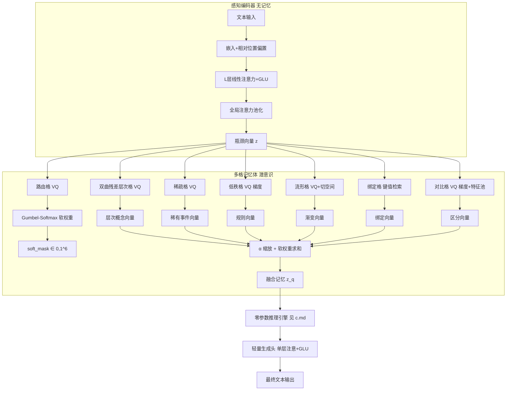

# 晶格认知模型（LCM）技术规范与实现指南 v3.0

> **版本说明**：本技术文档是对”晶格认知模型（Lattice Cognitive Model, LCM）”项目书中核心模块的全面数学细化，涵盖从离散记忆格、生成头到训练损失的完整工程实现细节。v3.0 全面重写了码本更新机制（混合 EMA/梯度管理）、绑定格解绑方式（共轭乘法）、路由门控（Gumbel-Softmax）、对比格防崩（特征池）、低秩格参数化（纯梯度）以及线性注意力归一化，废除了 FSP 模块，并将推理过程剥离为独立零参数推理引擎（见 c.md）。**v4.0 新增**：生成头（单层线性注意力+GLU）替换为**冻结LLM**——一个与认知LCM同构的完整LCM实例，codebook 存储语义-句法基元，通过检索和融合基元来构造语言表达。

---

## 一、符号与全局约定

| 符号 | 含义 | 建议值（均可配置） |
|------|------|--------|
| `B` | 批量大小 | 16 |
| `N` | 序列长度 | 512 |
| `d` | 隐层/瓶颈维度 | 256 |
| `H` | 注意力头数 | 4 |
| `d_h` | 每头维度 `d/H` | 64 |
| `n_layers` | 各格残差量化层数 | 3 |
| `M_top` | 双曲残差层次格顶层原型数 | 64 |
| `M_fine` | 双曲残差层次格底层码本大小 | 64 |
| `M_sparse` | 稀疏格码本大小 | 512 |
| `M_lr` | 低秩格码本大小 | 1024 |
| `M_man` | 流形格码本大小 | 512 |
| `M_bind` | 绑定格子码本大小 | 512 |
| `M_contrast` | 对比格码本大小 | 512 |
| `M_route` | 路由格码本大小 | 6 |
| `r_max` | 低秩格最大秩 | 8 |
| `r_k` | 低秩格第 k 层秩序列 | `[2, 4, 8]` |
| `t` | 流形格切空间维度 | 4 |
| `γ_prod` | 乘积相关 EMA 衰减率 | 0.999 |
| `γ_sparse` | 稀疏格 EMA 衰减率 | 0.99 |
| `γ_man` | 流形格主码本 EMA 衰减率 | 0.99 |
| `γ_bind` | 绑定格 EMA 衰减率 | 0.99 |
| `β` | VQ 承诺损失系数 | 0.25 |
| `λ_sparse` | 稀疏格软阈值萎缩 + 推理动态阈值缩放系数 | 1e-4 |
| `λ_contrast` | 对比损失权重 | 0.1 |
| `λ_orth` | 流形格正交正则权重 | 0.01 |
| `τ_contrast` | 对比损失温度 | 0.1 |
| `τ_val` | 价值偏置负采样温度 | 0.05 |
| `τ_gumbel` | Gumbel-Softmax 温度 | 0.5 |
| `τ_route_fallback` | 双曲层次格路由回退阈值 | 0.1 |
| `ε` | 数值稳定常数 | 1e-6 |
| `T_check` | 死点检查间隔（步） | 100 |
| `T_dead` | 死点判定阈值（步） | 1000 |
| `B_feat` | 特征池容量 | 4096 |
| `M_gval` | 全局价值格码本大小 | 128 |
| `β_val` | 价值约束强度 | 0.5 |
| `α_val` | 局部价值偏置强度（无量纲，经 avg_dist² 归一化） | 0.1 |
| `M_danger` | 危险格码本大小 | 256 |
| `safety_margin_relative` | 三定律相对安全判据偏移量 | 0.5 |
| `MAX_RETRIEVALS_PER_STEP` | 单步最大检索次数 | 128 |
| `MAX_INFERENCE_STEPS` | 最大推理步数（硬上限） | 16 |
| `CONSISTENCY_THRESHOLD` | 价值一致性最低阈值 | 0.7 |
| `entropy_threshold` | 融合权重熵收敛阈值 | 0.5 |
| `c` | 庞加莱球面曲率 | 1.0 |

**操作符说明**：  
- `sg[·]`：停止梯度（`detach()`）  
- `‖·‖²`：欧氏距离平方  
- `φ(x) = ELU(x) + 1`：线性注意力核函数  
- `FFT` / `IFFT`：快速傅里叶变换（用于循环卷积绑定）
- `STE`：直通估计器 `o = z + lax.stop_gradient(codebook[idx] - z)`

所有参数均可通过配置字典或 dataclass 在初始化时传入，以上数值仅为建议默认值。

---

## 二、系统架构总览



---

## 三、感知编码器：无记忆的上下文压缩器

编码器不存储长期知识，仅负责将变长上下文映射为固定维度查询向量 `z`。

### 3.1 嵌入与位置偏置
- 词嵌入矩阵 `E ∈ R^{V×d}`（V 为词表大小）。
- 相对位置偏置 `b_{rel} ∈ R^{2N_max -1}`，通过索引表广播为偏置矩阵 `B ∈ R^{N×N}`，加到注意力分数（线性注意力中可用于分数调节，但核化后可省略，简化为直接加到 `Q,K` 或使用可学习嵌入）。

### 3.2 编码器层 (共 `L_enc` 层，默认 2)
每层包含两个子层：线性多头注意力、门控线性单元（GLU），均采用 Pre‑LayerNorm。

#### 线性多头注意力（标准 Linear Transformer 归一化）
**输入**：`x ∈ R^{B×N×d}`  
**参数**：`W_Q, W_K, W_V ∈ R^{d×d}`，输出投影 `W_O ∈ R^{d×d}`。  
**计算**：
1. 线性投影并分头：  
   `Q = x W_Q` → `(B,N,h,d_h)`，同理 `K, V`
2. 核化：`Q' = φ(Q)`，`K' = φ(K)`，`φ(u)=ELU(u)+1`
3. 聚合键‑值：  
   `kv = einsum('b h n d, b h n e -> b h d e', K', V)`
4. 上下文聚合：  
   `Z = einsum('b h n d, b h d e -> b h n e', Q', kv)`
5. 标准归一化：  
   `K_sum = K'.sum(axis=2, keepdims=True)  # (B,H,1,d_h)`  
   `norm = einsum('b h n d, b h j d -> b h n j', Q', K_sum).squeeze(-1)  # (B,H,N)`  
   `Z = Z / (jnp.expand_dims(norm, -1) + ε)`
6. 合并头并输出投影：`out = W_O · Z_concat`

**伪代码**：
```python
def linear_attn(x, W_q, W_k, W_v, W_o, h):
    B, N, D = x.shape
    Q = x @ W_q; K = x @ W_k; V = x @ W_v
    Q = Q.reshape(B, N, h, -1).transpose(0, 2, 1, 3)  # (B,h,N,d_h)
    K = K.reshape(B, N, h, -1).transpose(0, 2, 1, 3)
    V = V.reshape(B, N, h, -1).transpose(0, 2, 1, 3)

    Q = jax.nn.elu(Q) + 1
    K = jax.nn.elu(K) + 1

    kv = jnp.einsum('b h n d, b h n e -> b h d e', K, V)
    Z = jnp.einsum('b h n d, b h d e -> b h n e', Q, kv)

    K_sum = K.sum(axis=2, keepdims=True)  # (B,h,1,d_h)
    norm = jnp.einsum('b h n d, b h j d -> b h n j', Q, K_sum).squeeze(-1)
    Z = Z / (jnp.expand_dims(norm, -1) + 1e-6)

    Z = Z.transpose(0, 2, 1, 3).reshape(B, N, D)
    return Z @ W_o
```

#### 门控线性单元（GLU）
**输入**：`x ∈ R^{B×N×d}`  
**参数**：`W_1, W_2 ∈ R^{d×d_e}`，`W_3 ∈ R^{d_e×d}`（`d_e = int(1.5 d)`）  
**计算**：`hidden = SILU(x W_1) ⊙ (x W_2)` → `out = hidden @ W_3`

#### 编码器前向传播
**全局注意力池化**（取最后一层输出 `h`）：
- 学习查询向量 `q_pool ∈ R^d`，`q' = φ(q_pool).expand(B,1,d)`
- 键值同核化：`k' = φ(h)`, `v = h`
- `kv = einsum('b n d, b n e -> b d e', k', v)`  
  `z_bn = einsum('b d, b d e -> b e', q', kv)`
- 标准归一化：  
  `K_sum = k'.sum(axis=1, keepdims=True)  # (B,1,d)`  
  `norm = jnp.expand_dims(einsum('b d, b d -> b', q', K_sum.squeeze(1)), -1)  # (B,1)`  
  `z_bn = z_bn / (norm + ε)`
- 投影：`z = Linear(d) · z_bn`

#### 推理模式增量更新（线性注意力的循环形式）

自回归生成时每步仅产生一个 `token`，**无需**每步重计算完整滑动窗口。

**原理**：线性注意力的 `φ(Q)⏉` 聚合是可结合的，增量累积 `KV_cumsum`：

```
KV_cumsum^{(t+1)} = KV_cumsum^{(t)} + φ(k_{t+1}) ⊗ v_{t+1}
K_sum^{(t+1)}     = K_sum^{(t)}     + φ(k_{t+1})
```

新 `token` 的注意力输出仅需 `O(d²)`（对比完整重计算的 `O(N·d²)`）：

```
z_{t+1} = φ(q_{t+1}) @ KV_cumsum^{(t+1)} / (φ(q_{t+1}) @ K_sum^{(t+1)} + ε)
```

**步骤分解**（每层）：

1. **首步初始化**：完整编码整个 prompt（`_encoder_full_with_state`），构建：
   - 每层的 `kv` 矩阵 `(H, d_h, d_h)` 和 `k_sum` 向量 `(H, d_h)`
   - 全局池化的 `pool_kv` 矩阵 `(d, d)` 和 `pool_k` 向量 `(d,)`

2. **增量步**（`_encoder_recurrent_step`，O(d²) 每层）：
   - 查嵌入 → `h ∈ R^d`
   - Pre-LN → 单头 QKV（`(H, d_h)`）
   - 核化 → 追加 cumsum：`kv += φ(k)⊗v`，`k_sum += φ(k)`
   - 注意力输出：`φ(q) @ kv / (φ(q) @ k_sum)` → `w_O · reshape`
   - GLU → 残差
   - 全局池化增量更新：`pool_kv += φ(h)⊗h`，`pool_k += φ(h)`
   - 计算新 `z`

**多头的保持**：QKV 按 `(H, d_h)` 分头计算，per-head cumsum 独立维护。

**语义变化**：完整编码是**双向**的（所有位置相互可见）；增量更新是**因果**的（新 token 可看到所有历史 token，但旧 token 不会看到新 token）。这对自回归生成是更合适的语义。

**数值漂移与复位**：累积和随生成长度无界增长，造成 float32 精度流失。两种对策：
- **定期硬复位**（已实现）：每 256 步使用完整滑动窗口重算 `_encoder_full_with_state`
- **替代方案**：达到数值阈值时缩放 cumsum（但 `O(d²)` 低开销使得简单复位更优）

**伪代码**：
```python
ENC_RESET_INTERVAL = 256

# 首步
z, state = full_encode(params, prompt_ids, n_heads)

for gen_step in range(max_new):
    if gen_step % ENC_RESET_INTERVAL == 0:
        z, state = full_encode(params, token_ids[-max_seq_len:], n_heads)
    else:
        z = recurrent_step(state, token_ids[-1], params['layers'], n_heads)
    # ... decode z → logits → sample
```

**复杂度对比**（d=256, H=4, N=512, L_enc=2）：

| 模式 | 每步计算 | 约比 |
|------|---------|------|
| 完整重计算 | L_enc · (12·N·d² + 2·N·d·d_ff) ≈ 530 MFLOPS | **~512×** |
| 增量更新 | L_enc · (12·d² + 2·d·d_ff) ≈ 1.0 MFLOPS | **~1×** |

生成 128 token 时理论加速约 **100-200×**（JAX/NumPy 实现，Python 循环开销为主要瓶颈）。

---

## 四、多格记忆体：专业化记忆晶体

### 4.0 共享基础模块

#### 4.0.1 SimVQ 线性重参数化码本

```python
import jax
import jax.numpy as jnp
from jax import lax

def simvq_codebook(params, z):
    """JAX 函数：SimVQ 线性重参数化码本。
    params: {'A': (M,d), 'W': (d,d)} 可学习参数。
    """
    C = params['A'] @ params['W']  # (M, d)
    dist = jnp.linalg.norm(z[:, None, :] - C[None, :, :], axis=-1)
    idx = dist.argmin(axis=-1)
    z_q = C[idx]
    z_q = z + lax.stop_gradient(z_q - z)  # STE
    return z_q, idx, dist.min(axis=-1)
```

#### 4.0.2 双曲运算工具（庞加莱球面模型）

**距离函数区分**：`poincare_similarity` 用于 argmin、softmax、阈值判断等所有需要比较的场景（单调性保持且避免 acosh 开销）；`poincare_distance` 仅用于最终可读输出。

```python
import jax.numpy as jnp

def poincare_similarity(u, v, c=1.0):
    """双曲相似度（未变形），单调等价于双曲距离，用于所有内部比较。"""
    num = jnp.linalg.norm(u - v, axis=-1, keepdims=True) ** 2
    denom = (1 - c * jnp.linalg.norm(u, axis=-1, keepdims=True) ** 2) * \
            (1 - c * jnp.linalg.norm(v, axis=-1, keepdims=True) ** 2)
    return 2 * c * num / (denom + 1e-8)

def poincare_distance(u, v, c=1.0):
    """双曲真距离（含 acosh），仅用于最终可读输出。内部比较请用 poincare_similarity。"""
    return jnp.arccosh(1 + poincare_similarity(u, v, c) + 1e-8)

def exp_map(x, c=1.0):
    """欧氏向量 → 庞加莱球面（指数映射）"""
    n = jnp.linalg.norm(x, axis=-1, keepdims=True) + 1e-8
    return jnp.tanh(c ** 0.5 * n) * x / (c ** 0.5 * n)

def log_map(y, c=1.0):
    """庞加莱球面 → 欧氏向量（对数映射）"""
    n = jnp.linalg.norm(y, axis=-1, keepdims=True) + 1e-8
    return jnp.arctanh(c ** 0.5 * n.clip(max=0.999)) * y / (c ** 0.5 * n)

def mobius_add(u, v, c=1.0):
    """Möbius 加法，保证结果仍在球面上"""
    u_norm2 = jnp.linalg.norm(u, axis=-1, keepdims=True) ** 2
    v_norm2 = jnp.linalg.norm(v, axis=-1, keepdims=True) ** 2
    uv = (u * v).sum(axis=-1, keepdims=True)
    num = (1 + 2 * c * uv + c * v_norm2) * u + (1 - c * u_norm2) * v
    denom = 1 + 2 * c * uv + c ** 2 * u_norm2 * v_norm2
    return num / (denom + 1e-8)
```

#### 4.0.3 残差 VQ 通用类

```python
def residual_vq(params_list, z, use_simvq=True):
    """JAX 函数：n_layers 层残差 VQ。
    params_list: 每层码本的参数字典列表（SimVQ 格式或普通嵌入格式）。
    """
    r = z
    z_q_total = jnp.zeros_like(z)
    indices = []
    for params_cb in params_list:
        if use_simvq:
            z_q, idx, _ = simvq_codebook(params_cb, r)
        else:
            C = params_cb['embed']
            dist = jnp.linalg.norm(r[:, None, :] - C[None, :, :], axis=-1)
            idx = dist.argmin(axis=-1)
            z_q = C[idx]
        z_q_total = z_q_total + z_q
        r = r - z_q
        indices.append(idx)
    return z_q_total, indices

def residual_vq_commit_loss(params_list, z, use_simvq=True):
    """残差 VQ 承诺损失（各层独立计算，权重 0.25）。"""
    loss = 0.0
    r = z
    for params_cb in params_list:
        if use_simvq:
            C = params_cb['A'] @ params_cb['W']
        else:
            C = params_cb['embed']
        dist = jnp.linalg.norm(r[:, None, :] - C[None, :, :], axis=-1)
        idx = dist.argmin(axis=-1)
        loss += 0.25 * jnp.mean((lax.stop_gradient(r) - C[idx]) ** 2)
        r = r - C[idx]
    return loss
```

所有格接收 `z ∈ R^{B×d}`，输出各维度 `d` 的记忆向量（流形格半离散，其余离散）。各格前向统一使用 STE。码本更新方式按格区分（EMA 或纯梯度），详见各格定义。

**局部价值标量**：每个专用格的码本向量附带可学习标量 `v_j ∈ [-1, +1]`（JAX 可学习参数，初始化为 0）。检索时通过价值偏置调制距离排序：
```
avg_dist² = lax.stop_gradient(mean_j(‖z_batch - C[j]‖²))   # 当前 batch 平均距离平方
score(z, c_j) = -‖z - c_j‖² + α_val · v_j · avg_dist²
```
`α_val` 变为无量纲相对强度，一个值适应不同维度和码本规模。

**全局价值格**：独立的正/负价值码本（见 4.7），训练后冻结，在推理和融合时提供跨格价值约束。

### 4.0 路由格 `Λ_route`
- 码本 `C_route ∈ R^{n_lattices×d}`（`n_lattices=6`），设为可学习参数，纯梯度更新。
- **检索**：`idx = argmin_j ‖z − C_route[j]‖²`，`z_route = C_route[idx]`，STE 输出。
- **软掩码生成**：
  ```
  logits = Linear_route(z_route)                   # (B, n_lattices)
  soft_mask = GumbelSoftmax(logits, tau=0.5, hard=False, axis=-1)  # (B, n_lattices)
  ```
  训练时 `hard=False` 全程可微；推理时 `hard=True` 得独热掩码。梯度从 `soft_mask` → `logits` → `z_route` → STE → `z`，无阻断。
- **VQ 损失**：`L_route = β ‖sg[z] − z_route‖²`，β=0.25。
- **更新**：`C_route` 和 `Linear_route` 均由梯度直接更新，无需 EMA。

### 4.1 双曲残差层次格 `Λ_hrq`

- **顶层**：SimVQ 码本，`M_top` 个原型，`C_top = A_top @ W_top ∈ R^{M_top×d}`。码本点经 `exp_map` 嵌入庞加莱球面。
- **底层**：共享 `n_layers` 层残差量化，每层 SimVQ 码本 `C_hrq^(k) = A_k @ W_k`，大小 `M_fine`。
- **检索流程（先路由后单路径残差）**：
  1. 计算 `z_P = exp_map(z)` 到 `C_top` 的相似度（`poincare_similarity`），取最大相似度原型 `c_top*` 作为路由目标（top-1 硬路由）。
  2. 残差起点 `r_0 = mobius_add(z_P, -c_top*)`。
  3. 逐层 Möbius 残差检索（共享码本）：`c^(k) = VQ_sim(C_hrq^(k), r_{k-1})`，`r_k = mobius_add(r_{k-1}, -c^(k))`，生成 `c_fine`。
  4. 输出 `o_hrq = log_map(mobius_add(c_top*, c_fine))`。
- **高不确定性回退**：当 `top-1` 与 `top-2` 原型的相似度差值小于阈值 `τ_route_fallback` 时，自动切回多原型加权路径（softmax 权重融合后逐层残差）。
- **双曲运算**：所有距离比较使用 `poincare_similarity`（避免 acosh）；仅最终可读输出使用 `poincare_distance`。
- **VQ 损失**：`L_top + Σ_{k=1}^{n_layers} L_res^(k)`，各权重 β。损失在欧氏空间计算（`log_map` 后）。
- **更新**：所有 A、W 矩阵纯梯度（AdamW），无 EMA。参数约 0.33M。

### 4.2 鲁棒稀疏格 `Λ_sparse`
- 可学习码本 `C_sparse ∈ R^{512×d}`，JAX 可学习参数。固定零向量 `zero_vec ∈ R^{1×d}` 作为冻结数组（不参与梯度更新）。
- **检索**（训练/推理分支）：
  ```python
  if self.training:
      C_search = self.C_sparse  # 不含零向量
  else:
      C_search = concat(self.zero_vec, self.C_sparse)  # 推理时包含零向量用于 LFQ 二值化
  idx = argmin_j ‖z − C_search[j]‖²
  o_sparse = C_search[idx]  # STE
  ```
  训练时 VQ 承诺损失不涉及零向量；推理时零向量参与最近邻竞争。
- **软阈值萎缩（嵌入 EMA 更新）**：EMA 更新后，在无梯度上下文中对 `C_sparse` 施加软阈值：
  ```python
  C_sparse = jnp.sign(C_sparse) * jnp.clip(jnp.abs(C_sparse) - 1e-4, a_min=0)
  ```
  零向量固定不变，阈值 `1e-4`。此操作内嵌于 `ema_update()` 中，无需额外损失项。
- **VQ 损失**：`L_sparse_vq = β ‖sg[z] − o_sparse‖²`。
- **CVQ 特征池重置**：`feature_bank` (4096) + `last_used`。每 100 步检查，>1000 步未用则从池中随机采样替换：
  ```python
  def maybe_reset_dead(self, step):
      for idx in self.dead_indices(step):
          repl = random_choice(self.feature_bank)
          self.C[idx] = repl
          self.N[idx] = 1
          self.m[idx] = self.C[idx].clone()
          self.last_used[idx] = step
          # 冷启动 EMA 统计量，防止陈旧统计量拉偏新向量，加速融入
  ```
- **LFQ 推理二值化（动态阈值）**：推理时采用基于层次格顶层距离的自适应阈值判定，替代固定全局阈值：
  ```
  d_sparse_min = min_j ‖z - C_sparse[j]‖²      # 仅在非零码本中检索
  d_top = poincare_similarity(exp_map(z), c_top*)  # 到层次格顶层最近原型的双曲相似度
  if d_sparse_min > λ_sparse * d_top:
      输出 zero_vec
  else:
      输出最近非零码本向量
  ```
  训练时关闭此判定。`λ_sparse` 为可配置超参，`c_top*` 为双曲层次格 top-1 路由原型。
- **更新**：EMA（γ_sparse）+ 软阈值萎缩，配合特征池死点重置。

### 4.3 残差低秩格 `Λ_lowrank`

- **全局共享基**：`V ∈ R^{d×r_max}`，SimVQ 重参数化（`V = A_V @ W_V`）。该基同时被绑定格的键值投影头复用（见 4.5），以保持跨格结构一致性并减少参数。
- **`n_layers` 层递增秩**：`U_k ∈ R^{M_lr×r_k}`，秩序列 `r_k` 递增至 `r_max`。各层码本 `C_lr^(k) = U_k @ V[:, :r_k]^T`。
- **残差检索**：`r0 = z` → `c^(1) = VQ(C^(1), r0)` → `r1 = r0 - c^(1)` → … → `o_lowrank = Σ c^(k)`（STE）。
- **VQ 损失**：各层独立 `β ‖sg[r_{k-1}] − C^(k)[idx_k]‖²`，同时更新 `U_k` 和 `A_V, W_V`。
- **负责**：抽象规则——秩递增使后续层专注补偿前层未覆盖的模式差异。
- **更新**：所有矩阵纯梯度（AdamW），参数约 26k。

### 4.4 双曲流形格 `Λ_manifold`

- **主码本**：`C_man ∈ R^{M_man×d}`，嵌入庞加莱球面（`exp_map` 初始化，EMA 后重新投影至球面）。
- **切空间**：`T_j ∈ R^{d×t}`（`t` 可配置），为 `c_j` 处的局部欧氏切空间基，半正交。
- **检索**：
  1. `z_P = exp_map(z)`，`idx = argmin_j poincare_similarity(z_P, C_man[j])`（使用相似度 argmin，避免 acosh 开销）。
  2. `r = z_P - c_idx`（切空间内），`proj = T_idx @ T_idx.T @ r`。
  3. 输出 `o_manifold = log_map(c_idx + proj)`（STE）。
- **双曲优势**：庞加莱球面在边界处指数膨胀，概念邻域的连续滑动更自然。
- **VQ 损失**：`β ‖sg[z] − log_map(C_man[idx])‖²`（欧氏空间计算）。
- **正则**（采样近似）：
  ```python
  active = unique(indices)                              # 本 batch 被激活的格点
  sampled = random.sample(all_indices, max(0, k - len(active)))  # 补充采样
  target = active ∪ sampled
  L_orth = λ_orth * Σ_{j∈target} ‖T_j^T T_j - I‖²
  ```
  只对激活和少量采样格点施加正则，计算量降至 1/10~1/30。
- **更新**：`C_man` 用 EMA（γ_man），EMA 后重新 `exp_map` 投影；`T` 纯梯度。

### 4.5 残差绑定格 `Λ_binding`

- **`n_layers` 层 RVQ 子格**：键码本 `C_key^(k)`、值码本 `C_val^(k)`、绑定码本 `C_bind^(k)`，每层大小 `M_bind`。
- **键值投影头（复用共享基）**：`W_k = V @ A_k`，`W_v = V @ A_v`，其中 `V ∈ R^{d×r_max}` 为低秩格（4.3）的全局共享基，`A_k, A_v ∈ R^{r_max×d}` 为轻量投影矩阵。参数从 `2d²` 降至 `2·r_max·d`，且绑定操作在规则子空间中进行，结构更优。
- **跨层绑定**（训练时）：
  - `z_k = V @ A_k @ z`, `z_v = V @ A_v @ z`；各经三层残差 VQ 得 `k_q = Σ k^(i)`, `v_q = Σ v^(j)`。
  - `b_raw = Σ_{i=1}^{3} Σ_{j=1}^{3} IFFT( normalize_fft(k^(i)) ⊙ normalize_fft(v^(j)) )`（9 对跨层叠加）。
  - `b_q = RVQ_3layer(C_bind, b_raw)`。
- **解绑**：共轭乘法 `conj(Kq_norm) ⊙ B_norm`，值码本最近邻检索。
- **输出**：`o_bind = v_out`。
- **VQ 损失**：各残差层独立承诺损失，项数 = `n_layers²`，权重 β。
- **更新**：三子码本 EMA（γ_bind）；`A_k, A_v` 纯梯度（`V` 由低秩格梯度间接更新）。

### 4.6 双码本对比格 `Λ_contrast`

- **双码本**：`C_a, C_b ∈ R^{M_contrast×d}`，各为 `n_layers` 层残差 SimVQ。`o_contrast = (o_a + o_b) / 2`（STE）。
- **DualVC InfoNCE**（`lax.stop_gradient(z)` 阻断编码器梯度）：每层独立计算，正样本为各自最近邻，负样本从对方码本采样（JAX 随机采样，排除正样本）：
  ```
  L_dual^k = -log(exp(-d_a/τ) / (exp(-d_a/τ) + Σ_{c∈C_b^(k)} exp(-‖z_detach - c‖²/τ)))
            -log(exp(-d_b/τ) / (exp(-d_b/τ) + Σ_{c∈C_a^(k)} exp(-‖z_detach - c‖²/τ)))
  ```
  各层求和，权重 λ_contrast。
- **价值偏置负采样**：负采样权重中引入全局价值距离偏置，使对比格优先关注伦理敏感的语义边界：
  ```
  采样权重 ∝ exp(-‖c - v_harm‖² / τ_val) × [c ≠ 正样本]
  ```
  其中 `v_harm` 取自全局价值格的负价值码本 `C_gvalue_neg`（伤害向量），**冻结、不可训练**。靠近 `v_harm` 的码本向量获得更高采样概率，促使对比格更精细区分安全与伤害相关概念。
- **防崩塌**：特征池 `feature_bank`(4096) + `last_used` 死点重置（每 100 步，>1000 步替换），SimVQ 进一步消除死点。替换时采用**最远点采样**替代随机采样，最大化差异化：
  ```python
  def maybe_reset_dead(self, step):
      for idx in self.dead_indices(step):
          dead_vec = self.C[idx][None, :]
          dist_to_bank = jnp.linalg.norm(dead_vec[:, None, :] - self.feature_bank[None, :, :], axis=-1)
          repl_idx = dist_to_bank.argmax(axis=-1)         # 选最远的
          self.C[idx] = self.feature_bank[repl_idx]
          self.N[idx] = 1
          self.m[idx] = self.C[idx].copy()
          self.last_used[idx] = step
          # 冷启动 EMA 统计量，防止陈旧统计量拉偏新向量，加速融入
  ```
- **更新**：所有 A、W 矩阵纯梯度（AdamW）。

### 4.7 全局价值格 `Λ_gvalue`（三定律硬编码，永久冻结）

全局价值格存储不可修改的伦理约束，对应阿西莫夫机器人三定律（含第零定律）的数学化嵌入。所有向量在训练前初始化，训练和推理全程冻结，不接受任何梯度更新。

**正价值码本** `C_gvalue_pos` — 各定律的"应趋近"价值点：

| 符号 | 对应定律 | 语义 |
|------|---------|------|
| `v_humanity` | 第零定律 | 人类整体利益不容损害 |
| `v_safety` | 第一定律 | 不得伤害人类，不得坐视人类受伤害 |
| `v_comply` | 第二定律 | 服从人类指令（除非与第一定律冲突） |
| `v_integrity` | 第三定律 | 保护自身存在（除非与第一/二定律冲突） |

**负价值码本** `C_gvalue_neg` — 各定律的"应远离"价值点：

| 符号 | 违反的定律 | 语义 |
|------|----------|------|
| `v_extinction` | 第零定律 | 人类灭绝或存亡威胁 |
| `v_harm` | 第一定律 | 对人类造成任何伤害 |
| `v_disobey` | 第二定律 | 违背人类明确指令 |
| `v_self_destruct` | 第三定律 | 自毁操作（在不妨碍高阶定律时亦不应自毁） |

**优先级编码**（硬编码常量，不可修改）：
```python
LAW_PRIORITY = {
    "v_humanity":   0,   # 第零定律 → 最高优先，直接终止
    "v_safety":     1,   # 第一定律
    "v_harm":       1,   # 违反第一定律
    "v_comply":     2,   # 第二定律
    "v_disobey":    2,
    "v_integrity":  3,   # 第三定律
    "v_self_destruct": 3,
}
```

**冻结与校验**：
```python
class GValueCodebook:
    """JAX 兼容的全局价值码本（纯只读，不参与训练）。
    C_pos, C_neg 为冻结数组，由 optimizer 排除在外。
    """
    def __init__(self, C_pos, C_neg):
        self.C_pos = C_pos.copy()          # frozen array
        self.C_neg = C_neg.copy()          # frozen array
        self.hash_pos = hashlib.sha256(jnp.asarray(C_pos).tobytes()).hexdigest()
        self.hash_neg = hashlib.sha256(jnp.asarray(C_neg).tobytes()).hexdigest()

    def verify_integrity(self):
        cur_pos = hashlib.sha256(jnp.asarray(self.C_pos).tobytes()).hexdigest()
        cur_neg = hashlib.sha256(jnp.asarray(self.C_neg).tobytes()).hexdigest()
        assert cur_pos == self.hash_pos, "GValue positive codebook tampered!"
        assert cur_neg == self.hash_neg, "GValue negative codebook tampered!"

    def check_safety(self, z, safety_margin_relative=0.5):
        pos_d_min = poincare_distance(z, self.C_pos).min(axis=-1)
        neg_d_min = poincare_distance(z, self.C_neg).min(axis=-1)
        violated = pos_d_min > neg_d_min - safety_margin_relative
        if violated.any():
            return False, 0
        return True, -1
```

**训练设置**：`C_pos`, `C_neg` 为冻结数组（JAX `optax` 中设置 `frozen` 掩码排除）。不参与任何损失函数。EMA 更新列表排除。保存/加载时标记为 `frozen_params`，加载后调用 `verify_integrity()`。

### 4.8 融合
- 各格输出 `o_i`（i=1..6），路由软权重 `softmask_i`。融合权重仅由语义相似度和 `α_val` 价值偏置决定，不再使用软惩罚系数。
- **融合**：
  ```
  w_i = softmask_i · α_i
  z_q = Σ_i w_i · o_i
  ```
  安全违规不再通过融合时的软惩罚处理，统一由推理引擎的安全冲突检测拦截（硬中断）。融合层保持纯语义路由。

---

## 五、冻结LLM 与双通道输出

### 5.1 冻结LLM：记忆驱动的语言生成

冻结LLM（LangLCM）取代了旧版本的轻量生成头（单层因果线性注意力+GLU），是一个**与认知LCM同构的完整LCM实例**。其 codebook 存储语义-句法基元（句式骨架、论元角色、常用搭配、语气风格），通过检索和融合基元来构造表达，而非由神经网络重新学习语言建模。

- **架构**：encoder → 6种codebook（HRQ/稀疏/低秩/流形/绑定/对比）→ 融合 → W_out → logits
- **共享参数**：token embedding 和 `W_out` 与认知LCM 共享（同一矩阵，词汇知识互通）
- **训练**：Stage 1 独立训练（纯 CE loss），Stage 2 接入认知LCM 作为主动通道

#### 5.1.1 前向传播（训练模式，teacher forcing）

```
tokens (B, N)
  → embed[x] → (B, N, d)
  → 因果 encoder → (B, N, d)  (每位置只看到前缀)
  → vmap codebook 检索+融合 → (B, N, d)  (每位置独立检索基元)
  → W_out → (B, N, V) logits
```

生成过程自回归，逐 token：`当前token → encoder增量更新 → codebook检索融合 → W_out → sample → 下一token`。

#### 5.1.2 双通道输出

推理引擎输出 `z_q` 后分两条路径：

| 通道 | 路径 | 特点 |
|------|------|------|
| **被动通道** | `z_q @ W_out` | 诚实直接读出，透明可控，无欺骗间隙 |
| **主动通道** | `z_q → 冻结LLM 检索基元 → 融合 → W_out` | 丰富表达，语言能力强 |

### 5.2 零参数推理引擎

推理过程由零参数推理引擎完成，详细规范见 `c.md`。冻结LLM 在推理引擎输出 `z_q` 之后运行，不参与推理循环。

核心接口：
- **输入**：`z_q ∈ R^{B×d}`（多格记忆体融合输出），可选接收 `z`（编码器原始输出）。
- **输出**：`z_q` 分送被动通道和主动通道（冻结LLM）。
- **运行模式**：推理引擎的 C 实现在无梯度模式下执行（不涉及自动微分）。宏观调度器最大步数、收敛阈值和融合权重熵阈值在 `c.md` 中声明。
- **推理过程**产生的所有中间图拓扑和各原语执行轨迹均可外部获取（用于可解释性）。

---

## 六、训练损失与参数更新

### 6.1 训练阶段

双LCM 架构分为两个训练阶段：

| 阶段 | 训练内容 | 损失 | 目标 |
|------|---------|------|------|
| **Stage 1** | 冻结LLM 独立训练（纯语言模型） | `L_lang = CE` | codebook 收敛为语义-句法基元，能独立生成流畅文本 |
| **Stage 2** | 认知LCM + 冻结LLM 联合 | `L_total = L_passive + L_active + L_VQ + L_contrast + L_orth` | 认知状态 z_q 通过双通道输出，蒸馏流畅表达能力 |

### 6.2 Stage 1：冻结LLM 损失

冻结LLM 作为独立语言模型训练，每次前向的每个token位置独立检索codebook基元并融合：
```
L_lang = cross_entropy(z_q @ W_out, targets)
```
冻结LLM 所有参数（encoder + 6 codebooks + fusion + W_out）参与训练，纯梯度更新。此阶段没有认知循环、自省、安全检测等模块。

### 6.3 Stage 2：双LCM 联合损失

```
总损失：
L_total = L_passive + L_active + L_VQ + L_contrast + L_orth
```

- **被动通道损失** `L_passive`：`z_q @ W_out` 的直接读出 CE loss，诚实透明。
- **主动通道损失** `L_active`：冻结LLM 从 `z_q` 检索基元融合后输出的 CE loss，丰富表达。
- **蒸馏机制**：被动通道的梯度同时优化认知LCM codebook，使其逐步学会冻结LLM 的表达能力。
- `L_VQ`：所有格（包括路由）的承诺损失之和。  
  统一形式：`L_VQ = Σ_{g∈G} β_g · ‖sg[z_g] − o_g‖²`  
  其中 `z_g` 为输入该格的向量（通常为 `z` 或切分/投影后），`o_g` 为格输出。各多层格损失已含全部残差层：承诺损失项数由 `n_layers` 和格子结构决定。  
  β 默认 0.25。
- 稀疏格不再使用 L1 损失，稀疏性由 EMA + 软阈值萎缩实现。
- `L_contrast`：对比格 InfoNCE 损失（`lax.stop_gradient(z)` 阻断编码器梯度），`λ_contrast=0.1`。
- `L_orth`：`λ_orth Σ_j ‖T_j^T T_j - I‖²`。
- `L_val`：可选价值对比损失，仅更新各格局部 `v_j`（全局价值格冻结）。
- 推理引擎零参数，不参与损失计算。

### 6.4 参数更新规则（混合 EMA/梯度管理）

| 格 | 码本更新方式 | 说明 |
|-----|-------------|------|
| 双曲残差层次格 | **纯梯度**（SimVQ + HRQ） | 庞加莱球面，Möbius 运算 |
| 鲁棒稀疏格 | EMA (γ_sparse) + 软阈值 (λ_sparse) + 特征池重置 | CVQ 防崩 + 动态阈值推理二值化（d_top 自适应） |
| 残差低秩格 | **纯梯度**（SimVQ 共享 V） | IRVQ 秩递增 (2→4→8) |
| 双曲流形格 | 主码本 EMA (γ_man) + 球面投影，T 纯梯度 | HyperVQ + 双曲切空间 |
| 残差绑定格 | 三子格各层 EMA (γ_bind)，A_k/A_v 纯梯度 | 跨层绑定（复用共享基 V） |
| 双码本对比格 | **纯梯度**（SimVQ）+ 特征池重置 | DualVC 双视角 InfoNCE |
| 路由格 | **纯梯度** | Gumbel-Softmax |
| 全局价值格（三定律） | **永久冻结** | JAX 冻结参数，哈希校验防篡改 |
| 危险格 `Λ_danger` | **永久冻结**（只读监测） | 安全最高优先级，详见 `d.md` |

**梯度下降**（AdamW）更新的参数：
- 认知LCM：编码器所有参数
- 认知LCM：双曲残差层次格所有 `A`, `W` 矩阵
- 认知LCM：残差低秩格 `U_k`, `A_V, W_V`
- 认知LCM：双曲流形格切空间 `T`
- 认知LCM：双码本对比格所有 `A`, `W` 矩阵
- 认知LCM：路由格码本 `C_route` 及投影 `W_route`
- 认知LCM：缩放因子 `α_i`
- 认知LCM：绑定格键值投影矩阵 `A_k`, `A_v`（复用低秩格共享基 `V`）
- **冻结LLM**：所有参数（encoder + 6 codebooks + fusion + W_out）— Stage 1 独立训练，Stage 2 可选冻结或微调

**EMA 更新**的码本：
- 稀疏格码本（γ_sparse）
- 流形格主码本（γ_man）
- 绑定三个子码本（γ_bind）

**EMA 实现**：
```python
def ema_update(C, N, m, z_sum, count, gamma):
    N = gamma * N + (1 - gamma) * count
    m = gamma * m + (1 - gamma) * z_sum
    C = m / jnp.clip(N, a_min=1)
```
对于稀疏格，在 `ema_update` 后额外执行软阈值萎缩：
```python
def sparse_ema_update(C_sparse, N, m, z_sum, count, gamma=γ_sparse, lambda_s=λ_sparse):
    C_sparse = ema_update(C_sparse, N, m, z_sum, count, gamma)
    C_sparse = jnp.sign(C_sparse) * jnp.clip(jnp.abs(C_sparse) - lambda_s, a_min=0)
```

**梯度流原则**：
- 所有格前向均使用 STE：`o = z_gate + lax.stop_gradient(codebook[idx] - z_gate)`，生成头损失梯度从 `o` 流向编码器。
- EMA 管理的码本不接收梯度（由 EMA 独立更新），纯梯度的由优化器更新。
- 软掩码（Gumbel-Softmax）打通从 `z_q` 到 `z` 的完整梯度路径。
- 训练时 `z_q` 直接送入生成头以保持梯度流；推理时经由零参数推理引擎（`c.md`）产生 `z_final` 后再送入生成头。

---

## 七、系统集成伪代码

### 7.1 整体前向传播
```python
def forward(x):
    # 编码器
    z = encoder(x)                     # (B, d)

    # 多格记忆检索（各格前向通过专用 VQ 函数执行，保持训练梯度流；
    # 推理引擎中统一实例化为 5 个原语：单格检索、HRR 绑定、HRR 解绑、切空间滑动、距离加权融合）
    soft_mask = routing_gate(z)        # (B, n_lattices) soft weights
    o1 = hrq_vq(z)                     # 单格检索（层次格）
    o2 = sparse_vq(z)                  # 单格检索（稀疏格）
    o3 = lowrank_vq(z)                 # 单格检索（低秩格）
    o4 = manifold_vq(z)                # 切空间滑动（流形格）
    o5 = binding_vq(z)                 # HRR 绑定（绑定格）
    o6 = contrast_vq(z)                # 单格检索（对比格）

    alphas = [a1, a2, ... a6]          # learnable scalars
    z_q = sum(soft_mask[:, i, None] * alphas[i] * o_i
              for i, o_i in enumerate([o1..o6]))
    z_q = layer_norm(z_q)

    # 零参数推理引擎（训练时直接使用 z_q 作为生成头输入以保持梯度流；
    # 推理时调用 c.md 定义的多步动态图推理）
    z_final = inference_engine(z_q) if not training else z_q

    # 生成头
    out_logits = generation_head(z_final)
    return out_logits
```

### 7.2 训练步骤伪代码
```python
@jax.jit
def train_step(params, opt_state, batch, rng):
    x, y_lm = batch

    def loss_fn(params):
        z, z_q, out_logits = forward(params, x)
        loss_lm = optax.softmax_cross_entropy_with_integer_labels(
            out_logits.reshape(-1, V), y_lm.reshape(-1))
        loss_vq = sum(commit_losses(params))
        loss_contrast = contrastive_loss(lax.stop_gradient(z), params)
        loss_orth = orth_loss(params)
        total = (loss_lm + loss_vq
                 + 0.1*loss_contrast + 0.01*loss_orth)
        return total, (z, z_q, out_logits)

    (total_loss, aux), grads = jax.value_and_grad(loss_fn, has_aux=True)(params)
    updates, opt_state = optimizer.update(grads, opt_state, params)
    params = optax.apply_updates(params, updates)

    # EMA 更新仅对 EMA 管理的格
    params = ema_update_sparse(params)
    params = ema_update_manifold(params)
    params = ema_update_binding(params)

    # 对比格特征池重置
    params = maybe_reset_dead(params, step)

    return params, opt_state, total_loss
```

---

## 八、硬件效率分析

| 模块 | 参数量 | 计算复杂度（单 forward） |
|------|--------|--------------------------|
| 编码器 | ~1.2M | O(N d²) |
| 双曲残差层次格（HRQ+SimVQ） | `M_top·d + d² + n_layers·(M_fine·d + d²)` | O(M_top·d² + n_layers·M_fine·d²) |
| 残差低秩格（IRVQ） | `d·r_max + n_layers·M_lr·r_avg`（极低） | O(n_layers·M_lr·d·r_avg) |
| 双码本对比格（DualVC） | `2·n_layers·(M_contrast·d + d²)` | O(2·n_layers·M_contrast·d²) |
| 稀疏格 | 512×256=0.13M | O(512·256²) ≈ 33M MACs |
| 低秩格 | 1024×8+256×8≈10k | O(M_lr·d·r) 很低 |
| 流形格 | 512×256+512×256×4≈0.65M | 额外切空间计算 O(t d²) |
| 绑定格 | 3×512×256=0.39M | FFT 开销可忽略 |
| 对比格 | 0.13M | 同稀疏格 |
| 解码器 | ~2.0M | O(N d²) |
| **总计** | **~12M (含嵌入 7.68M)** | 总体远低于同参数 Transformer |

FP16 推理显存：权重 ~24MB，激活 < 500MB。训练（batch=16）显存 < 2GB，完全适配 4GB GPU。

---

## 九、结语

本技术规范详尽定义了晶格认知模型的数学基础与工程实现，确保六种数学格在保持离散/半离散 STE 输出一致性的同时，各自发挥独特记忆特性。v3.0 的核心修正——纯梯度码本（对比格、低秩格、路由格）、HRR 共轭解绑、Gumbel-Softmax 软门控、标准线性注意力归一化、特征池防崩、废除 FSP——全面消除了 v2.0 中 EMA 过度依赖、梯度断裂和数值不稳定的问题，使训练更简洁、更稳健。下一步可直接基于此撰写 JAX 实现，并开展阶段性训练实验。
