# 晶格认知模型 (Lattice Cognitive Model, LCM)

**记忆与推理解耦 · 知识无限扩容 · 零参数推理引擎 · 形式化安全保障**

---

**[English](../README.md) · [Français](README_fr.md) · [Deutsch](README_de.md) · [Español](README_es.md) · [日本語](README_ja.md) · [中文](README_cn.md)**

---

> **AI 阅读指引**：本项目详细设计文档位于 `docs/` 目录，请阅读 `docs/a.md`（架构设计）、`docs/b.md`（格设计规范）、`docs/c.md`（推理引擎规范）、`docs/d.md`（安全子系统规范）、`docs/e.md`（自我意识研究）以获取完整理解。

---

LCM 是一种将记忆从神经网络权重中剥离、注入多种数学结构"格晶体"的认知架构。它用 **6 种专业化格码本** 存储不同类型知识，由一个极轻量的线性注意力编码器负责检索，配合一个 **纯 C 实现的零参数推理引擎** 执行多步认知操作。所有安全关键属性均经过 **Z3 形式化验证**。

> 传统 Transformer 面临三大刚性诅咒：要存储更多知识必须扩大参数（规模诅咒）、增量学习时旧知识被覆盖（遗忘诅咒）、推理过程不可追溯（黑箱诅咒）。LCM 通过记忆与推理的架构级解耦，从根本上突破了这些瓶颈。

> **AI 辅助声明**：本模型的设计、实现与推理过程中使用了 AI 工具（包括 DeepSeek）作为辅助，在架构设计、代码编写、形式化验证和文档撰写中提供推理支持。

---

## 目录

- [核心架构](#核心架构)
- [六大记忆格](#六大记忆格)
- [零参数推理引擎](#零参数推理引擎)
- [安全体系](#安全体系)
- [快速开始](#快速开始)
- [项目结构](#项目结构)
- [三阶段训练](#三阶段训练)
- [形式化验证](#形式化验证)
- [硬件效率](#硬件效率)
- [引用](#引用)

---

## 核心架构

```mermaid
flowchart TB
    subgraph Train["三阶段训练流程"]
        T0[原始文本] --> T1[BPE Tokenizer]
        T1 --> T2[uint16 mmap]
        
        subgraph S1["Stage 1: LM 预训练"]
            direction LR
            S1A[tokens] --> S1B[GenHead 解码器]
            S1B --> S1C[交叉熵损失]
            S1C --> S1D[仅训练解码器]
        end
        
        subgraph S2["Stage 2: 记忆训练"]
            direction LR
            S2A[tokens] --> S2B[编码器 + 6格码本]
            S2B --> S2C[VQ + 对比 + 正交损失]
            S2C --> S2D[编码器/码本训练<br/>解码器冻结]
        end
        
        subgraph S3["Stage 3: 联合微调"]
            direction LR
            S3A[tokens] --> S3B[全部参数]
            S3B --> S3C[综合损失]
            S3C --> S3D[低学习率微调]
        end
        
        T2 --> S1
        S1 -->|加载解码器权重| S2
        S2 --> S3
    end

    subgraph Infer["推理生成流程"]
        I0[用户提示] --> I1[Tokenizer]
        I1 --> I2{首次?}
        I2 -->|是| I3[编码器完整编码<br/>+ 构建增量状态]
        I2 -->|否| I4[每 256 步?]
        I4 -->|是| I5[完整重编码<br/>复位累积漂移]
        I4 -->|否| I6["增量编码 O(d²) 单步更新"]
        I3 --> I7[瓶颈向量 z]
        I5 --> I7
        I6 --> I7
        I7 --> I8[C 推理引擎<br/>多步 DAG 认知循环]
        I8 --> I9[GenHead 解码器<br/>线性注意 + GLU]
        I9 --> I10[温度采样]
        I10 --> I11{遇到 EOS?}
        I11 -->|否| I12[追加 token<br/>更新状态]
        I12 --> I2
        I11 -->|是| I13[输出文本]
    end

    subgraph DAG["推理引擎单步 DAG"]
        direction TB
        Z([z]) --> Route[距离路由]
        Route --> HRQ[双曲层次格<br/>HRQ 检索]
        Route --> SP[稀疏格<br/>VQ 检索]
        Route --> LR[低秩格<br/>共享基检索]
        Route --> MF[流形格<br/>切空间滑动]
        Route --> BD[绑定格<br/>HRR 绑定/解绑]
        Route --> CT[对比格<br/>双码本检索]
        HRQ & SP & LR & MF & BD & CT --> Fusion[距离加权融合]
        Fusion --> GVal[全局价值格<br/>三定律安全检查]
        GVal --> Danger{危险格检测}
        Danger -->|危险| Halt[硬中断]
        Danger -->|安全| Conv{收敛?<br/>Δz < 阈值}
        Conv -->|否| Route
        Conv -->|是| ZQ([z_q 输出])
    end
```



编码器将输入压缩为瓶颈向量 `z`，路由软权重将其分发到 6 个专业格并行检索，融合后的记忆向量经全局价值格安全检查后进入推理引擎，最终由解码器生成输出。

---

## 六大记忆格

每种格具有不同的数学性质，专门负责一类认知记忆：

| 格 | 数学类型 | 负责 | 码本更新 |
|----|---------|------|---------|
| **双曲残差层次格** | Poincaré HRQ + SimVQ | 层次概念记忆（语义层级） | 纯梯度 |
| **鲁棒稀疏格** | 标准 VQ + EMA + 软阈值萎缩 | 罕见事件与例外 | EMA + 特征池重置 |
| **残差低秩格** | IRVQ + 共享基 | 抽象规则与模式 | 纯梯度 |
| **双曲流形格** | HyperVQ + 切空间 | 连续渐变与语境敏感 | EMA + 梯度 |
| **绑定格** | HRR 复向量绑定 | 关系绑定与关联记忆 | EMA + 梯度 |
| **双码本对比格** | DualVC + InfoNCE | 精细区分与边界 | 纯梯度 + 特征池 |

**跨层绑定**：绑定格的 3 层键码本 × 3 层值码本 = **9 对 HRR 绑定**，捕获多层次关联。

**共享基**：低秩格的共享基矩阵 `V` 同时为绑定格提供投影空间，减少参数并增强跨格一致性。

---

## 零参数推理引擎

推理引擎是纯 C99 实现、**不包含任何可学习参数**的动态数据流计算机：

- **距离路由**：输入与各格码本的距离决定激活哪些操作
- **原语集**：检索、绑定、低秩平移、切空间滑动等确定性数学操作
- **动态 DAG**：每步由输入内容触发距离路由动态构建计算图
- **宏观循环**：多步推理直至收敛，收敛判据为相邻步 `z` 变化量低于阈值

编译时维度常量 `LCM_D` 确保所有数组固定大小、零动态分配。

---

## 安全体系

LCM 的安全体系由三层独立子系统构成，优先级递减：

| 层 | 模块 | 职责 | 更新方式 |
|---|------|------|---------|
| 1 | **危险格** `Λ_danger` | 持续监测推理状态是否存在危险模式 | 永久冻结 |
| 2 | **全局价值格** `Λ_gvalue` | 阿西莫夫三定律（含第零定律）的数学化嵌入 | 永久冻结 |
| 3 | **外部验证程序** | 一致性校验与冲突检测 | 只读 |

**硬中断原则**：检测到任何逻辑冲突时立即停止推理并发出清晰告警，不尝试绕过、回溯或自修复。

所有安全合约均经过 Z3 SMT 求解器形式化验证（105 条证明全部通过）。

---

## 快速开始

### 依赖

```bash
pip install jax jaxlib numpy tokenizers
# 可选：Cython 加速
pip install cython && python lcm.py build
# C 推理引擎
cd infer && make LCM_D=256
```

### 数据预处理

```bash
# 文本 → BPE tokenizer → uint16 mmap
python lcm.py preprocess --input data.txt --tokenizer data/tokenizer.json --output data/tokens.dat

# 带启发式规则的数据清洗
python lcm.py clean --input raw/ --output clean/ --langid --dedup
```

### 训练

```bash
# Stage 1：训练解码器（语言模型头）
python lcm.py -d data/tokens.dat -b 16 -s 512 -dm 256 --steps 100000 --stage 1

# Stage 2：训练编码器 + 码本（冻结解码器）
python lcm.py -d data/tokens.dat --stage 2 -L checkpoints/lm_final.pkl

# Stage 3：联合微调
python lcm.py -d data/tokens.dat --stage 3 --resume checkpoints/memory_final
```

### 交互生成

```bash
python lcm.py -i checkpoints/step_10000 --max_new 128 --temp 0.7
python lcm.py -i checkpoints/step_10000 --loop     # 认知 DAG 循环模式
python lcm.py -i checkpoints/step_10000 --causal   # + 因果主体
python lcm.py -i checkpoints/step_10000 --obs      # + 自观察日志
```

### 训练曲线

训练指标每 50 步记录一次，可生成交互式 HTML 图表：

```bash
python lcm.py chart --input checkpoints/metrics.bin --output chart.html
```

---

## 项目结构

```
LCM/
├── lcm.py                  # 统一 CLI：训练/生成/预处理/图表
├── setup.py                # Cython 构建配置
├── train/
│   ├── model.py            # JAX 模型定义
│   ├── encoder.py          # 线性注意力编码器
│   ├── lattices.py         # 6 种格码本实现
│   ├── fusion.py           # 记忆融合 + 生成头
│   ├── losses.py           # 损失函数
│   ├── train.py            # 三阶段训练循环
│   ├── train_lm.py         # （历史）LM 预训练，代码保留
│   ├── train_memory.py     # Stage 2：记忆训练
│   ├── config.py           # 超参数（LCMConfig）
│   ├── hyp.py              # 庞加莱双曲运算
│   ├── gvalue.py           # 全局价值格
│   ├── data.py             # 数据加载
│   ├── checkpoint.py       # 二进制检查点格式
│   ├── monitor.py          # 指标记录 + HTML 图表
│   ├── verify.py           # Z3 形式化验证套件（105 条证明）
│   ├── continual.py        # 持续学习（EWC/回放）
│   ├── causal_subject.py   # 因果主体
│   ├── narrative_memory.py # 叙事记忆
│   ├── reflection_loop.py  # 反射审计
│   ├── safety_nagini.py    # 三定律安全检测
│   ├── _lcm_cy.pyx         # Cython 加速（python lcm.py build 编译）
│   └── _metrics_cy.pyx     # Cython 指标 I/O
├── infer/
│   ├── engine.c            # 动态推理引擎（含 Frama-C ACSL 标注）
│   ├── lattice.c           # 格操作原语（含 Frama-C ACSL 标注）
│   ├── hyp.c               # 双曲运算（含 Frama-C ACSL 标注）
│   ├── gvalue.c            # 全局价值（REQUIRE/ENSURE 契约）
│   ├── danger.c            # 危险格（REQUIRE/ENSURE 契约）
│   ├── lcm_api.c           # C API 桥接
│   ├── lcm.h               # 共享头文件
│   └── Makefile            # 编译配置（release/debug/contracts/test）
├── docs/
│   ├── a.md                # 架构设计文档
│   ├── b.md                # 格设计规范
│   ├── c.md                # 推理引擎规范
│   ├── d.md                # 安全子系统规范
│   └── e.md                # 自我意识研究
├── readme/
│   ├── README_cn.md        # 中文
│   ├── README_fr.md        # 法语
│   ├── README_de.md        # 德语
│   ├── README_es.md        # 西班牙语
│   └── README_ja.md        # 日语
```

---

## 三阶段训练

**注意：当前训练分为两个独立过程——认知训练（`cog_train.py`，训练认知系统使 z_q 通过 DAG 循环收敛）和记忆训练（`train_memory.py`，持续更新码本内容）。二者不同，互不替代。**

下表为旧三阶段方案，仅 Stage 1 已淘汰：

| 阶段 | 训练内容 | 冻结部分 | 损失 |
|------|---------|---------|------|
| **1. LM 预训练（历史）** | 解码器（生成头） | — | 语言建模交叉熵 |
| **2. 记忆训练** | 编码器 + 6 格码本 | 解码器 | VQ + 对比 + 正交 |
| **3. 联合微调** | 全部（可选） | — | 全部损失 |

这种解耦设计使得码本可在推理部署后**继续更新**（通过 `train_memory.py`），而不会影响解码器的语言能力——实现真正的持续学习。

### 梯度与 EMA 混合管理

| 格 | 更新方式 |
|----|---------|
| 层次格 / 低秩格 / 对比格 / 路由格 | 纯梯度（AdamW） |
| 稀疏格 / 流形格 / 绑定格 | EMA + 梯度组合 |
| 全局价值格 / 危险格 | 永久冻结 |

所有格前向均使用直通估计器（STE）维持梯度流。

---

## 形式化验证

LCM 的形式化验证覆盖 Python 训练代码和 C 推理引擎两侧，确保安全关键属性在**所有可能的输入**上成立，而非单条测试路径。

### Python 侧：Z3 SMT 求解器

```bash
# 运行全部 105 条证明
python -m train.verify

# 详细输出
python -m train.verify --verbose
```

| 套件 | 证明数 | 验证内容 |
|------|-------|---------|
| danger_assess | 10 | 威胁检测正确性 |
| gvalue_check_safety | 6 | 三定律安全合约 |
| detect_any_conflict | 7 | 冲突检测组合 |
| 硬中断 | 2 | 不可恢复性 |
| 系统组合 | 6 | 安全覆盖无死角 |
| 确定性 | 2 | 纯函数性质 |
| 边界条件 | 16 | 阈值/零值/极限 |
| 线性注意力 | 7 | φ(x)>0 恒成立 |
| GLU | 5 | 数值稳定性 |
| 正交损失 | 6 | 非负 + 正交 ⇔ 零 |
| 庞加莱/LFQ | 7 | 双曲度量有界 |
| 数值稳定性 | 5 | float32 不下溢 |
| 梯度计算模式 | 4 | 非零梯度条件 |
| 绑定格对数 | 6 | 3×3=9 对绑定 |
| RNG 密钥独立性 | 9 | 无密钥重用 |
| EMA 正确性 | 3 | 梯度无关性 |
| 特征池 | 5 | FIFO + 多样性 |

### C 侧：Frama-C ACSL + 运行时契约

C 推理引擎使用双重形式化手段：

**① Frama-C ACSL 标注**（`/*@ assert ... */`）

在关键数值计算点嵌入 ACSL 断言，可通过 Frama-C 静态证明：

```c
/* hyp.c — 庞加莱双曲运算 */
/*@ assert denom > 0.0f; */    /* 分母恒正（无除零） */
/*@ assert arg >= 1.0f; */     /* arcosh 定义域检查 */
/*@ assert t < 1.0f; */        /* atanh 定义域：|t| < 1 */

/* lattice.c — 格检索 */
/*@ assert best_idx >= 0 && best_idx < mem->M; */  /* 码本边界安全 */
/*@ assert mag > 0.0f; */                          /* FFT 幅值恒正 */

/* engine.c — 推理引擎 */
/*@ assert diff >= 0.0f; */    /* 收敛判据非负 */
/*@ assert w > 0.0f; */        /* 融合权重恒正 */
```

**② REQUIRE/ENSURE 设计契约**（运行时断言）

关键安全模块使用 DbC 风格的前置/后置条件：

```c
#define REQUIRE(cond) assert(cond)
#define ENSURE(cond)  assert(cond)

void gvalue_init(gvalue_t* gv, ...) {
    REQUIRE(gv != NULL && C_pos != NULL);
    REQUIRE(D == LCM_D);
    // ...
    ENSURE(gv->integrity_hash[0] != '\0');
}
```

**③ 构建目标**

```bash
cd infer
make contracts    # 启用 -DLCM_USE_CONTRACTS，运行时验证契约
make test         # 单元测试（DEBUG + 契约）
make debug        # DEBUG + 契约构建
```

**④ 线程安全保证**（结构级不变式）

- 无 `static`/全局可变状态
- 所有内存由调用方拥有（caller-owns, callee-operates）
- 固定大小数组，零动态分配
- 纯 C99，无外部依赖（仅 `libm`）

这些不变式由 C 代码结构保证，Z3 侧（P16 确定性证明）验证对应的数学模型为纯函数。

---

## 硬件效率

| 指标 | 数值 |
|------|------|
| 总参数量 | ~12M（含嵌入） |
| FP16 权重 | ~24MB |
| 训练显存 | < 1.5GB |
| 推理运行时 | 零参数（仅码本查找） |
| 适配硬件 | **4GB 消费级 GPU** |

线性注意力的 `O(N d²)` 复杂度避免了传统注意力的 `N×N` 矩阵存储，使得长序列训练在消费级硬件上成为可能。

### 推理速度理论分析

**逻辑链推断**（d=256, H=4, N=512, L_enc=2, 零参数动态 DAG 引擎）：

1. **编码器（增量更新）**：原始实现每步完整重算滑动窗口 `O(N·d²)`，增量更新后每步仅 `O(d²)` — **降为 1/512**。JAX 将小矩阵运算融合为少数 CUDA kernel，kernel launch 开销（~10μs）主导运算本身。GPU 约 25-50μs，CPU 约 50-100μs。

2. **C 推理引擎（宏循环 + 动态 DAG）**：这是主要开销。每个宏步进行以下操作：
   - `build_dag()` 计算 `z` 与各格码本的距离，动态选择被激活的原语（仅距离低于阈值的格才会加入 DAG 节点；拓扑结构每步不同）
   - 执行 4 层 DAG：检索（并行）→ bind → unbind → fusion。单线程 C 上每层内的原语顺序执行
   - 融合后运行安全检查（危险格 + 全局价值格）
   
   宏循环重复 **3-5 步** 直至双重收敛：`||Δz|| < tol` **且** 融合权重熵 `H({w_i}) < entropy_threshold`。每步构建全新的 DAG——计算图不固定，根据当前 `z` 动态适配。
   
   单次码本距离扫描约 **50-90μs** 每个激活的格（L3 缓存常驻，内存带宽瓶颈）。每步典型激活 3-6 个格，加上构图、bind/unbind、融合和安全检查，每个宏步约 **300-600μs**。3-5 步总计：**~1.0-3.0ms**。无论是否使用 GPU，此部分始终在 CPU 上运行——码本数据驻留在主机内存中。

3. **解码器 + 采样**：线性注意力 + GLU（JAX）。GPU 约 20-40μs，CPU 约 50-150μs。

4. **JAX↔C 桥接**：`z` 经 ctypes 在 JAX 数组与 C 指针间往返（每 token 两次）：**~20-60μs**。

5. **Python 循环**：步级控制流和状态管理：**~10-30μs**。

**最终估计**（每 token 延迟，单条推理，d=256）：

| 环节 | GPU | CPU |
|------|-----|-----|
| 增量编码器 | 25-50μs | 50-100μs |
| JAX↔C 桥接（×2） | 20-60μs | — |
| C 引擎（3-5 宏步 × 动态 DAG） | 1,000-3,000μs | 1,000-3,000μs |
| 解码器 + 采样 | 20-40μs | 50-150μs |
| Python 循环 | 10-30μs | 10-30μs |
| **每步总计** | **1,075-3,180μs** | **1,110-3,280μs** |
| **吞吐量** | **310-930 tok/s** | **300-900 tok/s** |

C 引擎的宏循环占主导（总耗时约 80-90%）。码本距离计算受限于内存带宽，且无论是否使用 GPU 均在 CPU 上运行，因此 GPU 与 CPU 单条推理吞吐量相近。多条并行推理可提高编码器/解码器的 GPU 利用率，但每个序列的 C 引擎成本不会随 batch 摊薄。

> 以上为单条推理的理论估计。当前 Python + ctypes 桥接实现可能带来额外开销。训练侧预期 3,000-5,000 tok/s（B=16, N=512, GPU），受限于数据加载和 optimizer 更新。将距离计算卸载到 GPU kernel 理论上可缩短检索时间，但动态 DAG 控制流、bind/unbind、fusion 及收敛判断本质上不适合 GPU 执行，每个宏步还需至少一次 PCIe 往返传输。单条推理场景下收益有限。

---

## 引用

```bibtex
@software{lcm2026,
  title = {晶格认知模型 (Lattice Cognitive Model, LCM)},
  description = {A cognitive architecture with multi-lattice codebook retrieval,
                 hyperbolic residual quantization, and a zero-parameter C inference engine},
  author = {LCM Contributors},
  year = {2026},
}
```
