# Modelo Cognitivo Reticular (Lattice Cognitive Model, LCM)

**Memoria y razonamiento desacoplados · Conocimiento escalable infinitamente · Motor de inferencia de cero parámetros · Garantías de seguridad formales**

---

**[English](../README.md) · [Français](README_fr.md) · [Deutsch](README_de.md) · Español · [日本語](README_ja.md) · [中文](README_cn.md)**

---

> **Guía de lectura para IA** : Los documentos de diseño detallados se encuentran en el directorio `docs/`. Lea `docs/a.md` (arquitectura), `docs/b.md` (especificaciones de retículos), `docs/c.md` (motor de inferencia), `docs/d.md` (seguridad) y `docs/e.md` (autoconciencia) para una comprensión completa.

---

LCM es una arquitectura cognitiva que extrae la memoria de los pesos de la red neuronal y la inyecta en múltiples estructuras matemáticas denominadas "cristales reticulados". Utiliza **6 codebooks reticulados especializados** para almacenar diferentes tipos de conocimiento, emplea un codificador de atención lineal extremadamente ligero para la recuperación, y lo combina con un **motor de inferencia de cero parámetros implementado puramente en C** que ejecuta operaciones cognitivas en múltiples pasos. Todas las propiedades críticas de seguridad están **verificadas formalmente con Z3**.

> Los Transformers tradicionales enfrentan tres maldiciones rígidas: para almacenar más conocimiento deben aumentar los parámetros (maldición de escala), el conocimiento antiguo se sobrescribe durante el aprendizaje incremental (maldición del olvido), y el proceso de inferencia no es rastreable (maldición de la caja negra). LCM supera fundamentalmente estos cuellos de botella mediante el desacoplamiento arquitectónico entre memoria y razonamiento.

> **Declaración de asistencia de IA**: En el diseño, implementación y proceso de razonamiento de este modelo se utilizaron herramientas de IA (incluyendo DeepSeek) como asistencia, proporcionando soporte de razonamiento en el diseño arquitectónico, escritura de código, verificación formal y redacción de documentos.

---

## Índice

- [Arquitectura central](#arquitectura-central)
- [Seis retículos de memoria](#seis-retículos-de-memoria)
- [Motor de inferencia de cero parámetros](#motor-de-inferencia-de-cero-parámetros)
- [Sistema de seguridad](#sistema-de-seguridad)
- [Inicio rápido](#inicio-rápido)
- [Estructura del proyecto](#estructura-del-proyecto)
- [Entrenamiento en tres etapas](#entrenamiento-en-tres-etapas)
- [Verificación formal](#verificación-formal)
- [Eficiencia de hardware](#eficiencia-de-hardware)
- [Citación](#citación)

---

## Arquitectura central

```mermaid
flowchart TB
    subgraph Train["Flujo de entrenamiento en tres etapas"]
        T0[Texto original] --> T1[BPE Tokenizer]
        T1 --> T2[uint16 mmap]
        
        subgraph S1["Etapa 1: Preentrenamiento LM"]
            direction LR
            S1A[tokens] --> S1B[Decodificador GenHead]
            S1B --> S1C[Pérdida de entropía cruzada]
            S1C --> S1D[Solo entrenar decodificador]
        end
        
        subgraph S2["Etapa 2: Entrenamiento de memoria"]
            direction LR
            S2A[tokens] --> S2B[Codificador + 6 codebooks]
            S2B --> S2C[VQ + Contrastiva + Pérdida ortogonal]
            S2C --> S2D[Entrenamiento codificador/codebook<br/>Decodificador congelado]
        end
        
        subgraph S3["Etapa 3: Ajuste fino conjunto"]
            direction LR
            S3A[tokens] --> S3B[Todos los parámetros]
            S3B --> S3C[Pérdida combinada]
            S3C --> S3D[Ajuste fino con tasa baja]
        end
        
        T2 --> S1
        S1 -->|Cargar pesos del decodificador| S2
        S2 --> S3
    end

    subgraph Infer["Flujo de generación de inferencia"]
        I0[Entrada del usuario] --> I1[Tokenizer]
        I1 --> I2{¿Primera vez?}
        I2 -->|Sí| I3[Codificación completa del codificador<br/>+ Construir estado incremental]
        I2 -->|No| I4[¿Cada 256 pasos?]
        I4 -->|Sí| I5[Recodificación completa<br/>Restablecer deriva acumulada]
        I4 -->|No| I6["Codificación incremental, actualización O(d²) por paso"]
        I3 --> I7[Vector de cuello de botella z]
        I5 --> I7
        I6 --> I7
        I7 --> I8[Motor de inferencia C<br/>Bucle cognitivo DAG multipaso]
        I8 --> I9[Decodificador GenHead<br/>Atención lineal + GLU]
        I9 --> I10[Muestreo de temperatura]
        I10 --> I11{¿EOS encontrado?}
        I11 -->|No| I12[Añadir token<br/>Actualizar estado]
        I12 --> I2
        I11 -->|Sí| I13[Texto de salida]
    end

    subgraph DAG["DAG de inferencia de un paso"]
        direction TB
        Z([z]) --> Route[Enrutamiento por distancia]
        Route --> HRQ[Retículo jerárquico hiperbólico<br/>Recuperación HRQ]
        Route --> SP[Retículo disperso<br/>Recuperación VQ]
        Route --> LR[Retículo de bajo rango<br/>Recuperación con base compartida]
        Route --> MF[Retículo de variedad<br/>Deslizamiento en espacio tangente]
        Route --> BD[Retículo de vinculación<br/>Enlace/Desenlace HRR]
        Route --> CT[Retículo contrastivo<br/>Recuperación de doble codebook]
        HRQ & SP & LR & MF & BD & CT --> Fusion[Fusión ponderada por distancia]
        Fusion --> GVal[Retículo de valor global<br/>Verificación de las Tres Leyes]
        GVal --> Danger{Detección de retículo de peligro}
        Danger -->|Peligro| Halt[Interrupción forzosa]
        Danger -->|Seguro| Conv{¿Convergencia?<br/>Δz < Umbral}
        Conv -->|No| Route
        Conv -->|Sí| ZQ([Salida z_q])
    end
```



El codificador comprime la entrada en un vector de cuello de botella `z`, los pesos de enrutamiento lo distribuyen en paralelo a 6 retículos especializados para recuperación, el vector de memoria fusionado pasa por la verificación de seguridad del retículo de valor global antes de ingresar al motor de inferencia, y finalmente el decodificador genera la salida.

---

## Seis retículos de memoria

Cada retículo posee propiedades matemáticas distintas y se especializa en un tipo de memoria cognitiva:

| Retículo | Tipo matemático | Responsabilidad | Actualización del codebook |
|----------|-----------------|-----------------|---------------------------|
| **Retículo jerárquico residual hiperbólico** | Poincaré HRQ + SimVQ | Memoria conceptual jerárquica (niveles semánticos) | Solo gradiente |
| **Retículo disperso robusto** | VQ estándar + EMA + umbral suave de contracción | Eventos raros y excepciones | EMA + reinicio del pool de características |
| **Retículo de bajo rango residual** | IRVQ + base compartida | Reglas abstractas y patrones | Solo gradiente |
| **Retículo de variedad hiperbólica** | HyperVQ + espacio tangente | Gradientes continuos y sensibilidad al contexto | EMA + gradiente |
| **Retículo de vinculación** | HRR con vectores complejos | Vinculación de relaciones y memoria asociativa | EMA + gradiente |
| **Retículo contrastivo de doble codebook** | DualVC + InfoNCE | Discriminación fina y límites | Solo gradiente + pool de características |

**Vinculación entre capas**: 3 capas de codebook de clave × 3 capas de codebook de valor del retículo de vinculación = **9 pares de enlace HRR**, capturando asociaciones multinivel.

**Base compartida**: La matriz de base compartida `V` del retículo de bajo rango también proporciona el espacio de proyección para el retículo de vinculación, reduciendo parámetros y mejorando la consistencia entre retículos.

---

## Motor de inferencia de cero parámetros

El motor de inferencia es un computador de flujo de datos dinámico implementado en C99 puro, **sin parámetros aprendibles**:

- **Enrutamiento por distancia**: La distancia entre la entrada y los codebooks de cada retículo determina qué operaciones se activan
- **Conjunto de primitivas**: Operaciones matemáticas deterministas como recuperación, vinculación, traslación de bajo rango, deslizamiento en el espacio tangente
- **DAG dinámico**: Cada paso construye un grafo de computación dinámico activado por el enrutamiento de distancia según el contenido de entrada
- **Bucle macroscópico**: Razonamiento en múltiples pasos hasta la convergencia, cuyo criterio es que la variación de `z` entre pasos adyacentes esté por debajo del umbral

La constante de dimensión en tiempo de compilación `LCM_D` garantiza que todos los arrays tengan tamaño fijo y cero asignación dinámica.

---

## Sistema de seguridad

El sistema de seguridad de LCM consta de tres subsistemas independientes en orden decreciente de prioridad:

| Capa | Módulo | Responsabilidad | Método de actualización |
|------|--------|-----------------|------------------------|
| 1 | **Retículo de peligro** `Λ_danger` | Monitoreo continuo del estado de inferencia en busca de patrones peligrosos | Congelado permanentemente |
| 2 | **Retículo de valor global** `Λ_gvalue` | Incorporación matemática de las Tres Leyes de Asimov (incluyendo la Ley Cero) | Congelado permanentemente |
| 3 | **Verificador externo** | Verificación de consistencia y detección de conflictos | Solo lectura |

**Principio de interrupción forzosa**: Al detectar cualquier conflicto lógico, se detiene inmediatamente la inferencia y se genera una alerta clara, sin intentar eludir, retroceder o auto-reparar.

Todos los contratos de seguridad han sido verificados formalmente con el solucionador Z3 SMT (las 105 pruebas pasan en su totalidad).

---

## Inicio rápido

### Dependencias

```bash
pip install jax jaxlib numpy tokenizers
# Opcional: aceleración Cython
pip install cython && python lcm.py build
# Motor de inferencia C
cd infer && make LCM_D=256
```

### Preprocesamiento de datos

```bash
# Texto → tokenizador BPE → uint16 mmap
python lcm.py preprocess --input data.txt --tokenizer data/tokenizer.json --output data/tokens.dat

# Limpieza de datos con reglas heurísticas
python lcm.py clean --input raw/ --output clean/ --langid --dedup
```

### Entrenamiento

```bash
# Etapa 1: entrenar el decodificador (cabezal de modelo de lenguaje)
python lcm.py -d data/tokens.dat -b 16 -s 512 -dm 256 --steps 100000 --stage 1

# Etapa 2: entrenar codificador + codebooks (decodificador congelado)
python lcm.py -d data/tokens.dat --stage 2 -L checkpoints/lm_final.pkl

# Etapa 3: ajuste fino conjunto
python lcm.py -d data/tokens.dat --stage 3 --resume checkpoints/memory_final
```

### Generación interactiva

```bash
python lcm.py -i checkpoints/step_10000 --max_new 128 --temp 0.7
python lcm.py -i checkpoints/step_10000 --loop     # Modo de bucle DAG cognitivo
python lcm.py -i checkpoints/step_10000 --causal   # + Sujeto causal
python lcm.py -i checkpoints/step_10000 --obs      # + Registro de autoobservación
```

### Curvas de entrenamiento

Las métricas de entrenamiento se registran cada 50 pasos y se pueden generar gráficos HTML interactivos:

```bash
python lcm.py chart --input checkpoints/metrics.bin --output chart.html
```

---

## Estructura del proyecto

```
LCM/
├── lcm.py                  # CLI unificada: entrenamiento/generación/preprocesamiento/gráficos
├── setup.py                # Configuración de compilación Cython
├── train/
│   ├── model.py            # Definición del modelo JAX
│   ├── encoder.py          # Codificador de atención lineal
│   ├── lattices.py         # Implementación de 6 codebooks reticulados
│   ├── fusion.py           # Fusión de memoria + cabezal generador
│   ├── losses.py           # Funciones de pérdida
│   ├── train.py            # Bucle de entrenamiento en tres etapas
│   ├── train_lm.py         # (Histórico) Preentrenamiento LM, código conservado
│   ├── train_memory.py     # Etapa 2: entrenamiento de memoria
│   ├── config.py           # Hiperparámetros (LCMConfig)
│   ├── hyp.py              # Operaciones hiperbólicas de Poincaré
│   ├── gvalue.py           # Retículo de valor global
│   ├── data.py             # Carga de datos
│   ├── checkpoint.py       # Formato binario de puntos de control
│   ├── monitor.py          # Registro de métricas + gráficos HTML
│   ├── verify.py           # Suite de verificación formal Z3 (105 pruebas)
│   ├── continual.py        # Aprendizaje continuo (EWC/repetición)
│   ├── causal_subject.py   # Sujeto causal
│   ├── narrative_memory.py # Memoria narrativa
│   ├── reflection_loop.py  # Auditoría de reflexión
│   ├── safety_nagini.py    # Detección de seguridad de las Tres Leyes
│   ├── _lcm_cy.pyx         # Aceleración Cython (compilar con python lcm.py build)
│   └── _metrics_cy.pyx     # E/S de métricas Cython
├── infer/
│   ├── engine.c            # Motor de inferencia dinámico (con anotaciones Frama-C ACSL)
│   ├── lattice.c           # Primitivas de operaciones reticulares (con anotaciones Frama-C ACSL)
│   ├── hyp.c               # Operaciones hiperbólicas (con anotaciones Frama-C ACSL)
│   ├── gvalue.c            # Valor global (contratos REQUIRE/ENSURE)
│   ├── danger.c            # Retículo de peligro (contratos REQUIRE/ENSURE)
│   ├── lcm_api.c           # Puente de la API C
│   ├── lcm.h               # Archivo de cabecera compartido
│   └── Makefile            # Configuración de compilación (release/debug/contracts/test)
├── docs/
│   ├── a.md                # Documento de diseño arquitectónico
│   ├── b.md                # Especificación de diseño reticular
│   ├── c.md                # Especificación del motor de inferencia
│   ├── d.md                # Especificación del subsistema de seguridad
│   └── e.md                # Investigación sobre autoconciencia
```

---

## Entrenamiento en tres etapas

**Procesos de entrenamiento actuales: el entrenamiento cognitivo (`cog_train.py`) es el proceso principal — entrena todo el sistema cognitivo (codificador + 6 codebooks + W_out + bucle cognitivo), incluyendo la actualización de los codebooks. El entrenamiento de memoria (`train_memory.py`) es un proceso auxiliar dedicado a la actualización independiente de los codebooks después del despliegue (aprendizaje continuo). Son complementarios, no mutuamente excluyentes.**

Tabla del antiguo esquema de tres etapas, solo la Etapa 1 está obsoleta:

| Etapa | Contenido de entrenamiento | Parte congelada | Pérdida |
|-------|---------------------------|-----------------|---------|
| **1. Preentrenamiento LM (histórico)** | Decodificador (cabezal generador) | — | Entropía cruzada de modelado de lenguaje |
| **2. Entrenamiento de memoria** | Codificador + 6 codebooks reticulados | Decodificador | VQ + contrastiva + ortogonal |
| **3. Ajuste fino conjunto** | Todos (opcional) | — | Todas las pérdidas |

Este diseño desacoplado permite que los codebooks **se sigan actualizando** después del despliegue de inferencia (a través de `train_memory.py`) sin afectar la capacidad lingüística del decodificador, logrando un verdadero aprendizaje continuo.

### Gestión híbrida de gradiente y EMA

| Retículo | Método de actualización |
|----------|------------------------|
| Retículo jerárquico / Bajo rango / Contrastivo / Enrutamiento | Solo gradiente (AdamW) |
| Retículo disperso / Variedad / Vinculación | EMA + gradiente combinados |
| Retículo de valor global / Peligro | Congelado permanentemente |

Todos los retículos utilizan el estimador de paso directo (STE) en el paso forward para mantener el flujo de gradiente.

---

## Verificación formal

La verificación formal de LCM cubre tanto el código de entrenamiento en Python como el motor de inferencia en C, garantizando que las propiedades críticas de seguridad se cumplan para **todas las entradas posibles**, no solo para rutas de prueba individuales.

### Lado Python: Solucionador Z3 SMT

```bash
# Ejecutar las 105 pruebas completas
python -m train.verify

# Salida detallada
python -m train.verify --verbose
```

| Suite | N.º de pruebas | Contenido verificado |
|-------|---------------|---------------------|
| danger_assess | 10 | Corrección de detección de amenazas |
| gvalue_check_safety | 6 | Contratos de seguridad de las Tres Leyes |
| detect_any_conflict | 7 | Combinaciones de detección de conflictos |
| Interrupción forzosa | 2 | Irrecuperabilidad |
| Combinación del sistema | 6 | Cobertura de seguridad sin puntos ciegos |
| Determinismo | 2 | Propiedades de función pura |
| Condiciones de frontera | 16 | Umbrales/valores cero/límites |
| Atención lineal | 7 | φ(x)>0 siempre se cumple |
| GLU | 5 | Estabilidad numérica |
| Pérdida ortogonal | 6 | No negativa + ortogonal ⇔ cero |
| Poincaré/LFQ | 7 | Métrica hiperbólica acotada |
| Estabilidad numérica | 5 | float32 no subdesborda |
| Modos de cálculo de gradiente | 4 | Condiciones de gradiente no nulo |
| Pares de vinculación del retículo | 6 | 3×3=9 pares de enlace |
| Independencia de claves RNG | 9 | Sin reutilización de claves |
| Corrección de EMA | 3 | Independencia del gradiente |
| Pool de características | 5 | FIFO + diversidad |

### Lado C: Frama-C ACSL + Contratos en tiempo de ejecución

El motor de inferencia en C utiliza un doble enfoque de verificación formal:

**① Anotaciones Frama-C ACSL** (`/*@ assert ... */`)

Incorpora aserciones ACSL en puntos críticos de cálculo numérico, verificables estáticamente mediante Frama-C:

```c
/* hyp.c — Operaciones hiperbólicas de Poincaré */
/*@ assert denom > 0.0f; */    /* El denominador siempre es positivo (sin división por cero) */
/*@ assert arg >= 1.0f; */     /* Verificación del dominio de arcosh */
/*@ assert t < 1.0f; */        /* Dominio de atanh: |t| < 1 */

/* lattice.c — Recuperación reticular */
/*@ assert best_idx >= 0 && best_idx < mem->M; */  /* Seguridad de límites del codebook */
/*@ assert mag > 0.0f; */                          /* La magnitud FFT siempre es positiva */

/* engine.c — Motor de inferencia */
/*@ assert diff >= 0.0f; */    /* El criterio de convergencia es no negativo */
/*@ assert w > 0.0f; */        /* Los pesos de fusión siempre son positivos */
```

**② Contratos de diseño REQUIRE/ENSURE** (aserciones en tiempo de ejecución)

Los módulos de seguridad críticos utilizan condiciones previas/posteriores al estilo DbC:

```c
#define REQUIRE(cond) assert(cond)
#define ENSURE(cond)  assert(cond)

void gvalue_init(gvalue_t* gv, ...) {
    REQUIRE(gv != NULL && C_pos != NULL);
    REQUIRE(D == LCM_D);
    // ...
    ENSURE(gv->integrity_hash[0] != '\0');
}
```

**③ Objetivos de compilación**

```bash
cd infer
make contracts    # Habilita -DLCM_USE_CONTRACTS, verifica contratos en tiempo de ejecución
make test         # Pruebas unitarias (DEBUG + contratos)
make debug        # Compilación DEBUG + contratos
```

**④ Garantía de seguridad de concurrencia** (invariantes a nivel de estructura)

- Sin estado mutable `static`/global
- Toda la memoria es propiedad del llamante (caller-owns, callee-operates)
- Arrays de tamaño fijo, cero asignación dinámica
- C99 puro, sin dependencias externas (solo `libm`)

Estos invariantes están garantizados por la estructura del código C, y el lado Z3 (prueba de determinismo P16) verifica que el modelo matemático correspondiente es una función pura.

---

## Eficiencia de hardware

| Indicador | Valor |
|-----------|-------|
| Parámetros totales | ~12M (incluyendo embeddings) |
| Pesos FP16 | ~24MB |
| Memoria de entrenamiento GPU | < 1.5GB |
| Inferencia en tiempo de ejecución | Cero parámetros (solo búsqueda en codebook) |
| Hardware compatible | **GPU de consumo 4GB** |

La complejidad `O(N d²)` de la atención lineal evita el almacenamiento de la matriz `N×N` de la atención tradicional, haciendo posible el entrenamiento de secuencias largas en hardware de consumo.

### Análisis teórico de velocidad de inferencia

**Inferencia de cadenas lógicas** (d=256, H=4, N=512, L_enc=2, motor DAG dinámico de cero parámetros):

1. **Codificador (incremental)**: La implementación original recalcula completamente la ventana deslizante en cada paso con `O(N·d²)`. Con la actualización incremental, cada paso requiere solo `O(d²)` — **se reduce a 1/512**. JAX fusiona las operaciones de matrices pequeñas en unos pocos kernels CUDA; la sobrecarga de lanzamiento (~10μs) domina el cálculo en sí. GPU ~25-50μs, CPU ~50-100μs.

2. **Motor de inferencia C (bucle macro + DAG dinámico)**: Este es el costo dominante. Cada paso macro:
   - `build_dag()` calcula las distancias desde `z` a cada codebook reticular y selecciona dinámicamente las primitivas activadas (solo los retículos por debajo del umbral de distancia se añaden como nodos DAG; la topología varía en cada paso)
   - Se ejecuta un DAG de 4 capas: retrieves (paralelo) → bind → unbind → fusion. En C monohilo, cada primitiva activa se ejecuta secuencialmente dentro de su capa
   - Las comprobaciones de seguridad (retículo de peligro + retículo de valor global) se ejecutan tras la fusión
   
   El bucle macro repite **3 a 5 pasos** hasta la doble convergencia: `||Δz|| < tol` Y entropía de pesos de fusión `H({w_i}) < entropy_threshold`. Cada paso macro construye un DAG nuevo — el grafo de cómputo no es fijo, se adapta dinámicamente al `z` actual.
   
   Un escaneo de distancia de codebook individual toma ~50-90μs por retículo activo (residente en caché L3, limitado por ancho de banda de memoria). Con típicamente 3-6 retículos activados por paso, más construcción del grafo, bind/unbind, fusión y comprobaciones de seguridad, cada paso macro es ~300-600μs. En 3-5 pasos: **~1.0-3.0 ms total**. Esta parte siempre se ejecuta en la CPU, independientemente del modo GPU — los datos de los codebooks residen en la memoria del host.

3. **Decodificador + muestreo**: Atención lineal + GLU (JAX). GPU ~20-40μs, CPU ~50-150μs.

4. **Puente JAX↔C**: `z` cruza entre arrays de JAX y punteros de C a través de ctypes (dos cruces por token): **~20-60μs**.

5. **Bucle Python**: Control de flujo y gestión de estado: **~10-30μs**.

**Estimación final** (latencia por token, inferencia unitaria, d=256):

| Componente | GPU | CPU |
|------------|-----|-----|
| Codificador incremental | 25-50μs | 50-100μs |
| Puente JAX↔C (×2) | 20-60μs | — |
| Motor C (3-5 pasos macro × DAG dinámico) | 1,000-3,000μs | 1,000-3,000μs |
| Decodificador + muestreo | 20-40μs | 50-150μs |
| Bucle Python | 10-30μs | 10-30μs |
| **Total por token** | **1,075-3,180μs** | **1,110-3,280μs** |
| **Rendimiento** | **310-930 tok/s** | **300-900 tok/s** |

El bucle macro del motor C domina (~80-90% del tiempo total). El cálculo de distancia de los codebooks está limitado por el ancho de banda de memoria y se ejecuta en la CPU independientemente del modo GPU, por lo que los rendimientos GPU y CPU son similares para inferencia unitaria. El procesamiento por lotes de múltiples consultas mejoraría la utilización de GPU para el codificador/decodificador, pero el costo del motor C por secuencia no se amortiza en la dimensión del lote.

> Estas son estimaciones teóricas para inferencia unitaria. La implementación actual del puente Python + ctypes puede añadir sobrecarga. El rendimiento de entrenamiento es de 3,000-5,000 tok/s (B=16, N=512, GPU), limitado por la carga de datos y las actualizaciones del optimizador. Trasladar el cálculo de distancias a un kernel de GPU podría reducir teóricamente el tiempo de recuperación, pero el flujo de control dinámico del DAG, bind/unbind, fusion y las comprobaciones de convergencia son fundamentalmente inadecuados para ejecución en GPU. Cada paso macro también requeriría al menos un viaje de ida y vuelta por PCIe (z → GPU, distancias → CPU). Para inferencia unitaria, las ganancias serían marginales.

---

## Citación

```bibtex
@software{lcm2026,
  title = {晶格认知模型 (Lattice Cognitive Model, LCM)},
  description = {A cognitive architecture with multi-lattice codebook retrieval,
                 hyperbolic residual quantization, and a zero-parameter C inference engine},
  author = {LCM Contributors},
  year = {2026},
}
```
